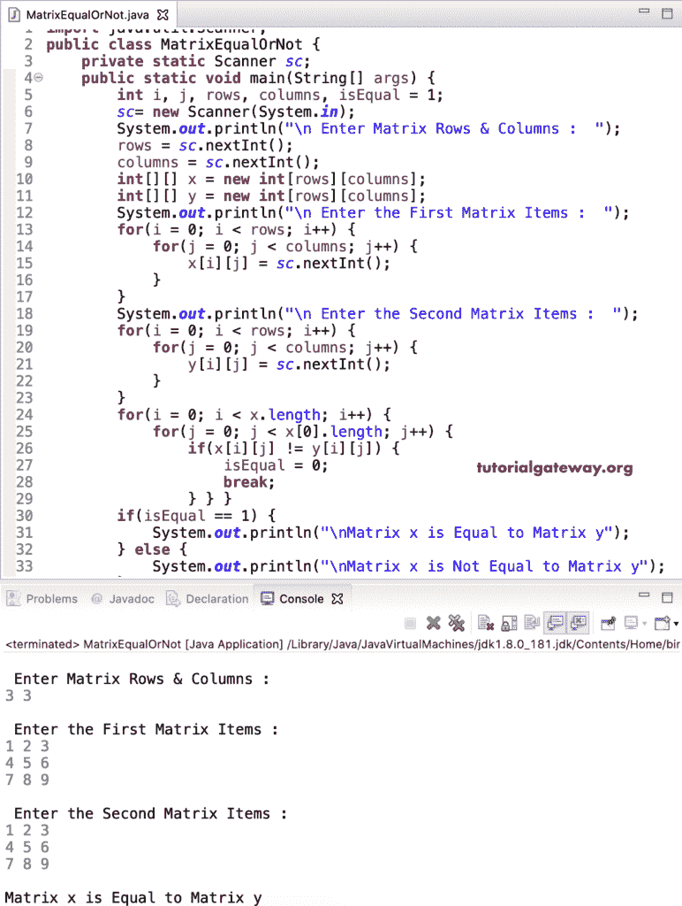

# Java 程序：检查两个矩阵是否相等

> 原文：<https://www.tutorialgateway.org/java-program-to-check-two-matrices-are-equal/>

写一个 Java 程序来检查两个矩阵是否相等。或者如何用一个例子编写一个 Java 程序来发现两个多维矩阵是否相等。

在这个 Java Matrix equal 示例中，我们声明了两个 2 * 2 整数矩阵。接下来，我们使用 for 循环来迭代矩阵项。在循环的[中，我们使用](https://www.tutorialgateway.org/java-for-loop/) [If 语句](https://www.tutorialgateway.org/java-if-statement/)来检查矩阵 x 中的每个项目是否不等于矩阵 y 项目。如果为真，我们将 isEqual 值更改为 0，并应用 break 语句退出循环。接下来，我们使用 [If Else 语句](https://www.tutorialgateway.org/java-if-else-statement/)中的 isEqual 变量来打印基于 isEqual 值的输出。

```java
public class MatrixEqualOrNot {
	public static void main(String[] args) {
		int[][] x = {{1, 2}, {3, 4}};
		int[][] y = {{1, 2}, {3, 4}};

		int i, j, isEqual = 1;

		for(i = 0; i < x.length; i++)
		{
			for(j = 0; j < x[0].length; j++)
			{
				if(x[i][j] != y[i][j]) {
					isEqual = 0;
					break;
				}
			}
		}
		if(isEqual == 1) {
			System.out.println("\nMatrix x is Equal to Matrix y");
		}
		else {
			System.out.println("\nMatrix x is Not Equal to Matrix y");
		}
	}
}
```

Java 矩阵等输出

```java
Matrix x is Equal to Matrix y
```

## 检查两个矩阵是否相等的 Java 程序示例 2

这个 [Java](https://www.tutorialgateway.org/java-tutorial/) Matrix Equal 代码同上。然而，这个用于多维相等的 [Java 代码](https://www.tutorialgateway.org/learn-java-programs/)允许用户输入行数、列数和[矩阵](https://www.tutorialgateway.org/two-dimensional-array-in-java/)项。

```java
import java.util.Scanner;

public class MatrixEqualOrNot {
	private static Scanner sc;

	public static void main(String[] args) {
		int i, j, rows, columns, isEqual = 1;	

		sc= new Scanner(System.in);	

		System.out.println("\n Enter Matrix Rows & Columns :  ");
		rows = sc.nextInt();
		columns = sc.nextInt();

		int[][] x = new int[rows][columns];
		int[][] y = new int[rows][columns];

		System.out.println("\n Enter the First Matrix Items :  ");
		for(i = 0; i < rows; i++) {
			for(j = 0; j < columns; j++) {
				x[i][j] = sc.nextInt();
			}		
		}

		System.out.println("\n Enter the Second Matrix Items :  ");
		for(i = 0; i < rows; i++) {
			for(j = 0; j < columns; j++) {
				y[i][j] = sc.nextInt();
			}		
		}

		for(i = 0; i < x.length; i++)
		{
			for(j = 0; j < x[0].length; j++)
			{
				if(x[i][j] != y[i][j]) {
					isEqual = 0;
					break;
				}
			}
		}
		if(isEqual == 1) {
			System.out.println("\nMatrix x is Equal to Matrix y");
		}
		else {
			System.out.println("\nMatrix x is Not Equal to Matrix y");
		}
	}
}
```



让我试试不同的矩阵。

```java
 Enter Matrix Rows & Columns :  
2 2

 Enter the First Matrix Items :  
1 2
3 4

 Enter the Second Matrix Items :  
1 3
3 4

Matrix x is Not Equal to Matrix y
```