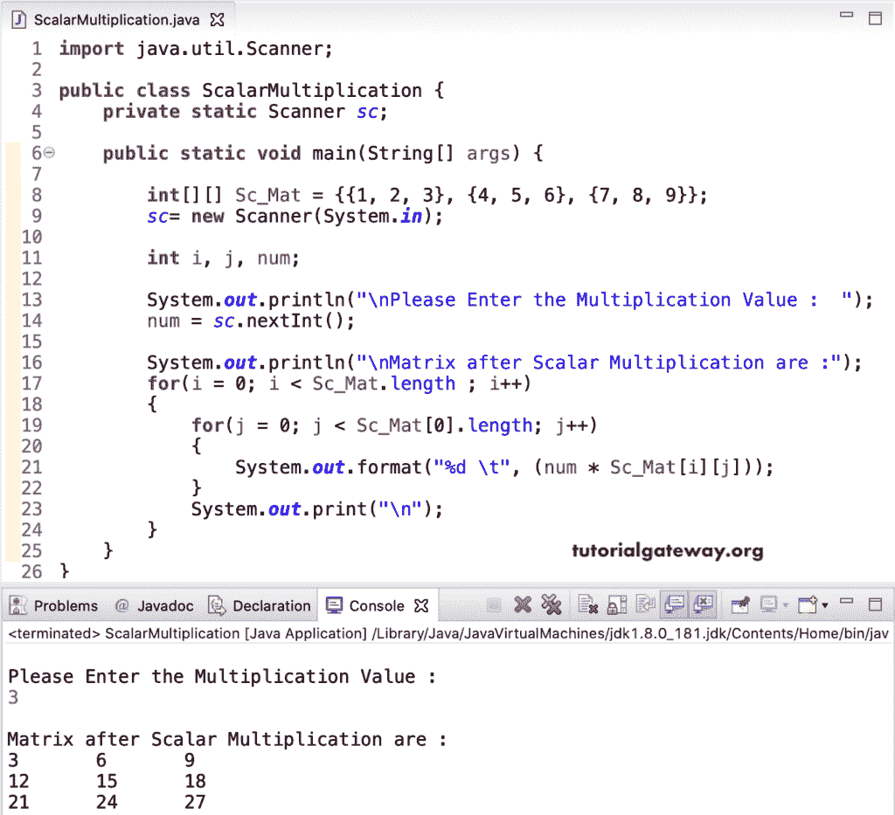

# Java 程序：标量矩阵乘法

> 原文：<https://www.tutorialgateway.org/java-scalar-matrix-multiplication-program/>

写一个 Java 程序，用一个例子来执行标量矩阵乘法。或者编写一个 Java 程序来计算给定多维数组上的标量乘法。

在这个 Java 标量矩阵乘法的例子中，我们声明了一个 Sc_Mat 3 * 3 整数矩阵。接下来，我们允许用户插入任意整数值来执行标量乘法。然后，我们使用[进行循环](https://www.tutorialgateway.org/java-for-loop/)来迭代矩阵，并在其中执行乘法。

```java
import java.util.Scanner;

public class ScalarMultiplication {
	private static Scanner sc;

	public static void main(String[] args) {

		int[][] Sc_Mat = {{1, 2, 3}, {4, 5, 6}, {7, 8, 9}};
		sc= new Scanner(System.in);

		int i, j, num;

		System.out.println("\nPlease Enter the Multiplication Value :  ");
		num = sc.nextInt();

		System.out.println("\nMatrix after Scalar Multiplication are :");
		for(i = 0; i < Sc_Mat.length ; i++)
		{
			for(j = 0; j < Sc_Mat[0].length; j++)
			{
				System.out.format("%d \t", (num * Sc_Mat[i][j]));
			}
			System.out.print("\n");
		}
	}
}
```



## Java 标量矩阵乘法程序示例 2

这个 [Java](https://www.tutorialgateway.org/java-tutorial/) 矩阵代码的标量乘法同上。然而，这个标量矩阵的 [Java 代码](https://www.tutorialgateway.org/learn-java-programs/)允许用户输入行数、列数和[矩阵](https://www.tutorialgateway.org/two-dimensional-array-in-java/)项。请参考 [C 程序执行标量矩阵乘法](https://www.tutorialgateway.org/c-program-to-perform-scalar-matrix-multiplication/)文章，以了解迭代方式的循环执行。

```java
import java.util.Scanner;

public class ScalarMultiplication {
	private static Scanner sc;

	public static void main(String[] args) {

		sc= new Scanner(System.in);

		int i, j, rows, columns, num;

		System.out.println("\n Enter Scalar Matrix Rows & Columns :  ");
		rows = sc.nextInt();
		columns = sc.nextInt();

		int[][] Sc_Mat = new int[rows][columns];

		System.out.println("\n Enter the First Matrix Items :  ");
		for(i = 0; i < rows; i++) {
			for(j = 0; j < columns; j++) {
				Sc_Mat[i][j] = sc.nextInt();
			}		
		}

		System.out.println("\nPlease Enter the Multiplication Value :  ");
		num = sc.nextInt();

		System.out.println("\nMatrix after Scalar Multiplication are :");
		for(i = 0; i < Sc_Mat.length ; i++)
		{
			for(j = 0; j < Sc_Mat[0].length; j++)
			{
				System.out.format("%d \t", (num * Sc_Mat[i][j]));
			}
			System.out.print("\n");
		}
	}
}
```

```java
 Enter Scalar Matrix Rows & Columns :  
3 3

 Enter the First Matrix Items :  
10 20 30
40 60 80
90 11 55

Please Enter the Multiplication Value :  
4

Matrix after Scalar Multiplication are :
40 	80 	120 	
160 	240 	320 	
360 	44 	220 
```