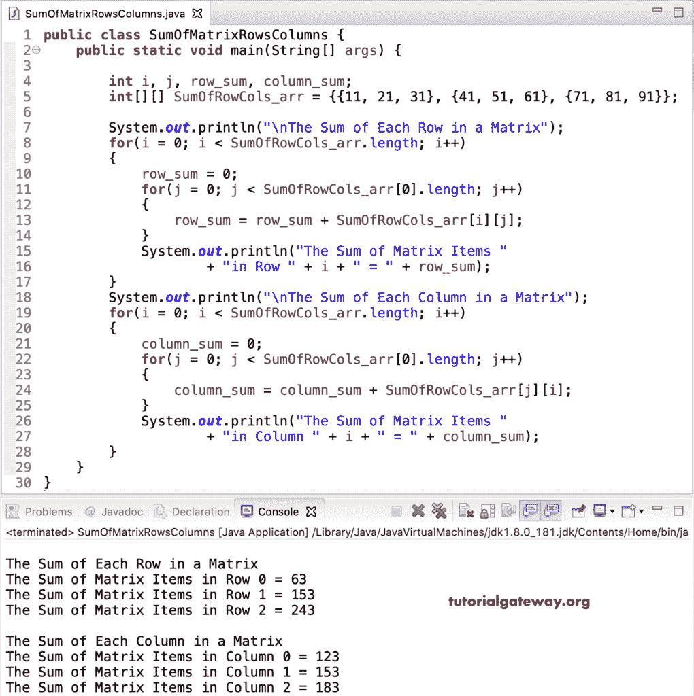

# Java 程序：寻找矩阵行和列之和

> 原文：<https://www.tutorialgateway.org/java-program-to-find-sum-of-matrix-rows-and-column/>

写一个 Java 程序，用一个例子求出每个矩阵行和列的和。或 Java 程序来计算给定矩阵或多维数组中每一行和每列的总和。在这个矩阵行和列的 Java sum 示例中，我们声明了一个具有随机值的 3 * 3 SumOfRowCols_arr 整数矩阵。接下来，我们使用 for 循环来迭代 SumOfRowCols_arr 矩阵项。在 for 循环中，我们计算行和列的 SumOfRowCols_arr 矩阵和。

```java
public class SumOfMatrixRowsColumns {

	public static void main(String[] args) {

		int i, j, row_sum, column_sum;	

		int[][] SumOfRowCols_arr = {{11, 21, 31}, {41, 51, 61}, {71, 81, 91}};

		for(i = 0; i < SumOfRowCols_arr.length; i++)
		{
			row_sum = 0;
			column_sum = 0;
			for(j = 0; j < SumOfRowCols_arr[0].length; j++)
			{
				row_sum = row_sum + SumOfRowCols_arr[i][j];
				column_sum = column_sum + SumOfRowCols_arr[j][i];
			}
			System.out.println("\nThe Sum of Matrix Items "
					+ "in Row " + i + " = " + row_sum);
			System.out.println("\nThe Sum of Matrix Items "
					+ "in Column " + i + " = " + column_sum);
		}
	}
}
```

矩阵行和列的 Java 和输出

```java
 The Sum of Matrix Items in Row 0 = 63

The Sum of Matrix Items in Column 0 = 123

The Sum of Matrix Items in Row 1 = 153

The Sum of Matrix Items in Column 1 = 153

The Sum of Matrix Items in Row 2 = 243

The Sum of Matrix Items in Column 2 = 183
```

## 计算矩阵行和列总和的 Java 程序示例 2

这个 [Java](https://www.tutorialgateway.org/java-tutorial/) 矩阵的行列和代码同上。然而，我们使用两个单独的[循环](https://www.tutorialgateway.org/java-for-loop/)来计算行和列的总和。建议大家参考各列的 [Java Sum 和各行](https://www.tutorialgateway.org/java-program-to-find-sum-of-each-matrix-row/)的 [Java Sum 示例。](https://www.tutorialgateway.org/java-program-to-find-sum-of-each-matrix-row/)

```java
public class SumOfMatrixRowsColumns {

	public static void main(String[] args) {

		int i, j, row_sum, column_sum;	

		int[][] SumOfRowCols_arr = {{11, 21, 31}, {41, 51, 61}, {71, 81, 91}};

		System.out.println("\nThe Sum of Each Row in a Matrix");	
		for(i = 0; i < SumOfRowCols_arr.length; i++)
		{
			row_sum = 0;
			for(j = 0; j < SumOfRowCols_arr[0].length; j++)
			{
				row_sum = row_sum + SumOfRowCols_arr[i][j];
			}
			System.out.println("The Sum of Matrix Items "
					+ "in Row " + i + " = " + row_sum);
		}
		System.out.println("\nThe Sum of Each Column in a Matrix");
		for(i = 0; i < SumOfRowCols_arr.length; i++)
		{
			column_sum = 0;
			for(j = 0; j < SumOfRowCols_arr[0].length; j++)
			{
				column_sum = column_sum + SumOfRowCols_arr[j][i];
			}
			System.out.println("The Sum of Matrix Items "
					+ "in Column " + i + " = " + column_sum);
		}
	}
}
```



这个 Java Matrix 的列和行的总和代码与上面的相同。然而，这个用于矩阵列和行总和的 [Java 代码](https://www.tutorialgateway.org/learn-java-programs/)允许用户输入行、列和[矩阵](https://www.tutorialgateway.org/two-dimensional-array-in-java/)项。

```java
import java.util.Scanner;

public class SumOfMatrixRowsColumns {

	private static Scanner sc;

	public static void main(String[] args) {

		int i, j, rows, columns, row_sum, column_sum;	

		sc= new Scanner(System.in);

		System.out.println("\n Enter Matrix Rows and Columns :  ");
		rows = sc.nextInt();
		columns = sc.nextInt();

		int[][] SumOfRowCols_arr = new int[rows][columns];

		System.out.println("\n Please Enter the Matrix Items :  ");
		for(i = 0; i < rows; i++) {
			for(j = 0; j < columns; j++) {
				SumOfRowCols_arr[i][j] = sc.nextInt();
			}		
		}

		System.out.println("\nThe Sum of Each Row in a Matrix");	
		for(i = 0; i < SumOfRowCols_arr.length; i++)
		{
			row_sum = 0;
			for(j = 0; j < SumOfRowCols_arr[0].length; j++)
			{
				row_sum = row_sum + SumOfRowCols_arr[i][j];
			}
			System.out.println("The Sum of Matrix Items "
					+ "in Row " + i + " = " + row_sum);
		}
		System.out.println("\nThe Sum of Each Column in a Matrix");
		for(i = 0; i < SumOfRowCols_arr.length; i++)
		{
			column_sum = 0;
			for(j = 0; j < SumOfRowCols_arr[0].length; j++)
			{
				column_sum = column_sum + SumOfRowCols_arr[j][i];
			}
			System.out.println("The Sum of Matrix Items "
					+ "in Column " + i + " = " + column_sum);
		}
	}
}
```

```java
 Enter Matrix Rows and Columns :  
3 3

 Please Enter the Matrix Items :  
15 25 35
45 55 65
75 85 95

The Sum of Each Row in a Matrix
The Sum of Matrix Items in Row 0 = 75
The Sum of Matrix Items in Row 1 = 165
The Sum of Matrix Items in Row 2 = 255

The Sum of Each Column in a Matrix
The Sum of Matrix Items in Column 0 = 135
The Sum of Matrix Items in Column 1 = 165
The Sum of Matrix Items in Column 2 = 195
```