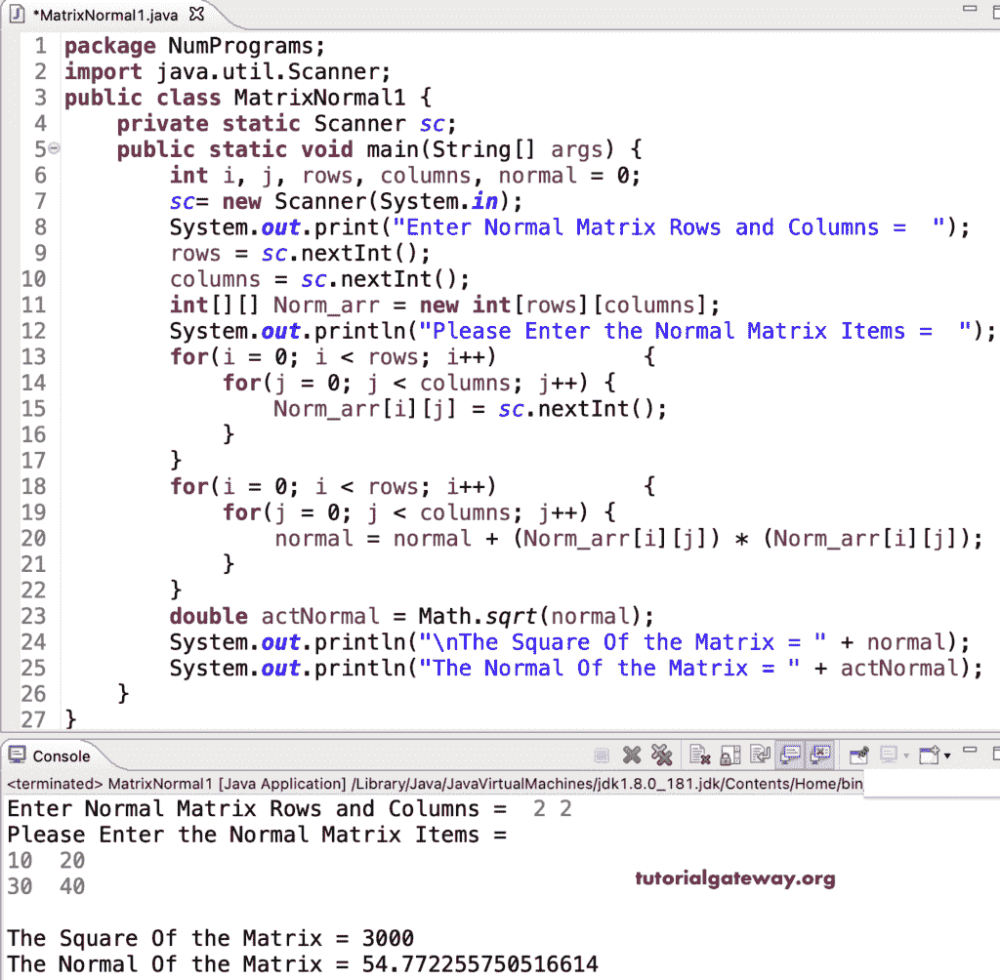

# Java 程序：寻找矩阵法线

> 原文：<https://www.tutorialgateway.org/java-program-to-find-the-normal-of-a-matrix/>

用 for 循环写一个 Java 程序来求矩阵的法线。矩阵的法线是矩阵项平方和的平方根。在这个 Java 矩阵正规的例子中，我们使用嵌套 for 循环来迭代矩阵并找到矩阵的平方。接下来，数学 sqrt 函数将找到矩阵的平方根。

```java
package NumPrograms;

import java.util.Scanner;

public class MatrixNormal1 {
	private static Scanner sc;	
	public static void main(String[] args) {

		int i, j, rows, columns, normal = 0;	
		sc= new Scanner(System.in);	

		System.out.print("Enter Normal Matrix Rows and Columns =  ");
		rows = sc.nextInt();
		columns = sc.nextInt();

		int[][] Norm_arr = new int[rows][columns];

		System.out.println("Please Enter the Normal Matrix Items =  ");
		for(i = 0; i < rows; i++) 
		{
			for(j = 0; j < columns; j++) 
			{
				Norm_arr[i][j] = sc.nextInt();
			}		
		}

		for(i = 0; i < rows; i++) 
		{
			for(j = 0; j < columns; j++) 
			{
				normal = normal + (Norm_arr[i][j]) * (Norm_arr[i][j]);
			}		
		}
		double actNormal = Math.sqrt(normal);
		System.out.println("\nThe Square Of the Matrix = " + normal);
		System.out.println("The Normal Of the Matrix = " + actNormal);

	}
}
```



## Java 程序，使用 while 循环查找矩阵的法线

```java
package NumPrograms;

import java.util.Scanner;

public class MatrixNormal2 {
	private static Scanner sc;	
	public static void main(String[] args) {

		int i, j, rows, columns, normal = 0;	
		sc= new Scanner(System.in);	

		System.out.print("Enter Normal Matrix Rows and Columns =  ");
		rows = sc.nextInt();
		columns = sc.nextInt();

		int[][] Norm_arr = new int[rows][columns];

		System.out.println("Please Enter the Normal Matrix Items =  ");
		i = 0; 
		while(i < rows) 
		{
			j = 0; 
			while(j < columns) 
			{
				Norm_arr[i][j] = sc.nextInt();
				normal = normal + (Norm_arr[i][j]) * (Norm_arr[i][j]);
				j++;
			}
			i++;
		}

		double actNormal = Math.sqrt(normal);
		System.out.println("\nThe Square Of the Matrix = " + normal);
		System.out.println("The Normal Of the Matrix = " + actNormal);

	}
}
```

```java
Enter Normal Matrix Rows and Columns =  3 3
Please Enter the Normal Matrix Items =  
15 25 35
45 55 65
75 85 95

The Square Of the Matrix = 33225
The Normal Of the Matrix = 182.27726133558184
```

这个 [Java 例子](https://www.tutorialgateway.org/learn-java-programs/)使用 do while 循环计算并打印给定矩阵的法线。

```java
package NumPrograms;

import java.util.Scanner;

public class MatrixNormal3 {
	private static Scanner sc;	
	public static void main(String[] args) {

		int i, j, rows, columns, normal = 0;	
		sc= new Scanner(System.in);	

		System.out.print("Enter Normal Matrix Rows and Columns =  ");
		rows = sc.nextInt();
		columns = sc.nextInt();

		int[][] Norm_arr = new int[rows][columns];

		System.out.println("Please Enter the Normal Matrix Items =  ");
		i = 0; 

		do
		{
			j = 0; 
			do
			{
				Norm_arr[i][j] = sc.nextInt();
				normal = normal + (Norm_arr[i][j]) * (Norm_arr[i][j]);

			}while(++j < columns);

		} while(++i < rows);

		double actNormal = Math.sqrt(normal);
		System.out.println("\nThe Square Of the Matrix = " + normal);
		System.out.println("The Normal Of the Matrix = " + actNormal);

	}
}
```

```java
Enter Normal Matrix Rows and Columns =  3 3
Please Enter the Normal Matrix Items =  
10 20 30
40 50 60
70 80 90

The Square Of the Matrix = 28500
The Normal Of the Matrix = 168.81943016134133
```