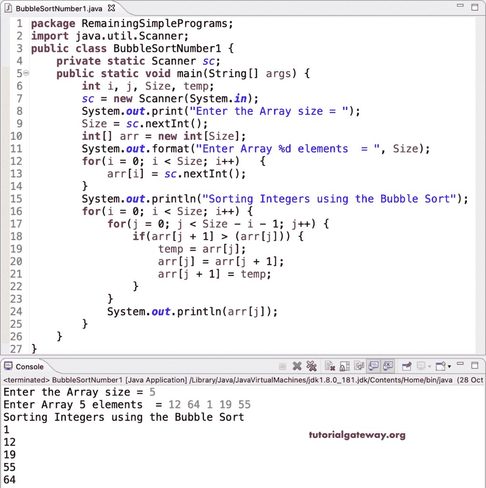

# Java 程序：整数的冒泡排序

> 原文：<https://www.tutorialgateway.org/java-bubble-sort-program-on-integers/>

编写一个 Java 冒泡排序程序，使用 for 循环对整数数组项执行冒泡排序。在这个 Java 示例中，我们使用 multiple for 循环来迭代整数数组，比较相邻的数字，并交换它们。

```java
package RemainingSimplePrograms;

import java.util.Scanner;

public class BubbleSortNumber1 {

	private static Scanner sc;

	public static void main(String[] args) {
		int i, j, Size, temp;

		sc = new Scanner(System.in);		
		System.out.print("Enter the Array size = ");
		Size = sc.nextInt();

		int[] arr = new int[Size];

		System.out.format("Enter Array %d elements  = ", Size);
		for(i = 0; i < Size; i++) 
		{
			arr[i] = sc.nextInt();
		}

		System.out.println("Sorting Integers using the Bubble Sort");
		for(i = 0; i < Size; i++)
		{
			for(j = 0; j < Size - i - 1; j++)
			{
				if(arr[j + 1] > (arr[j]))
				{
					temp = arr[j];
					arr[j] = arr[j + 1];
					arr[j + 1] = temp;
				}
			}
			System.out.println(arr[j]);
		}
	}
}
```



对整数执行冒泡排序是另一个 [Java 例子](https://www.tutorialgateway.org/learn-java-programs/)。

```java
package RemainingSimplePrograms;

import java.util.Scanner;

public class BubbleSortNumber2 {

	private static Scanner sc;

	public static void main(String[] args) {
		int i, j, Size, temp;

		sc = new Scanner(System.in);		
		System.out.print("Enter the Array size = ");
		Size = sc.nextInt();

		int[] arr = new int[Size];

		System.out.format("Enter Array %d elements  = ", Size);
		for(i = 0; i < Size; i++) 
		{
			arr[i] = sc.nextInt();
		}

		System.out.println("Sorting Integers using the Bubble Sort");
		for(j = 0; j < Size; j++)
		{
			for(i = j + 1; i < Size; i++)
			{
				if(arr[i] < (arr[j]))
				{
					temp = arr[j];
					arr[j] = arr[i];
					arr[i] = temp;
				}
			}
			System.out.println(arr[j]);
		}
	}
}
```

```java
Enter the Array size = 5
Enter Array 5 elements  = 14 99 5 25 11
Sorting Integers using the Bubble Sort
5
11
14
25
99
```

使用 while 循环的整数 Java 冒泡排序程序。

```java
package RemainingSimplePrograms;

import java.util.Scanner;

public class BubbleSortNumber3 {

	private static Scanner sc;

	public static void main(String[] args) {
		int i, j, Size, temp;

		sc = new Scanner(System.in);		
		System.out.print("Enter the Array size = ");
		Size = sc.nextInt();

		int[] arr = new int[Size];

		System.out.format("Enter Array %d elements  = ", Size);
		for(i = 0; i < Size; i++) 
		{
			arr[i] = sc.nextInt();
		}

		System.out.println("Sorting Integers using the Bubble Sort");
		i = 0;
		while( i < Size)
		{
			j = 0;
			while( j < Size - i - 1)
			{
				if(arr[j + 1] > (arr[j]))
				{
					temp = arr[j];
					arr[j] = arr[j + 1];
					arr[j + 1] = temp;
				}
				j++;
			}
			System.out.println(arr[j]);
			i++;
		}
	}
}
```

```java
Enter the Array size = 7
Enter Array 7 elements  = 11 88 7 64 1 99 55
Sorting Integers using the Bubble Sort
1
7
11
55
64
88
99
```