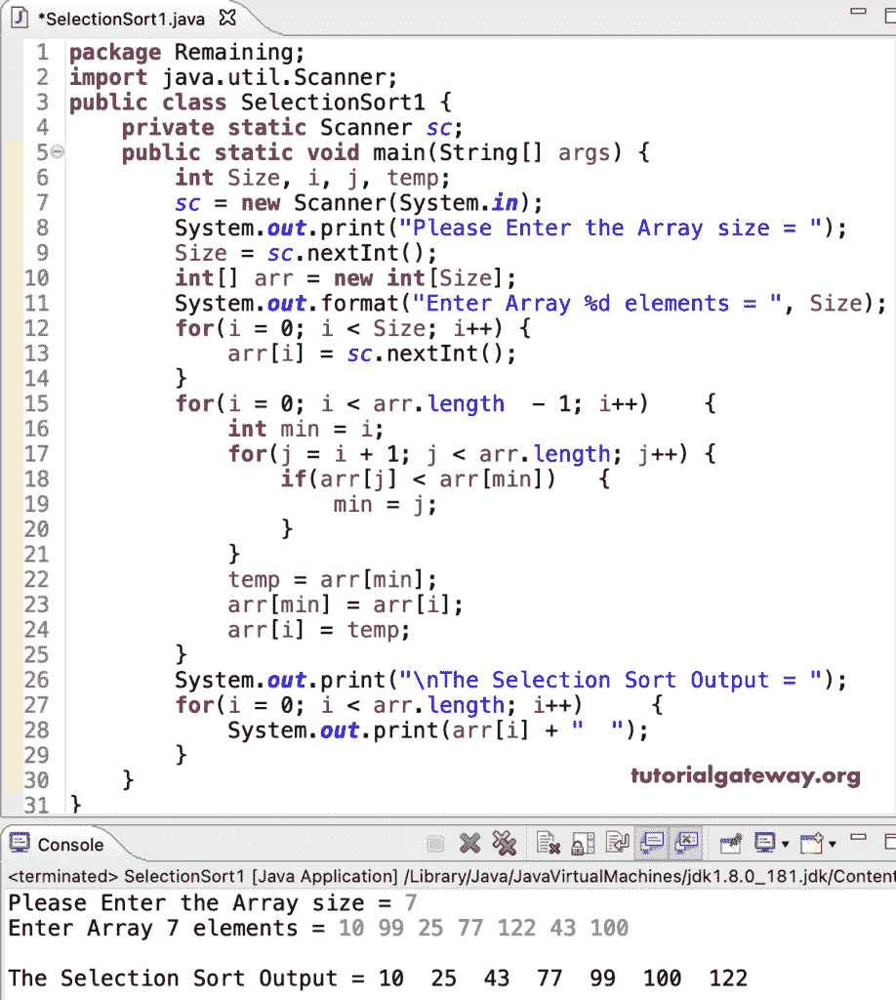

# Java 程序：执行选择排序

> 原文：<https://www.tutorialgateway.org/java-program-to-perform-selection-sort/>

编写一个 Java 程序来执行选择排序。这个 Java 示例允许输入数组大小、项目，并使用嵌套 for 循环对数组执行选择排序。

```java
package Remaining;

import java.util.Scanner;

public class SelectionSort1 {
	private static Scanner sc;

	public static void main(String[] args) {
		int Size, i, j, temp;

		sc = new Scanner(System.in);		
		System.out.print("Please Enter the Array size = ");
		Size = sc.nextInt();

		int[] arr = new int[Size];

		System.out.format("Enter Array %d elements = ", Size);
		for(i = 0; i < Size; i++) {
			arr[i] = sc.nextInt();
		}

		for(i = 0; i < arr.length  - 1; i++)
		{
			int min = i;

			for(j = i + 1; j < arr.length; j++)
			{
				if(arr[j] < arr[min])
				{
					min = j;
				}
			}
			temp = arr[min];
			arr[min] = arr[i];
			arr[i] = temp;

		}
		System.out.print("\nThe Selection Sort Output = ");
		for(i = 0; i < arr.length; i++) 
		{
			System.out.print(arr[i] + "  ");
		}
	}
}
```



使用 while 循环对数组执行选择排序的 Java 程序。

```java
package Remaining;

import java.util.Scanner;

public class SelectionSort2 {
	private static Scanner sc;

	public static void main(String[] args) {
		int Size, i, j, temp;

		sc = new Scanner(System.in);		
		System.out.print("Please Enter the Array size = ");
		Size = sc.nextInt();

		int[] arr = new int[Size];

		System.out.format("Enter Array %d elements = ", Size);
		i = 0; 
		while(i < Size) {
			arr[i] = sc.nextInt();
			i++;
		}

		i = 0; 
		while(i < arr.length - 1)
		{
			int min = i;
			j = i + 1;

			while(j < arr.length)
			{
				if(arr[j] < arr[min])
				{
					min = j;
				}
				j++;
			}
			temp = arr[min];
			arr[min] = arr[i];
			arr[i] = temp;
			i++;
		}
		System.out.print("\nOutput = ");
		i = 0; 
		while(i < arr.length) 
		{
			System.out.print(arr[i] + "  ");
			i++;
		}
	}
}
```

```java
Please Enter the Array size = 9
Enter Array 9 elements = 89 75 22 11 99 126 6 33 50

Output = 6  11  22  33  50  75  89  99  126 
```

编写 java [程序](https://www.tutorialgateway.org/learn-java-programs/)对数组进行选择排序是另一种方式。

```java
package Remaining;

import java.util.Scanner;

public class SelectionSort3 {
	private static Scanner sc;

	public static void main(String[] args) {
		int Size, i, j, temp;

		sc = new Scanner(System.in);		
		System.out.print("Please Enter the Array size = ");
		Size = sc.nextInt();

		int[] arr = new int[Size];

		System.out.format("Enter Array %d elements = ", Size);
		for(i = 0; i < Size; i++) {
			arr[i] = sc.nextInt();
		}

		for(i = 0; i < arr.length; i++)
		{	
			for(j = i + 1; j < arr.length; j++)
			{
				if(arr[i] > arr[j])
				{
					temp = arr[i];
					arr[i] = arr[j];
					arr[j] = temp;
				}
			}		
		}

		System.out.print("\nOutput = ");
		for(i = 0; i < arr.length; i++) 
		{
			System.out.print(arr[i] + "  ");
		}
	}
}
```

```java
Please Enter the Array size = 8
Enter Array 8 elements = 22 98 76 43 56 19 72 100

Output = 19  22  43  56  72  76  98  100 
```