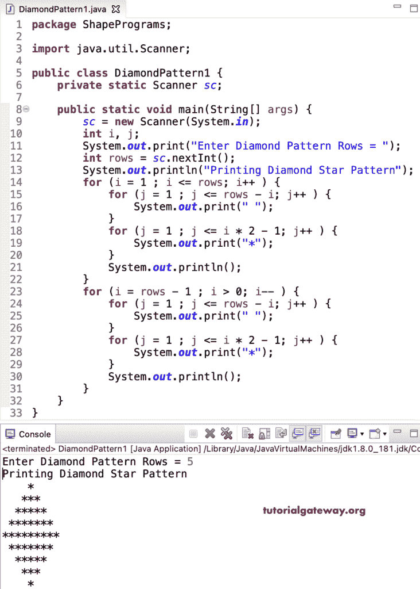

# Java 程序：打印星号的菱形图案

> 原文：<https://www.tutorialgateway.org/java-program-to-print-diamond-star-pattern/>

编写一个 Java 程序，使用 for 循环打印星号的菱形图案。菱形图案是金字塔和倒金字塔的组合。所以，这个 Java star diamond 示例划分代码来打印正金字塔和倒金字塔。

```java
package ShapePrograms;

import java.util.Scanner;

public class DiamondPattern1 {
	private static Scanner sc;

	public static void main(String[] args) {
		sc = new Scanner(System.in);

		int i, j;

		System.out.print("Enter Diamond Pattern Rows = ");
		int rows = sc.nextInt();

		System.out.println("Printing Diamond Star Pattern");

		for (i = 1 ; i <= rows; i++ ) 
		{
			for (j = 1 ; j <= rows - i; j++ ) 
			{
				System.out.print(" ");	
			}
			for (j = 1 ; j <= i * 2 - 1; j++ ) 
			{
				System.out.print("*");
			}
			System.out.println();
		}

		for (i = rows - 1 ; i > 0; i-- ) 
		{
			for (j = 1 ; j <= rows - i; j++ ) 
			{
				System.out.print(" ");
			}
			for (j = 1 ; j <= i * 2 - 1; j++ ) 
			{
				System.out.print("*");
			}
			System.out.println();
		}
	}
}
```



在这个 Java 菱形模式的星星[程序](https://www.tutorialgateway.org/learn-java-programs/)中，我们用一个 [while 循环](https://www.tutorialgateway.org/java-while-loop/)代替了循环的[。](https://www.tutorialgateway.org/java-for-loop/)

```java
package ShapePrograms;

import java.util.Scanner;

public class DiamondPattern3 {
	private static Scanner sc;

	public static void main(String[] args) {
		sc = new Scanner(System.in);

		int i, j, k;

		System.out.print("Enter Diamond Pattern Rows = ");
		int rows = sc.nextInt();

		System.out.println("Printing Diamond Star Pattern");
		i = 1 ;
		while(i <= rows ) 
		{
			j = 1 ;
			while( j <= rows - i  ) 
			{
				System.out.print(" ");	
				j++;
			}
			k = 1 ;
			while ( k <= i * 2 - 1 ) 
			{
				System.out.print("*");
				k++;
			}
			System.out.println();
			i++;
		}
		i = rows - 1 ;
		while( i > 0 ) 
		{
			j = 1 ;
			while ( j <= rows - i ) 
			{
				System.out.print(" ");
				j++;
			}
			k = 1 ;
			while( k <= i * 2 - 1 ) 
			{
				System.out.print("*");
				k++;
			}
			System.out.println();
			i--;
		}
	}
}
```

```java
Enter Diamond Pattern Rows = 12
Printing Diamond Star Pattern
           *
          ***
         *****
        *******
       *********
      ***********
     *************
    ***************
   *****************
  *******************
 *********************
***********************
 *********************
  *******************
   *****************
    ***************
     *************
      ***********
       *********
        *******
         *****
          ***
           *
```

## 用边循环边打印星号的菱形图案的 Java 程序

```java
package ShapePrograms;

import java.util.Scanner;

public class DiamondPattern4 {
	private static Scanner sc;

	public static void main(String[] args) {
		sc = new Scanner(System.in);

		int i, j, k;

		System.out.print("Enter Diamond Pattern Rows = ");
		int rows = sc.nextInt();

		System.out.println("Printing Diamond Star Pattern");
		i = 1 ;
		do
		{
			j = 1 ;
			do
			{
				System.out.print(" ");	
			} while( j++ <= rows - i  ) ;
			k = 1 ;
			do
			{
				System.out.print("*");
			} while ( ++k <= i * 2 - 1 ) ;
			System.out.println();

		} while(++i <= rows ) ;

		i = rows - 1 ;
		do
		{
			j = 1 ;
			do
			{
				System.out.print(" ");
			} while (j++ <= rows - i ) ;
			k = 1 ;
			do
			{
				System.out.print("*");
			} while( ++k <= i * 2 - 1 ) ;
			System.out.println();
		} while( --i > 0 ) ;
	}
}
```

```java
Enter Diamond Pattern Rows = 15
Printing Diamond Star Pattern
               *
              ***
             *****
            *******
           *********
          ***********
         *************
        ***************
       *****************
      *******************
     *********************
    ***********************
   *************************
  ***************************
 *****************************
  ***************************
   *************************
    ***********************
     *********************
      *******************
       *****************
        ***************
         *************
          ***********
           *********
            *******
             *****
              ***
               *
```

在这个 Java 例子中，菱形图案函数打印给定符号的菱形图案。

```java
package ShapePrograms;

import java.util.Scanner;

public class DiamondPattern2 {
	private static Scanner sc;

	public static void main(String[] args) {
		sc = new Scanner(System.in);

		System.out.print("Enter Diamond Pattern Rows = ");
		int rows = sc.nextInt();

		System.out.print("Enter Character for Diamond Pattern = ");
		char ch = sc.next().charAt(0);

		System.out.println("Printing Diamond Pattern");
		diamondPattern(rows, ch);
	}
	public static void diamondPattern(int rows, char ch) {
		int i, j, k;
		int x = rows - 1;
		int y = 1;

		for (i = 1 ; i <= rows; i++ ) 
		{
			for (j = 1 ; j <= x; j++ ) 
			{
				System.out.print(" ");	
			}
			for (k = 1 ; k <= y; k++ ) 
			{
				System.out.print(ch);
			}
			if(x > i)
			{
				x = x - 1;
				y = y + 2;
			}
			if(x < i)
			{
				x = x + 1;
				y = y - 2;
			}
			System.out.println();
		}
	}
}
```

```java
Enter Diamond Pattern Rows = 10
Enter Character for Diamond Pattern = #
Printing Diamond Pattern
         #
        ###
       #####
      #######
     #########
     #########
      #######
       #####
        ###
         #
```