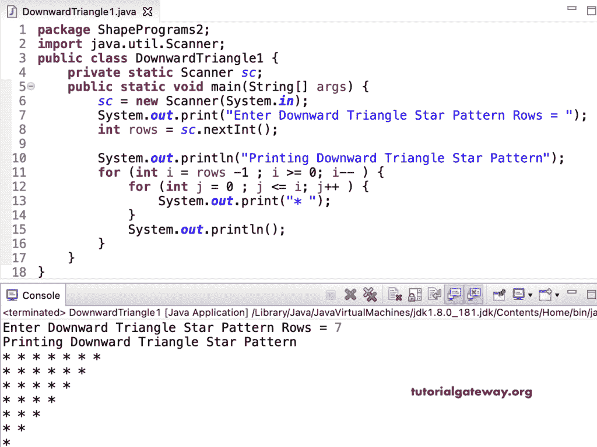

# Java 程序：打印向下三角形星形图案

> 原文：<https://www.tutorialgateway.org/java-program-to-print-downward-triangle-star-pattern/>

编写一个 Java 程序，使用 for 循环打印向下的三角形星形图案。

```java
package ShapePrograms2;

import java.util.Scanner;

public class DownwardTriangle1 {
	private static Scanner sc;

	public static void main(String[] args) {
		sc = new Scanner(System.in);

		System.out.print("Enter Downward Triangle Star Pattern Rows = ");
		int rows = sc.nextInt();

		System.out.println("Printing Downward Triangle Star Pattern");

		for (int i = rows -1 ; i >= 0; i-- ) 
		{
			for (int j = 0 ; j <= i; j++ ) 
			{
				System.out.print("* ");
			}
			System.out.println();
		}
	}
}
```



这个 [Java 例子](https://www.tutorialgateway.org/learn-java-programs/)使用 while 循环显示了恒星向下的三角形模式。

```java
package ShapePrograms2;

import java.util.Scanner;

public class DownwardTriangle2 {
	private static Scanner sc;

	public static void main(String[] args) {
		sc = new Scanner(System.in);

		System.out.print("Enter Downward Triangle Star Pattern Rows = ");
		int rows = sc.nextInt();

		System.out.println("Printing Downward Triangle Star Pattern");

		int j, i = rows - 1 ;

		while ( i >= 0) 
		{
			j = 0 ;

			while ( j <= i ) 
			{
				System.out.print("* ");
				 j++;
			}
			System.out.println();
			i--;
		}
	}
}
```

```java
Enter Downward Triangle Star Pattern Rows = 8
Printing Downward Triangle Star Pattern
* * * * * * * * 
* * * * * * * 
* * * * * * 
* * * * * 
* * * * 
* * * 
* * 
* 
```

使用 do while 循环打印向下三角形星形图案的 Java 程序。

```java
package ShapePrograms2;

import java.util.Scanner;

public class DownwardTriangle3 {
	private static Scanner sc;

	public static void main(String[] args) {
		sc = new Scanner(System.in);

		System.out.print("Enter Downward Triangle Star Pattern Rows = ");
		int rows = sc.nextInt();

		System.out.println("Printing Downward Triangle Star Pattern");

		int j, i = rows - 1 ;

		do
		{
			j = 0 ;

			do
			{
				System.out.print("* ");

			} while ( ++j <= i );

			System.out.println();

		} while ( --i >= 0);
	}
}
```

```java
Enter Downward Triangle Star Pattern Rows = 14
Printing Downward Triangle Star Pattern
* * * * * * * * * * * * * * 
* * * * * * * * * * * * * 
* * * * * * * * * * * * 
* * * * * * * * * * * 
* * * * * * * * * * 
* * * * * * * * * 
* * * * * * * * 
* * * * * * * 
* * * * * * 
* * * * * 
* * * * 
* * * 
* * 
*
```

在这个 Java 例子中，DownwardTrianglePattern 函数打印给定符号的向下三角形模式。

```java
package ShapePrograms2;

import java.util.Scanner;

public class DownwardTriangle4 {
	private static Scanner sc;

	public static void main(String[] args) {
		sc = new Scanner(System.in);

		System.out.print("Enter Downward Triangle Star Pattern Rows = ");
		int rows = sc.nextInt();

		System.out.print("Enter Character for Downward Triangle Pattern = ");
		char ch = sc.next().charAt(0);

		System.out.println("Printing Downward Triangle Pattern");
		DownwardTrianglePattern(rows, ch);
	}

	public static void DownwardTrianglePattern(int rows, char ch) {
		for (int i = rows -1 ; i >= 0; i-- ) 
		{
			for (int j = 0 ; j <= i; j++ ) 
			{
				System.out.print(ch + " ");
			}
			System.out.println();
		}
	}
}
```

```java
Enter Downward Triangle Star Pattern Rows = 14
Enter Character for Downward Triangle Pattern = #
Printing Downward Triangle Pattern
# # # # # # # # # # # # # # 
# # # # # # # # # # # # # 
# # # # # # # # # # # # 
# # # # # # # # # # # 
# # # # # # # # # # 
# # # # # # # # # 
# # # # # # # # 
# # # # # # # 
# # # # # # 
# # # # # 
# # # # 
# # # 
# # 
# 
```