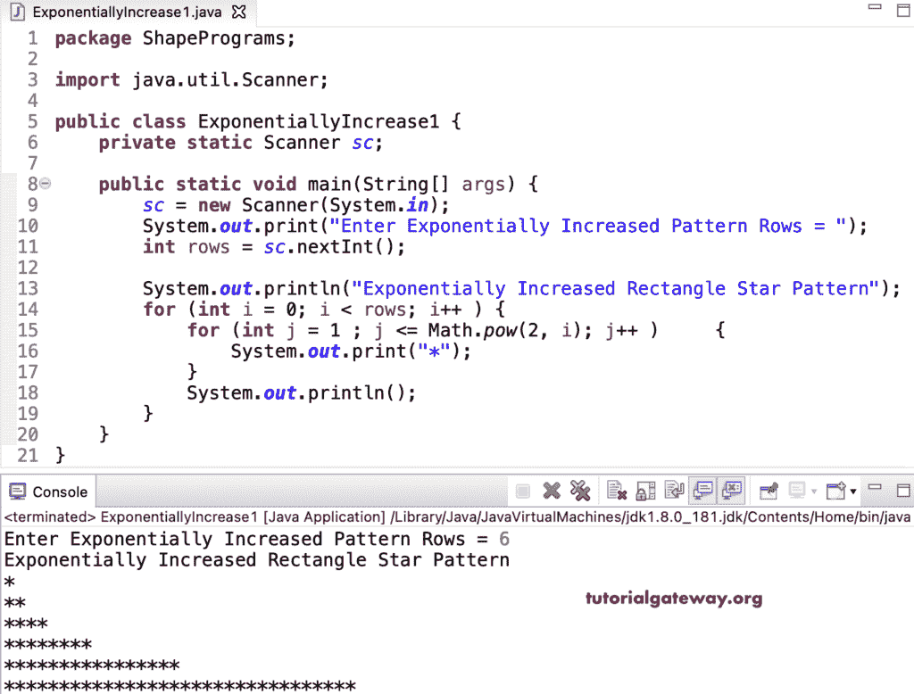

# Java 程序：打印星号的指数增长图案

> 原文：<https://www.tutorialgateway.org/java-program-to-print-exponentially-increased-star-pattern/>

编写一个 Java 程序，使用 for 循环打印星号的指数增长的图案。它使用嵌套 for 循环，其中第一个 for 循环从零迭代到给定的行。然后，Java 嵌套循环对每次迭代从 1 迭代到 I 值的幂，以打印星号的指数增长的图案。

```java
package ShapePrograms;

import java.util.Scanner;

public class ExponentiallyIncrease1 {
	private static Scanner sc;

	public static void main(String[] args) {
		sc = new Scanner(System.in);

		System.out.print("Enter Exponentially Increased Pattern Rows = ");
		int rows = sc.nextInt();

		System.out.println("Exponentially Increased Rectangle Star Pattern");

		for (int i = 0; i < rows; i++ ) 
		{
			for (int j = 1 ; j <= Math.pow(2, i); j++ ) 
			{
				System.out.print("*");
			}
			System.out.println();
		}
	}
}
```



在这个 Java 指数增长的星号图案[程序](https://www.tutorialgateway.org/learn-java-programs/)中，我们用一个 [while 循环](https://www.tutorialgateway.org/java-while-loop/)代替了循环的[。](https://www.tutorialgateway.org/java-for-loop/)

```java
package ShapePrograms;

import java.util.Scanner;

public class ExponentiallyIncrease2 {
	private static Scanner sc;

	public static void main(String[] args) {
		sc = new Scanner(System.in);

		System.out.print("Enter Exponentially Increased Pattern Rows = ");
		int rows = sc.nextInt();

		System.out.println("Printing Exponentially Increased Rectangle Star Pattern");

		int i = 0, j;
		while( i < rows) 
		{
			j = 1 ;
			while ( j <= Math.pow(2, i) ) 
			{
				System.out.print("*");
				j++;
			}
			System.out.println();
			i++ ;
		}
	}
}
```

```java
Enter Exponentially Increased Pattern Rows = 7
Printing Exponentially Increased Rectangle Star Pattern
*
**
****
********
****************
********************************
****************************************************************
```

## 使用边循环边打印星号的指数增长图案的 Java 程序

```java
package ShapePrograms;

import java.util.Scanner;

public class ExponentiallyIncrease3 {
	private static Scanner sc;

	public static void main(String[] args) {
		sc = new Scanner(System.in);

		int i = 0, j;

		System.out.print("Enter Exponentially Increased Pattern Rows = ");
		int rows = sc.nextInt();

		System.out.println("Printing Exponentially Increased Rectangle Star Pattern");

		do
		{
			j = 1 ;
			do
			{
				System.out.print("*");
			} while ( ++j <= Math.pow(2, i) );
			System.out.println();
		} while( ++i < rows) ;
	}
}
```

```java
Enter Exponentially Increased Pattern Rows = 4
Printing Exponentially Increased Rectangle Star Pattern
*
**
****
********
```

在这个 Java 例子中，指数增长模式函数打印给定符号的指数增长模式。

```java
package ShapePrograms;

import java.util.Scanner;

public class ExponentiallyIncrease4 {
	private static Scanner sc;

	public static void main(String[] args) {
		sc = new Scanner(System.in);

		System.out.print("Enter Exponentially Increased Pattern Rows = ");
		int rows = sc.nextInt();

		System.out.print("Enter Character for Exponentially Increased Pattern = ");
		char ch = sc.next().charAt(0);

		System.out.println("Printing Exponentially Increased Rectangle Star Pattern");
		ExponentiallyIncreasedPattern(rows, ch);

	}

	public static void ExponentiallyIncreasedPattern(int rows, char ch) {
		for (int i = 0; i < rows; i++ ) 
		{
			for (int j = 1 ; j <= Math.pow(2, i); j++ ) 
			{
				System.out.print(ch);
			}
			System.out.println();
		}
	}
}
```

```java
Enter Exponentially Increased Pattern Rows = 7
Enter Character for Exponentially Increased Pattern = #
Printing Exponentially Increased Rectangle Star Pattern
#
##
####
########
################
################################
################################################################
```