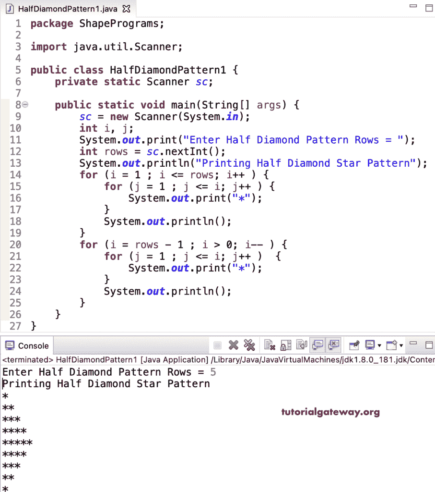

# Java 程序：打印星号的半菱形图案

> 原文：<https://www.tutorialgateway.org/java-program-to-print-half-diamond-star-pattern/>

编写一个 Java 程序来打印星号的半菱形图案，或者编写一个 Java 程序来打印星号的用于循环的右侧半菱形图案。这个 Java 半菱形星号示例打印了直角三角形和倒直角三角形，因为两者的组合给出了菱形的右侧半部分。

```java
package ShapePrograms;

import java.util.Scanner;

public class HalfDiamondPattern1 {
	private static Scanner sc;

	public static void main(String[] args) {
		sc = new Scanner(System.in);

		int i, j;

		System.out.print("Enter Half Diamond Pattern Rows = ");
		int rows = sc.nextInt();

		System.out.println("Printing Half Diamond Star Pattern");

		for (i = 1 ; i <= rows; i++ ) 
		{
			for (j = 1 ; j <= i; j++ ) 
			{
				System.out.print("*");	
			}
			System.out.println();
		}

		for (i = rows - 1 ; i > 0; i-- ) 
		{
			for (j = 1 ; j <= i; j++ ) 
			{
				System.out.print("*");
			}
			System.out.println();
		}
	}
}
```



在这个 Java 半菱形星号图案[程序](https://www.tutorialgateway.org/learn-java-programs/)中，我们用一个 [while 循环](https://www.tutorialgateway.org/java-while-loop/)代替了循环的[。](https://www.tutorialgateway.org/java-for-loop/)

```java
package ShapePrograms;

import java.util.Scanner;

public class HalfDiamondPattern2 {
	private static Scanner sc;

	public static void main(String[] args) {
		sc = new Scanner(System.in);

		int i, j;

		System.out.print("Enter Half Diamond Pattern Rows = ");
		int rows = sc.nextInt();

		System.out.println("Printing Half Diamond Star Pattern");
		i = 1 ;
		while ( i <= rows ) 
		{
			j = 1 ;
			while (j <= i ) 
			{
				System.out.print("*");
				j++;
			}
			System.out.println();
			i++;
		}
		i = rows - 1;
		while ( i > 0) 
		{
			j = 1 ;
			while ( j <= i ) 
			{
				System.out.print("*");
				j++;
			}
			System.out.println();
			i-- ;
		}
	}
}
```

```java
Enter Half Diamond Pattern Rows = 7
Printing Half Diamond Star Pattern
*
**
***
****
*****
******
*******
******
*****
****
***
**
*
```

## 用边循环边做边打印星号的半菱形图案的 Java 程序

```java
package ShapePrograms;

import java.util.Scanner;

public class HalfDiamondPattern3 {
	private static Scanner sc;

	public static void main(String[] args) {
		sc = new Scanner(System.in);

		int i, j;

		System.out.print("Enter Half Diamond Pattern Rows = ");
		int rows = sc.nextInt();

		System.out.println("Printing Half Diamond Star Pattern");
		i = 1 ;
		do
		{
			j = 1 ;
			do
			{
				System.out.print("*");
			} while (++j <= i ) ;
			System.out.println();
		} while ( ++i <= rows ) ;
		i = rows - 1;
		do
		{
			j = 1 ;
			do
			{
				System.out.print("*");
			} while ( ++j <= i ) ;
			System.out.println();
		} while ( --i > 0) ;
	}
}
```

```java
Enter Half Diamond Pattern Rows = 9
Printing Half Diamond Star Pattern
*
**
***
****
*****
******
*******
********
*********
********
*******
******
*****
****
***
**
*
```

在这个 Java 例子中，HalfDiamondPattern 函数打印给定符号的半菱形图案。

```java
package ShapePrograms;

import java.util.Scanner;

public class HalfDiamondPattern4 {
	private static Scanner sc;

	public static void main(String[] args) {
		sc = new Scanner(System.in);

		System.out.print("Enter Half Diamond Pattern Rows = ");
		int rows = sc.nextInt();

		System.out.print("Enter Character for Hollow Diamond Pattern = ");
		char ch = sc.next().charAt(0);

		System.out.println("Printing Half Diamond Star Pattern");
		HalfDiamondPattern(rows, ch);
	}

	public static void HalfDiamondPattern(int rows, char ch) {
		int i, j;

		for (i = 1 ; i <= rows; i++ ) 
		{
			for (j = 1 ; j <= i; j++ ) 
			{
				System.out.print(ch);	
			}
			System.out.println();
		}

		for (i = rows - 1 ; i > 0; i-- ) 
		{
			for (j = 1 ; j <= i; j++ ) 
			{
				System.out.print(ch);
			}
			System.out.println();
		}
	}
}
```

```java
Enter Half Diamond Pattern Rows = 12
Enter Character for Hollow Diamond Pattern = #
Printing Half Diamond Star Pattern
#
##
###
####
#####
######
#######
########
#########
##########
###########
############
###########
##########
#########
########
#######
######
#####
####
###
##
#
```