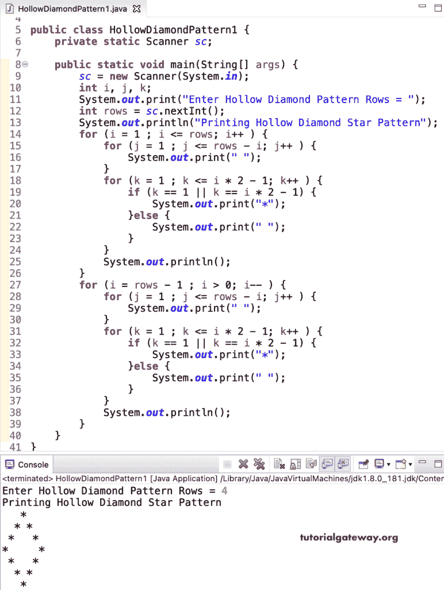

# Java 程序：打印空心菱形星形图案

> 原文：<https://www.tutorialgateway.org/java-program-to-print-hollow-diamond-star-pattern/>

编写一个 Java 程序，使用嵌套 for 循环和 if-else 语句打印空心菱形星形模式。这个 Java 空心菱形示例检查外部菱形线条，并打印星星以获得空心形状。

```java
package ShapePrograms;

import java.util.Scanner;

public class HollowDiamondPattern1 {
	private static Scanner sc;

	public static void main(String[] args) {
		sc = new Scanner(System.in);

		int i, j, k;

		System.out.print("Enter Hollow Diamond Pattern Rows = ");
		int rows = sc.nextInt();

		System.out.println("Printing Hollow Diamond Star Pattern");

		for (i = 1 ; i <= rows; i++ ) 
		{
			for (j = 1 ; j <= rows - i; j++ ) 
			{
				System.out.print(" ");	
			}
			for (k = 1 ; k <= i * 2 - 1; k++ ) 
			{
				if (k == 1 || k == i * 2 - 1) {
					System.out.print("*");
				}
				else {
					System.out.print(" ");
				}
			}
			System.out.println();
		}

		for (i = rows - 1 ; i > 0; i-- ) 
		{
			for (j = 1 ; j <= rows - i; j++ ) 
			{
				System.out.print(" ");
			}
			for (k = 1 ; k <= i * 2 - 1; k++ ) 
			{
				if (k == 1 || k == i * 2 - 1) {
					System.out.print("*");
				}
				else {
					System.out.print(" ");
				}
			}
			System.out.println();
		}
	}
}
```



在这个 Java 空心钻石星形模式[程序](https://www.tutorialgateway.org/learn-java-programs/)中，我们用一个 [while 循环](https://www.tutorialgateway.org/java-while-loop/)代替了循环的[。](https://www.tutorialgateway.org/java-for-loop/)

```java
package ShapePrograms;

import java.util.Scanner;

public class HollowDiamondPattern2 {
	private static Scanner sc;

	public static void main(String[] args) {
		sc = new Scanner(System.in);

		int i, j, k;

		System.out.print("Enter Diamond Pattern Rows = ");
		int rows = sc.nextInt();

		System.out.println("Printing Diamond Star Pattern");
		i = 1 ;
		while ( i <= rows) 
		{
			j = 1 ;
			while ( j <= rows - i) 
			{
				System.out.print(" ");	
				j++;
			}
			k = 1 ;
			while ( k <= i * 2 - 1) 
			{
				if (k == 1 || k == i * 2 - 1) {
					System.out.print("*");
				}
				else {
					System.out.print(" ");
				}
				k++;
			}
			System.out.println();
			i++ ;
		}

		i = rows - 1 ;
		while ( i > 0) 
		{
			j = 1 ;
			while(j <= rows - i ) 
			{
				System.out.print(" ");
				j++;
			}
			k = 1 ;
			while (k <= i * 2 - 1 ) 
			{
				if (k == 1 || k == i * 2 - 1) {
					System.out.print("*");
				}
				else {
					System.out.print(" ");
				}
				k++;
			}
			System.out.println();
			i-- ;
		}
	}
}
```

```java
Enter Diamond Pattern Rows = 8
Printing Diamond Star Pattern
       *
      * *
     *   *
    *     *
   *       *
  *         *
 *           *
*             *
 *           *
  *         *
   *       *
    *     *
     *   *
      * *
       *
```

## 用边循环边打印空心菱形星形图案的 Java 程序

```java
package ShapePrograms;

import java.util.Scanner;

public class HollowDiamondPattern3 {
	private static Scanner sc;

	public static void main(String[] args) {
		sc = new Scanner(System.in);

		int i, j, k;

		System.out.print("Enter Diamond Pattern Rows = ");
		int rows = sc.nextInt();

		System.out.println("Printing Diamond Star Pattern");
		i = 1 ;
		do
		{
			j = 1 ;
			do
			{
				System.out.print(" ");	
			} while ( j++ <= rows - i) ;
			k = 1 ;
			do 
			{
				if (k == 1 || k == i * 2 - 1) {
					System.out.print("*");
				}
				else {
					System.out.print(" ");
				}
			} while ( ++k <= i * 2 - 1);
			System.out.println();
		} while ( ++i <= rows) ;

		i = rows - 1 ;
		do
		{
			j = 1 ;
			do 
			{
				System.out.print(" ");
			} while(j++ <= rows - i );
			k = 1 ;
			do 
			{
				if (k == 1 || k == i * 2 - 1) {
					System.out.print("*");
				}
				else {
					System.out.print(" ");
				}
			} while (++k <= i * 2 - 1 );
			System.out.println();
		} while ( --i > 0);
	}
}
```

```java
Enter Diamond Pattern Rows = 10
Printing Diamond Star Pattern
          *
         * *
        *   *
       *     *
      *       *
     *         *
    *           *
   *             *
  *               *
 *                 *
  *               *
   *             *
    *           *
     *         *
      *       *
       *     *
        *   *
         * *
          *
```

在这个 Java 示例中，HollowDiamondPattern 函数打印给定符号的空心菱形图案。

```java
package ShapePrograms;

import java.util.Scanner;

public class HollowDiamondPattern4 {
	private static Scanner sc;

	public static void main(String[] args) {
		sc = new Scanner(System.in);

		System.out.print("Enter Hollow Diamond Pattern Rows = ");
		int rows = sc.nextInt();

		System.out.print("Enter Character for Hollow Diamond Pattern = ");
		char ch = sc.next().charAt(0);

		System.out.println("Printing Hollow Diamond Pattern");
		HollowDiamondPattern(rows, ch);
	}
	public static void HollowDiamondPattern(int rows, char ch) {
		int i, j, k;
		for (i = 1 ; i <= rows; i++ ) 
		{
			for (j = 1 ; j <= rows - i; j++ ) 
			{
				System.out.print(" ");	
			}
			for (k = 1 ; k <= i * 2 - 1; k++ ) 
			{
				if (k == 1 || k == i * 2 - 1) {
					System.out.print(ch);
				}
				else {
					System.out.print(" ");
				}
			}
			System.out.println();
		}

		for (i = rows - 1 ; i > 0; i-- ) 
		{
			for (j = 1 ; j <= rows - i; j++ ) 
			{
				System.out.print(" ");
			}
			for (k = 1 ; k <= i * 2 - 1; k++ ) 
			{
				if (k == 1 || k == i * 2 - 1) {
					System.out.print(ch);
				}
				else {
					System.out.print(" ");
				}
			}
			System.out.println();
		}
	}
}
```

```java
Enter Hollow Diamond Pattern Rows = 13
Enter Character for Hollow Diamond Pattern = $
Printing Hollow Diamond Pattern
            $
           $ $
          $   $
         $     $
        $       $
       $         $
      $           $
     $             $
    $               $
   $                 $
  $                   $
 $                     $
$                       $
 $                     $
  $                   $
   $                 $
    $               $
     $             $
      $           $
       $         $
        $       $
         $     $
          $   $
           $ $
            $
```