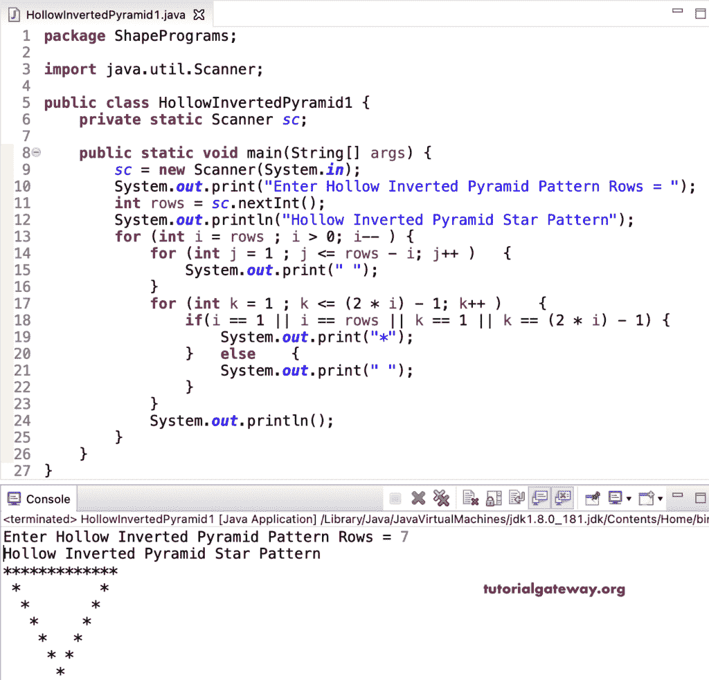

# Java 程序：打印空心倒星形金字塔

> 原文：<https://www.tutorialgateway.org/java-program-to-print-hollow-inverted-star-pyramid/>

写一个 Java 程序打印空心倒星形金字塔图案，用于循环。这个 Java 倒金字塔模式示例使用嵌套循环中的 if 条件来识别边并显示空心倒金字塔。

```java
package ShapePrograms;

import java.util.Scanner;

public class HollowInvertedPyramid1 {
	private static Scanner sc;

	public static void main(String[] args) {
		sc = new Scanner(System.in);

		System.out.print("Enter Hollow Inverted Pyramid Pattern Rows = ");
		int rows = sc.nextInt();

		System.out.println("Hollow Inverted Pyramid Star Pattern");

		for (int i = rows ; i > 0; i-- ) 
		{
			for (int j = 1 ; j <= rows - i; j++ ) 
			{
				System.out.print(" ");
			}
			for (int k = 1 ; k <= (2 * i) - 1; k++ ) 
			{
				if(i == 1 || i == rows || k == 1 || k == (2 * i) - 1)
				{
					System.out.print("*");
				}
				else
				{
					System.out.print(" ");
				}

			}
			System.out.println();
		}
	}
}
```



在这个 Java 空心倒星形金字塔[程序](https://www.tutorialgateway.org/learn-java-programs/)中，我们将循环的[替换为循环](https://www.tutorialgateway.org/java-for-loop/)的[。](https://www.tutorialgateway.org/java-while-loop/)

```java
package ShapePrograms;

import java.util.Scanner;

public class HollowInvertedPyramid2 {
	private static Scanner sc;

	public static void main(String[] args) {
		sc = new Scanner(System.in);

		System.out.print("Enter Hollow Inverted Pyramid Pattern Rows = ");
		int rows = sc.nextInt();

		System.out.println("Hollow Inverted Pyramid Star Pattern");
		int i = rows, j, k;

		while( i > 0) 
		{
			j = 1 ;
			while(j <= rows - i ) 
			{
				System.out.print(" ");
				j++;
			}
			k = 1 ;
			while(k <= (2 * i) - 1 ) 
			{
				if(i == 1 || i == rows || k == 1 || k == (2 * i) - 1)
				{
					System.out.print("*");
				}
				else
				{
					System.out.print(" ");
				}		
				k++;
			}
			System.out.println();
			i-- ;
		}
	}
}
```

```java
Enter Hollow Inverted Pyramid Pattern Rows = 9
Hollow Inverted Pyramid Star Pattern
*****************
 *             *
  *           *
   *         *
    *       *
     *     *
      *   *
       * *
        *
```

## 用边循环边打印空心倒星形金字塔的 Java 程序

```java
package ShapePrograms;

import java.util.Scanner;

public class HollowInvertedPyramid3 {
	private static Scanner sc;

	public static void main(String[] args) {
		sc = new Scanner(System.in);

		System.out.print("Enter Hollow Inverted Pyramid Pattern Rows = ");
		int rows = sc.nextInt();

		System.out.println("Hollow Inverted Pyramid Star Pattern");
		int i = rows, j, k;	
		do
		{
			j = 1 ;
			do
			{
				System.out.print(" ");
			} while(j++ <= rows - i ) ;
			k = 1 ;
			do
			{
				if(i == 1 || i == rows || k == 1 || k == (2 * i) - 1)
				{
					System.out.print("*");
				}
				else
				{
					System.out.print(" ");
				}		
			} while(++k <= (2 * i) - 1 ) ;
			System.out.println();
		} while( --i > 0) ;
	}
}
```

```java
Enter Hollow Inverted Pyramid Pattern Rows = 13
Hollow Inverted Pyramid Star Pattern
 *************************
  *                     *
   *                   *
    *                 *
     *               *
      *             *
       *           *
        *         *
         *       *
          *     *
           *   *
            * *
             *
```

在这个 Java 示例中，HollowInvertedPyramidPat 函数打印给定符号的空心倒金字塔图案。

```java
package ShapePrograms;

import java.util.Scanner;

public class HollowInvertedPyramid4 {
	private static Scanner sc;

	public static void main(String[] args) {
		sc = new Scanner(System.in);

		System.out.print("Enter Hollow Inverted Pyramid Pattern Rows = ");
		int rows = sc.nextInt();

		System.out.print("Enter Character for Exponentially Increased Pattern = ");
		char ch = sc.next().charAt(0);

		System.out.println("Hollow Inverted Pyramid Star Pattern");
		HollowInvertedPyramidPat(rows, ch);		
	}

	public static void HollowInvertedPyramidPat(int rows, char ch) {
		for (int i = rows ; i > 0; i-- ) 
		{
			for (int j = 1 ; j <= rows - i; j++ ) 
			{
				System.out.print(" ");
			}
			for (int k = 1 ; k <= (2 * i) - 1; k++ ) 
			{
				if(i == 1 || i == rows || k == 1 || k == (2 * i) - 1)
				{
					System.out.print(ch);
				}
				else
				{
					System.out.print(" ");
				}			
			}
			System.out.println();
		}
	}
}
```

```java
Enter Hollow Inverted Pyramid Pattern Rows = 17
Enter Character for Exponentially Increased Pattern = #
Hollow Inverted Pyramid Star Pattern
#################################
 #                             #
  #                           #
   #                         #
    #                       #
     #                     #
      #                   #
       #                 #
        #               #
         #             #
          #           #
           #         #
            #       #
             #     #
              #   #
               # #
                #
```