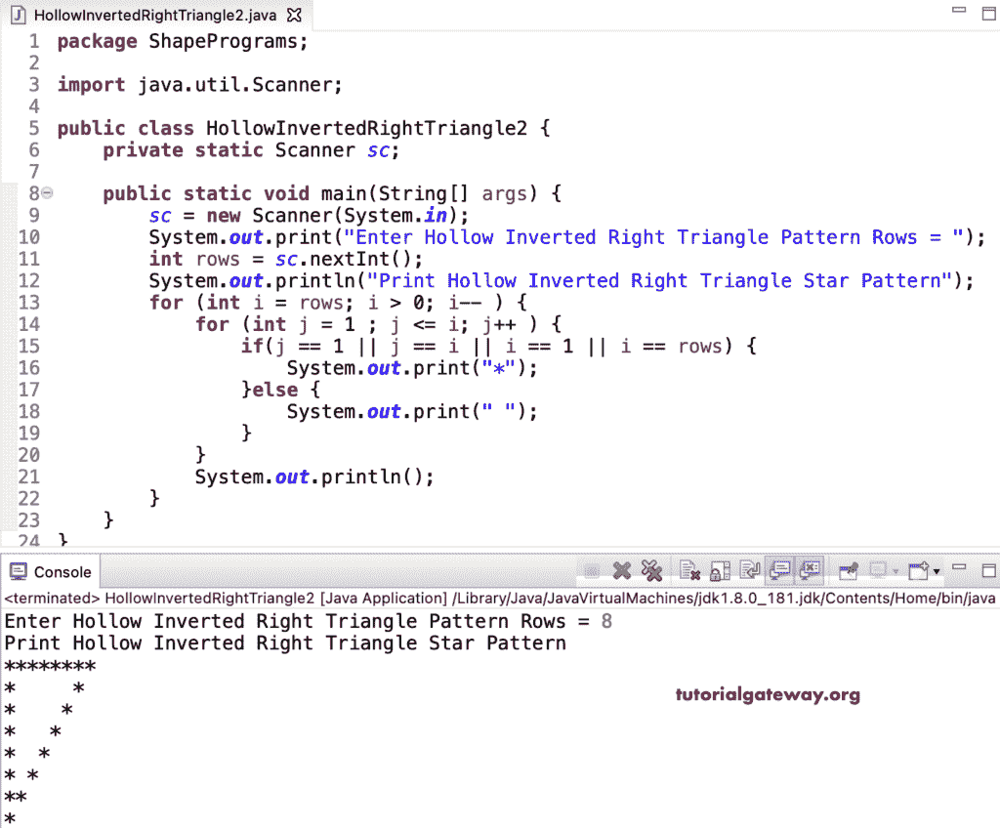

# Java 程序：打印空心倒直角三角形星形图案

> 原文：<https://www.tutorialgateway.org/java-program-to-print-hollow-inverted-right-triangle-star-pattern/>

写一个 Java 程序打印空心倒直角三角形星形图案用于循环。这个 Java 空心倒直角三角形星形模式示例使用 if 语句检查边框。如果是真的，它会打印星星；否则，它会打印一个空白空间来获得空心的倒直角三角形。

```java
package ShapePrograms;

import java.util.Scanner;

public class HollowInvertedRightTriangle1 {
	private static Scanner sc;

	public static void main(String[] args) {
		sc = new Scanner(System.in);

		System.out.print("Enter Hollow Inverted Right Triangle Pattern Rows = ");
		int rows = sc.nextInt();

		System.out.println("Print Hollow Inverted Right Triangle Star Pattern");

		for (int i = rows; i > 0; i-- ) 
		{
			if(i == 1 || i == rows) {
				for (int j = 1 ; j <= i; j++ ) 
				{
					System.out.print("*");
				}
			}
			else {
				for (int k = 1 ; k <= i; k++ ) {
					if(k == 1 || k == i) {
						System.out.print("*");
					}
					else {
						System.out.print(" ");
					}
				}
			}
			System.out.println();
		}
	}
}
```

```java
Enter Hollow Inverted Right Triangle Pattern Rows = 6
Print Hollow Inverted Right Triangle Star Pattern
******
*   *
*  *
* *
**
*
```

我们简化了上面的 [Java](https://www.tutorialgateway.org/learn-java-programs/) 空心倒直角三角形模式代码，去掉了多余的 [if else](https://www.tutorialgateway.org/java-if-else-statement/) 。

```java
package ShapePrograms;

import java.util.Scanner;

public class HollowInvertedRightTriangle2 {
	private static Scanner sc;

	public static void main(String[] args) {
		sc = new Scanner(System.in);

		System.out.print("Enter Hollow Inverted Right Triangle Pattern Rows = ");
		int rows = sc.nextInt();

		System.out.println("Print Hollow Inverted Right Triangle Star Pattern");

		for (int i = rows; i > 0; i-- ) 
		{
			for (int j = 1 ; j <= i; j++ ) 
			{
				if(j == 1 || j == i || i == 1 || i == rows) 
				{
					System.out.print("*");
				}
				else {
					System.out.print(" ");
				}
			}
			System.out.println();
		}
	}
}
```



在这个 Java 空心倒直角三角形星形模式程序中，我们将循环的[替换为](https://www.tutorialgateway.org/java-for-loop/)[而循环](https://www.tutorialgateway.org/java-while-loop/)。

```java
package ShapePrograms;

import java.util.Scanner;

public class HollowInvertedRightTriangle3 {
	private static Scanner sc;

	public static void main(String[] args) {
		sc = new Scanner(System.in);

		System.out.print("Enter Hollow Inverted Right Triangle Pattern Rows = ");
		int rows = sc.nextInt();

		System.out.println("Print Hollow Inverted Right Triangle Star Pattern");
		int j, i = rows;

		while( i > 0) 
		{
			j = 1 ;
			while( j <= i) 
			{
				if(j == 1 || j == i || i == 1 || i == rows) 
				{
					System.out.print("*");
				}
				else {
					System.out.print(" ");
				}
				j++;
			}
			System.out.println();
			i-- ;
		}
	}
}
```

```java
Enter Hollow Inverted Right Triangle Pattern Rows = 11
Print Hollow Inverted Right Triangle Star Pattern
***********
*        *
*       *
*      *
*     *
*    *
*   *
*  *
* *
**
*
```

## 用边循环边打印空心倒直角三角形星形图案的 Java 程序

```java
package ShapePrograms;

import java.util.Scanner;

public class HollowInvertedRightTriangle4 {
	private static Scanner sc;

	public static void main(String[] args) {
		sc = new Scanner(System.in);

		System.out.print("Enter Hollow Inverted Right Triangle Pattern Rows = ");
		int rows = sc.nextInt();

		System.out.println("Print Hollow Inverted Right Triangle Star Pattern");
		int j, i = rows;

		do
		{
			j = 1 ;
			do
			{
				if(j == 1 || j == i || i == 1 || i == rows) 
				{
					System.out.print("*");
				}
				else {
					System.out.print(" ");
				}
			} while( ++j <= i) ;
			System.out.println();
		} while( --i > 0);
	}
}
```

```java
Enter Hollow Inverted Right Triangle Pattern Rows = 14
Print Hollow Inverted Right Triangle Star Pattern
**************
*           *
*          *
*         *
*        *
*       *
*      *
*     *
*    *
*   *
*  *
* *
**
*
```

在这个 Java 示例中，HollowInvertedRightTrianglePat 函数打印给定符号的空心倒直角三角形图案。

```java
package ShapePrograms;

import java.util.Scanner;

public class HollowInvertedRightTriangle5 {
	private static Scanner sc;

	public static void main(String[] args) {
		sc = new Scanner(System.in);

		System.out.print("Enter Hollow Inverted Right Triangle Pattern Rows = ");
		int rows = sc.nextInt();

		System.out.print("Enter Character for Hollow Inverted Right Triangle Pattern = ");
		char ch = sc.next().charAt(0);

		System.out.println("Print Hollow Inverted Right Triangle Pattern");
		HollowInvertedRightTrianglePat(rows, ch);		
	}

	public static void HollowInvertedRightTrianglePat(int rows, char ch) {
		for (int i = rows; i > 0; i-- ) 
		{
			for (int j = 1 ; j <= i; j++ ) 
			{
				if(j == 1 || j == i || i == 1 || i == rows) 
				{
					System.out.print(ch);
				}
				else {
					System.out.print(" ");
				}
			}
			System.out.println();
		}
	}
}
```

```java
Enter Hollow Inverted Right Triangle Pattern Rows = 16
Enter Character for Hollow Inverted Right Triangle Pattern = #
Print Hollow Inverted Right Triangle Pattern
################
#             #
#            #
#           #
#          #
#         #
#        #
#       #
#      #
#     #
#    #
#   #
#  #
# #
##
#
```