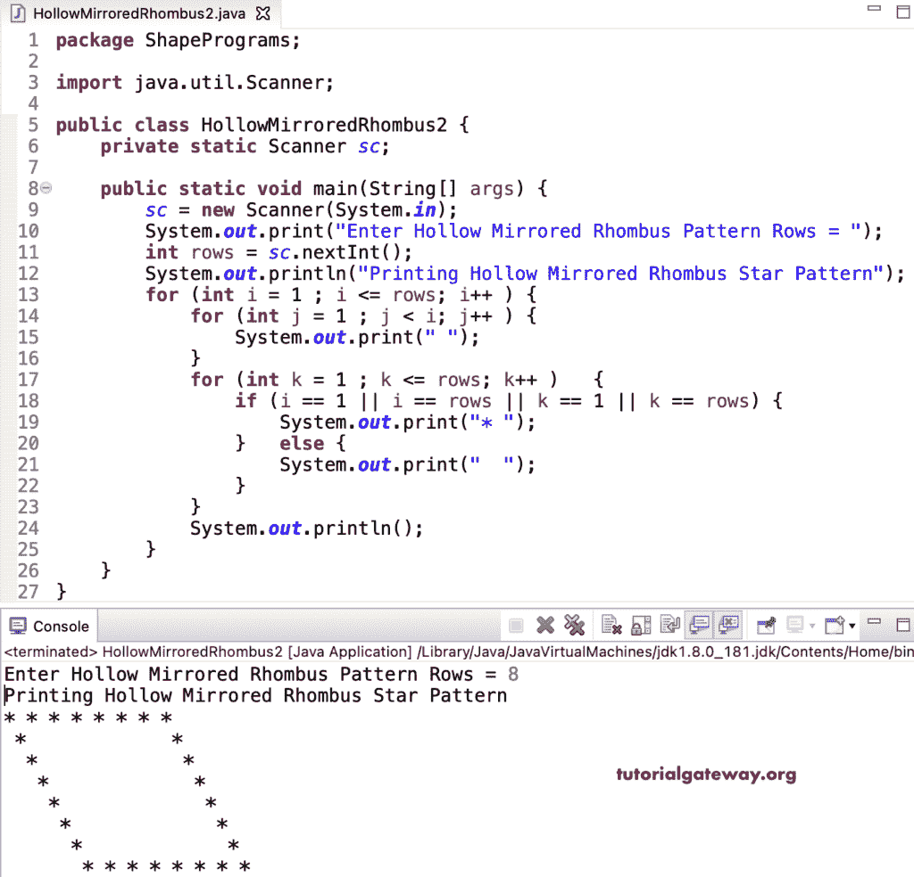

# Java 程序：打印星号的空心镜像菱形图案

> 原文：<https://www.tutorialgateway.org/java-program-to-print-hollow-mirrored-rhombus-star-pattern/>

写一个 Java 程序来打印星号的空心镜像菱形图案，用于循环。这个 Java 中空镜像菱形图案示例使用多个 if-else 语句和嵌套循环来迭代和打印中空镜像菱形。

```java
package ShapePrograms;

import java.util.Scanner;

public class HollowMirroredRhombus1 {
	private static Scanner sc;

	public static void main(String[] args) {
		sc = new Scanner(System.in);

		System.out.print("Enter Hollow Mirrored Rhombus Pattern Rows = ");
		int rows = sc.nextInt();

		System.out.println("Printing Hollow Mirrored Rhombus Star Pattern");

		for (int i = 1 ; i <= rows; i++ ) 
		{
			for (int j = i ; j > 0; j-- ) 
			{
				System.out.print(" ");
			}
			if (i == 1 || i == rows) 
			{
				for (int k = 1 ; k <= rows; k++ ) 
				{
					System.out.print("* ");
				}		
			}
			else
			{
				for (int k = 1 ; k <= rows; k++ ) 
				{
					if (k == 1 || k == rows) {
						System.out.print("* ");
					}
					else {
						System.out.print("  ");
					}
				}
			}
			System.out.println();
		}
	}
}
```

```java
Enter Hollow Mirrored Rhombus Pattern Rows = 7
Printing Hollow Mirrored Rhombus Star Pattern
 * * * * * * * 
  *           * 
   *           * 
    *           * 
     *           * 
      *           * 
       * * * * * * * 
```

虽然上面的方法是正确的，但是我们通过移除额外的 if-else 语句简化了 [Java](https://www.tutorialgateway.org/learn-java-programs/) 中空镜像菱形代码。

```java
package ShapePrograms;

import java.util.Scanner;

public class HollowMirroredRhombus2 {
	private static Scanner sc;

	public static void main(String[] args) {
		sc = new Scanner(System.in);

		System.out.print("Enter Hollow Mirrored Rhombus Pattern Rows = ");
		int rows = sc.nextInt();

		System.out.println("Printing Hollow Mirrored Rhombus Star Pattern");

		for (int i = 1 ; i <= rows; i++ ) 
		{
			for (int j = 1 ; j < i; j++ ) 
			{
				System.out.print(" ");
			}

			for (int k = 1 ; k <= rows; k++ ) 
			{
				if (i == 1 || i == rows || k == 1 || k == rows) {
					System.out.print("* ");
				}
				else {
					System.out.print("  ");
				}
			}
			System.out.println();
		}
	}
}
```



在这个 Java 中空镜像菱形星号图案程序中，我们将循环的[替换为](https://www.tutorialgateway.org/java-for-loop/)[而循环](https://www.tutorialgateway.org/java-while-loop/)。

```java
package ShapePrograms;

import java.util.Scanner;

public class HollowMirroredRhombus3 {
	private static Scanner sc;

	public static void main(String[] args) {
		sc = new Scanner(System.in);

		int i = 1, j, k;
		System.out.print("Enter Hollow Mirrored Rhombus Pattern Rows = ");
		int rows = sc.nextInt();

		System.out.println("Printing Hollow Mirrored Rhombus Star Pattern");

		while ( i <= rows) 
		{
			j = 1 ;
			while (j < i ) 
			{
				System.out.print(" ");
				j++;
			}
			k = 1 ;
			while( k <= rows ) 
			{
				if (i == 1 || i == rows || k == 1 || k == rows) {
					System.out.print("* ");
				}
				else {
					System.out.print("  ");
				}
				k++;
			}
			System.out.println();
			i++ ;
		}
	}
}
```

```java
Enter Hollow Mirrored Rhombus Pattern Rows = 10
Printing Hollow Mirrored Rhombus Star Pattern
* * * * * * * * * * 
 *                 * 
  *                 * 
   *                 * 
    *                 * 
     *                 * 
      *                 * 
       *                 * 
        *                 * 
         * * * * * * * * * * 
```

## 用边循环边打印星号的空心镜像菱形图案的 Java 程序

```java
package ShapePrograms;

import java.util.Scanner;

public class HollowMirroredRhombus4 {
	private static Scanner sc;

	public static void main(String[] args) {
		sc = new Scanner(System.in);

		int i = 1, j, k;
		System.out.print("Enter Hollow Mirrored Rhombus Pattern Rows = ");
		int rows = sc.nextInt();

		System.out.println("Printing Hollow Mirrored Rhombus Star Pattern");

		do
		{
			j = 1 ;
			do
			{
				System.out.print(" ");
			} while (j++ < i );

			k = 1 ;
			do
			{
				if (i == 1 || i == rows || k == 1 || k == rows) {
					System.out.print("* ");
				}
				else {
					System.out.print("  ");
				}
			} while( ++k <= rows ) ;
			System.out.println();
		} while ( ++i <= rows) ;
	}
}
```

```java
Enter Hollow Mirrored Rhombus Pattern Rows = 12
Printing Hollow Mirrored Rhombus Star Pattern
 * * * * * * * * * * * * 
  *                     * 
   *                     * 
    *                     * 
     *                     * 
      *                     * 
       *                     * 
        *                     * 
         *                     * 
          *                     * 
           *                     * 
            * * * * * * * * * * * * 
```

在这个 Java 例子中，HollowMirroredRhombusPat 函数打印给定符号的中空镜像菱形图案。

```java
package ShapePrograms;

import java.util.Scanner;

public class HollowMirroredRhombus5 {
	private static Scanner sc;

	public static void main(String[] args) {
		sc = new Scanner(System.in);

		System.out.print("Enter Hollow Mirrored Rhombus Pattern Rows = ");
		int rows = sc.nextInt();

		System.out.print("Enter Character for Mirrored Hollow Rhombus = ");
		char ch = sc.next().charAt(0);

		System.out.println("Printing Hollow Mirrored Rhombus Star Pattern");
		HollowMirroredRhombusPat(rows, ch);
	}

	public static void HollowMirroredRhombusPat(int rows, char ch) {
		for (int i = 1 ; i <= rows; i++ ) 
		{
			for (int j = 1 ; j < i; j++ ) 
			{
				System.out.print(" ");
			}

			for (int k = 1 ; k <= rows; k++ ) 
			{
				if (i == 1 || i == rows || k == 1 || k == rows) {
					System.out.print(ch + " ");
				}
				else {
					System.out.print("  ");
				}
			}
			System.out.println();
		}
	}
}
```

```java
Enter Hollow Mirrored Rhombus Pattern Rows = 16
Enter Character for Mirrored Hollow Rhombus = $
Printing Hollow Mirrored Rhombus Star Pattern
$ $ $ $ $ $ $ $ $ $ $ $ $ $ $ $ 
 $                             $ 
  $                             $ 
   $                             $ 
    $                             $ 
     $                             $ 
      $                             $ 
       $                             $ 
        $                             $ 
         $                             $ 
          $                             $ 
           $                             $ 
            $                             $ 
             $                             $ 
              $                             $ 
               $ $ $ $ $ $ $ $ $ $ $ $ $ $ $ $ 
```