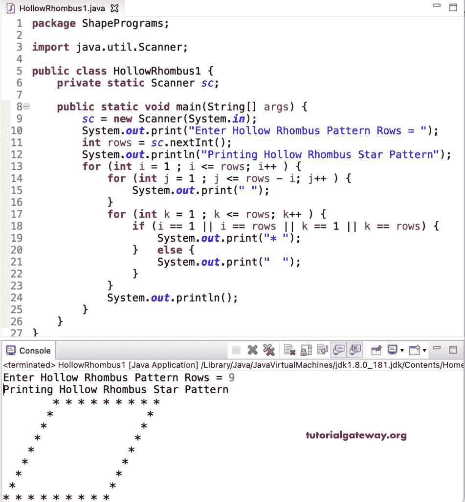

# Java 程序：打印空心菱形星形图案

> 原文：<https://www.tutorialgateway.org/java-program-to-print-hollow-rhombus-star-pattern/>

写一个 Java 程序打印空心菱形星形图案用于循环。这个 Java 空心菱形示例使用嵌套在 for 循环内部的两个 for 循环来遍历菱形行。在第二个 for 循环中，if 语句检查打印空心菱形是第一行还是最后一行和最后一列。

```java
package ShapePrograms;

import java.util.Scanner;

public class HollowRhombus1 {
	private static Scanner sc;

	public static void main(String[] args) {
		sc = new Scanner(System.in);

		System.out.print("Enter Hollow Rhombus Pattern Rows = ");
		int rows = sc.nextInt();

		System.out.println("Printing Hollow Rhombus Star Pattern");

		for (int i = 1 ; i <= rows; i++ ) 
		{
			for (int j = 1 ; j <= rows - i; j++ ) 
			{
				System.out.print(" ");
			}
			for (int k = 1 ; k <= rows; k++ ) 
			{
				if (i == 1 || i == rows || k == 1 || k == rows) {
					System.out.print("* ");
				}
				else {
					System.out.print("  ");
				}
			}
			System.out.println();
		}
	}
}
```



在这个 [Java](https://www.tutorialgateway.org/learn-java-programs/) 空心菱形星形模式程序中，我们将循环的[替换为嵌套的](https://www.tutorialgateway.org/java-for-loop/)[同时循环](https://www.tutorialgateway.org/java-while-loop/)。

```java
package ShapePrograms;

import java.util.Scanner;

public class HollowRhombus2 {
	private static Scanner sc;

	public static void main(String[] args) {
		sc = new Scanner(System.in);

		System.out.print("Enter Hollow Rhombus Pattern Rows = ");
		int rows = sc.nextInt();

		System.out.println("Printing Hollow Rhombus Star Pattern");
		int i = 1, j, k ;

		while ( i <= rows ) 
		{
			j = 1 ;
			while( j <= rows - i ) 
			{
				System.out.print(" ");
				j++;
			}
			k = 1 ;
			while ( k <= rows) 
			{
				if (i == 1 || i == rows || k == 1 || k == rows) {
					System.out.print("* ");
				}
				else {
					System.out.print("  ");
				}
				k++ ;
			}
			System.out.println();
			i++;
		}
	}
}
```

```java
Enter Hollow Rhombus Pattern Rows = 10
Printing Hollow Rhombus Star Pattern
         * * * * * * * * * * 
        *                 * 
       *                 * 
      *                 * 
     *                 * 
    *                 * 
   *                 * 
  *                 * 
 *                 * 
* * * * * * * * * * 
```

## 用边循环边打印空心菱形星形图案的 Java 程序

```java
package ShapePrograms;

import java.util.Scanner;

public class HollowRhombus3 {
	private static Scanner sc;

	public static void main(String[] args) {
		sc = new Scanner(System.in);

		System.out.print("Enter Hollow Rhombus Pattern Rows = ");
		int rows = sc.nextInt();

		System.out.println("Printing Hollow Rhombus Star Pattern");
		int i = 1, j, k ;

		do
		{
			j = 1 ;
			do
			{
				System.out.print(" ");
			} while( j++ <= rows - i ) ;
			k = 1 ;
			do 
			{
				if (i == 1 || i == rows || k == 1 || k == rows) {
					System.out.print("*");
				}
				else {
					System.out.print(" ");
				}
			} while ( ++k <= rows);
			System.out.println();
		} while ( ++i <= rows ) ;
	}
}
```

```java
Enter Hollow Rhombus Pattern Rows = 14
Printing Hollow Rhombus Star Pattern
              **************
             *            *
            *            *
           *            *
          *            *
         *            *
        *            *
       *            *
      *            *
     *            *
    *            *
   *            *
  *            *
 **************
```

在这个 Java 例子中，中空菱形模式函数打印给定符号的中空菱形模式。

```java
package ShapePrograms;

import java.util.Scanner;

public class HollowRhombus4 {
	private static Scanner sc;

	public static void main(String[] args) {
		sc = new Scanner(System.in);

		System.out.print("Enter Hollow Rhombus Pattern Rows = ");
		int rows = sc.nextInt();

		System.out.print("Enter Character for Hollow Rhombus Pattern = ");
		char ch = sc.next().charAt(0);

		System.out.println("Printing Hollow Rhombus Star Pattern");
		hollowRhombusPattern(rows, ch);	
	}

	public static void hollowRhombusPattern(int rows, char ch) {
		for (int i = 1 ; i <= rows; i++ ) 
		{
			for (int j = 1 ; j <= rows - i; j++ ) 
			{
				System.out.print(" ");
			}
			for (int k = 1 ; k <= rows; k++ ) 
			{
				if (i == 1 || i == rows || k == 1 || k == rows) {
					System.out.print(ch);
				}
				else {
					System.out.print(" ");
				}
			}
			System.out.println();
		}
	}
}
```

```java
Enter Hollow Rhombus Pattern Rows = 15
Enter Character for Hollow Rhombus Pattern = $
Printing Hollow Rhombus Star Pattern
              $$$$$$$$$$$$$$$
             $             $
            $             $
           $             $
          $             $
         $             $
        $             $
       $             $
      $             $
     $             $
    $             $
   $             $
  $             $
 $             $
$$$$$$$$$$$$$$$
```