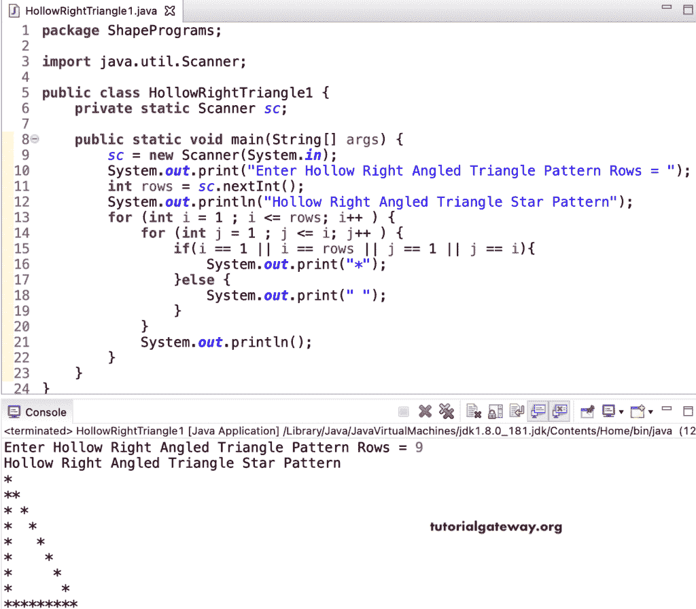

# Java 程序：打印星号的空心直角三角形图案

> 原文：<https://www.tutorialgateway.org/java-program-to-print-hollow-right-angled-triangle-star-pattern/>

写一个 Java 程序打印星号的空心直角三角形图案用于循环。这个 Java 空心直角三角形星号示例使用嵌套循环内部的 if 条件来查找外部行并显示空心直角三角形。

```java
package ShapePrograms;

import java.util.Scanner;

public class HollowRightTriangle1 {
	private static Scanner sc;

	public static void main(String[] args) {
		sc = new Scanner(System.in);

		System.out.print("Enter Hollow Right Angled Triangle Pattern Rows = ");
		int rows = sc.nextInt();

		System.out.println("Hollow Right Angled Triangle Star Pattern");

		for (int i = 1 ; i <= rows; i++ ) 
		{
			for (int j = 1 ; j <= i; j++ ) 
			{
				if(i == 1 || i == rows || j == 1 || j == i)
				{
					System.out.print("*");
				}
				else
				{
					System.out.print(" ");
				}
			}
			System.out.println();
		}
	}
}
```



在这个 Java 空心直角三角形星号图案[程序](https://www.tutorialgateway.org/learn-java-programs/)中，我们将循环的[替换为循环](https://www.tutorialgateway.org/java-for-loop/)的[。](https://www.tutorialgateway.org/java-while-loop/)

```java
package ShapePrograms;

import java.util.Scanner;

public class HollowRightTriangle2 {
	private static Scanner sc;

	public static void main(String[] args) {
		sc = new Scanner(System.in);

		System.out.print("Enter Hollow Right Angled Triangle Pattern Rows = ");
		int rows = sc.nextInt();

		System.out.println("Hollow Right Angled Triangle Star Pattern");
		int i = 1, j ;

		while( i <= rows) 
		{
			j = 1 ;
			while( j <= i ) 
			{
				if(i == 1 || i == rows || j == 1 || j == i)
				{
					System.out.print("*");
				}
				else
				{
					System.out.print(" ");
				}
				j++;
			}
			System.out.println();
			i++ ;
		}
	}
}
```

```java
Enter Hollow Right Angled Triangle Pattern Rows = 11
Hollow Right Angled Triangle Star Pattern
*
**
* *
*  *
*   *
*    *
*     *
*      *
*       *
*        *
***********
```

## 用边循环边打印星号的空心直角三角形图案的 Java 程序

```java
package ShapePrograms;

import java.util.Scanner;

public class HollowRightTriangle3 {
	private static Scanner sc;

	public static void main(String[] args) {
		sc = new Scanner(System.in);

		System.out.print("Enter Hollow Right Angled Triangle Pattern Rows = ");
		int rows = sc.nextInt();

		System.out.println("Hollow Right Angled Triangle Star Pattern");
		int i = 1, j ;

		do
		{
			j = 1 ;
			do
			{
				if(i == 1 || i == rows || j == 1 || j == i)
				{
					System.out.print("*");
				}
				else
				{
					System.out.print(" ");
				}
			} while( ++j <= i );
			System.out.println();
		} while( ++i <= rows) ;
	}
}
```

```java
Enter Hollow Right Angled Triangle Pattern Rows = 14
Hollow Right Angled Triangle Star Pattern
*
**
* *
*  *
*   *
*    *
*     *
*      *
*       *
*        *
*         *
*          *
*           *
**************
```

在这个 Java 例子中，HollowRightTrianglePat 函数打印给定符号的空心直角三角形图案。

```java
package ShapePrograms;

import java.util.Scanner;

public class HollowRightTriangle4 {
	private static Scanner sc;

	public static void main(String[] args) {
		sc = new Scanner(System.in);

		System.out.print("Enter Hollow Right Angled Triangle Pattern Rows = ");
		int rows = sc.nextInt();

		System.out.print("Character for Hollow Right Angled Triangle Pattern = ");
		char ch = sc.next().charAt(0);

		System.out.println("Hollow Right Angled Triangle Pattern");
		HollowRightTrianglePat(rows, ch);
	}

	public static void HollowRightTrianglePat(int rows, char ch) {
		for (int i = 1 ; i <= rows; i++ ) 
		{
			for (int j = 1 ; j <= i; j++ ) 
			{
				if(i == 1 || i == rows || j == 1 || j == i)
				{
					System.out.print(ch);
				}
				else
				{
					System.out.print(" ");
				}
			}
			System.out.println();
		}
	}
}
```

```java
Enter Hollow Right Angled Triangle Pattern Rows = 18
Character for Hollow Right Angled Triangle Pattern = #
Hollow Right Angled Triangle Pattern
#
##
# #
#  #
#   #
#    #
#     #
#      #
#       #
#        #
#         #
#          #
#           #
#            #
#             #
#              #
#               #
##################
```