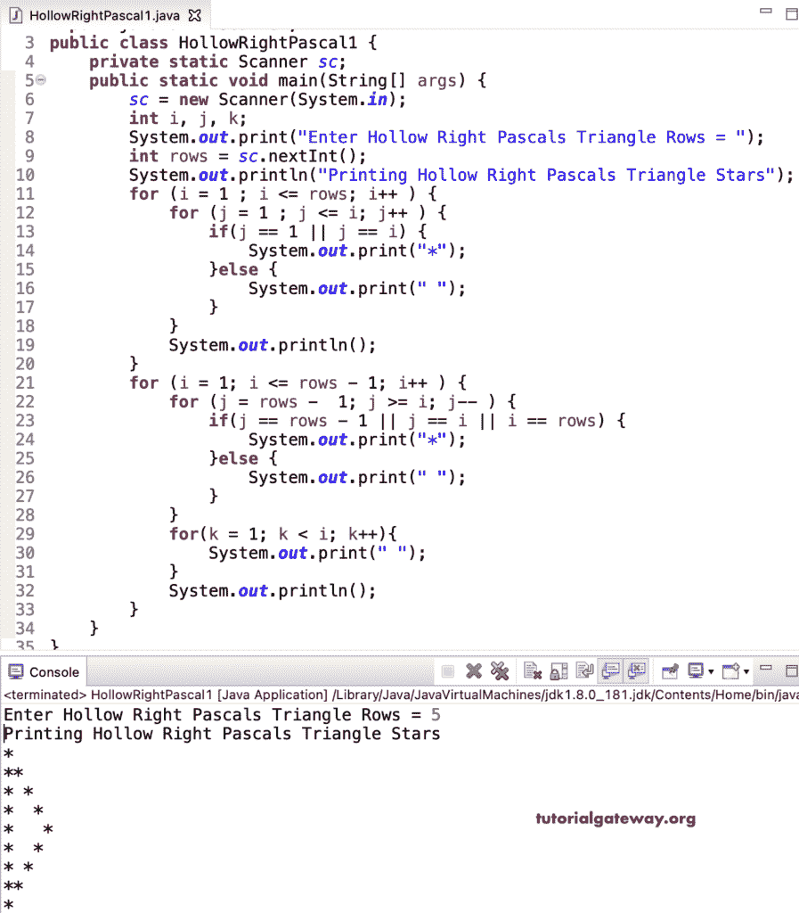

# Java 程序：打印空心直角三角形

> 原文：<https://www.tutorialgateway.org/java-program-to-print-hollow-right-pascals-star-triangle/>

编写一个 Java 程序，使用 for 循环打印空心直角帕斯卡星形三角形。

```java
package ShapePrograms2;

import java.util.Scanner;

public class HollowRightPascal1 {
	private static Scanner sc;

	public static void main(String[] args) {
		sc = new Scanner(System.in);

		int i, j, k;

		System.out.print("Enter Hollow Right Pascals Triangle Pattern Rows = ");
		int rows = sc.nextInt();

		System.out.println("Printing Hollow Right Pascals Triangle Star Pattern");

		for (i = 1 ; i <= rows; i++ ) 
		{
			for (j = 1 ; j <= i; j++ ) 
			{
				if(j == 1 || j == i) {
					System.out.print("*");
				}
				else {
					System.out.print(" ");
				}
			}
			System.out.println();
		}

		for (i = 1; i <= rows - 1; i++ ) 
		{
			for (j = rows -  1; j >= i; j-- ) 
			{
				if(j == rows - 1 || j == i || i == rows) {
					System.out.print("*");
				}
				else {
					System.out.print(" ");
				}
			}
			for(k = 1; k < i; k++)
			{
				System.out.print(" ");
			}
			System.out.println();
		}
	}
}
```



这个 [Java 示例](https://www.tutorialgateway.org/learn-java-programs/)使用 while 循环以空心直角帕斯卡三角形模式显示星星。

```java
package ShapePrograms2;

import java.util.Scanner;

public class HollowRightPascal2 {
	private static Scanner sc;

	public static void main(String[] args) {
		sc = new Scanner(System.in);

		System.out.print("Enter Hollow Right Pascals Triangle Pattern Rows = ");
		int rows = sc.nextInt();

		System.out.println("Printing Hollow Right Pascals Triangle Star Pattern");
		int i = 1, j, k;

		while ( i <= rows ) 
		{
			j = 1 ;
			while ( j <= i ) 
			{
				if(j == 1 || j == i) {
					System.out.print("*");
				}
				else {
					System.out.print(" ");
				}
				j++;
			}
			System.out.println();
			i++;
		}

		i = 1;
		while ( i <= rows - 1 ) 
		{
			j = rows -  1;
			while ( j >= i ) 
			{
				if(j == rows - 1 || j == i || i == rows) {
					System.out.print("*");
				}
				else {
					System.out.print(" ");
				}
				j--;
			}
			k = 1;
			while( k < i)
			{
				System.out.print(" ");
				k++;
			}
			System.out.println();
			i++;
		}
	}
}
```

```java
Enter Hollow Right Pascals Triangle Pattern Rows = 8
Printing Hollow Right Pascals Triangle Star Pattern
*
**
* *
*  *
*   *
*    *
*     *
*      *
*     *
*    * 
*   *  
*  *   
* *    
**     
*
```

使用 do while 循环打印空心直角三角形的 Java 程序。

```java
package ShapePrograms2;

import java.util.Scanner;

public class HollowRightPascal3 {
	private static Scanner sc;

	public static void main(String[] args) {
		sc = new Scanner(System.in);

		System.out.print("Enter Hollow Right Pascals Triangle Pattern Rows = ");
		int rows = sc.nextInt();

		System.out.println("Printing Hollow Right Pascals Triangle Star Pattern");
		int i = 1, j, k;

		do
		{
			j = 1 ;
			do
			{
				if(j == 1 || j == i) {
					System.out.print("*");
				}
				else {
					System.out.print(" ");
				}

			} while ( ++j <= i );
			System.out.println();

		} while ( ++i <= rows );

		i = 1;
		do
		{
			j = rows -  1;
			do
			{
				if(j == rows - 1 || j == i || i == rows) {
					System.out.print("*");
				}
				else {
					System.out.print(" ");
				}

			} while ( --j >= i ) ;
			k = 1;
			do
			{
				System.out.print(" ");

			} while( ++k < i);
			System.out.println();

		} while ( ++i <= rows - 1 ) ;
	}
}
```

```java
Enter Hollow Right Pascals Triangle Pattern Rows = 11
Printing Hollow Right Pascals Triangle Star Pattern
*
**
* *
*  *
*   *
*    *
*     *
*      *
*       *
*        *
*         *
*        * 
*       * 
*      *  
*     *   
*    *    
*   *     
*  *      
* *       
**        
*
```