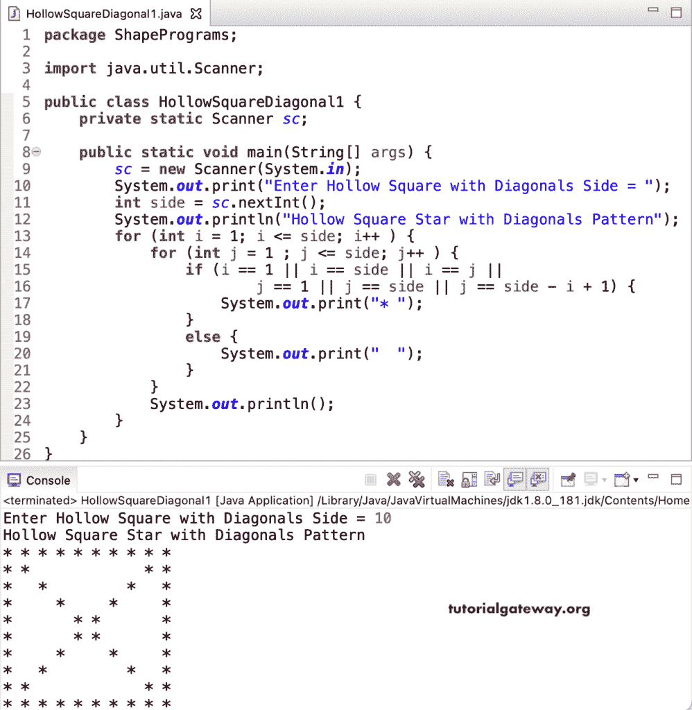

# Java 程序：用对角线打印空心方块

> 原文：<https://www.tutorialgateway.org/java-program-to-print-hollow-square-with-diagonals/>

写一个 Java 程序来打印星号的带有对角线图案的空心方块，用于循环。这个 Java 空心正方形示例使用嵌套 for 循环来迭代正方形边。If else 条件检查它是第一行还是第一列，最后一行还是最后一列，还是对角线。如果是真的，它会在那个位置打印一颗星；否则，打印空白。

```java
package ShapePrograms;

import java.util.Scanner;

public class HollowSquareDiagonal1 {
	private static Scanner sc;

	public static void main(String[] args) {
		sc = new Scanner(System.in);	

		System.out.print("Enter Hollow Square with Diagonals Side = ");
		int side = sc.nextInt();	

		System.out.println("Hollow Square Star with Diagonals Pattern");	

		for (int i = 1; i <= side; i++ ) 
		{
			for (int j = 1 ; j <= side; j++ ) 
			{
				if (i == 1 || i == side || i == j || 
						j == 1 || j == side || j == side - i + 1) {
					System.out.print("* ");
				}
				else {
					System.out.print("  ");
				}
			}
			System.out.println();
		}
	}
}
```



在这个 [Java 程序](https://www.tutorialgateway.org/learn-java-programs/)中，为了显示带有星星对角线图案的空心方块，我们将循环的[替换为嵌套的](https://www.tutorialgateway.org/java-for-loop/)[，同时循环](https://www.tutorialgateway.org/java-while-loop/)。

```java
package ShapePrograms;

import java.util.Scanner;

public class HollowSquareDiagonal2 {
	private static Scanner sc;

	public static void main(String[] args) {
		sc = new Scanner(System.in);

		System.out.print("Enter Hollow Square with Diagonals Side = ");
		int side = sc.nextInt();

		System.out.println("Hollow Square Star with Diagonals Pattern");
		int i = 1, j; 
		while (i <= side) 
		{
			j = 1 ;
			while( j <= side) 
			{
				if (i == 1 || i == side || i == j || 
						j == 1 || j == side || j == side - i + 1) {
					System.out.print("* ");
				}
				else {
					System.out.print("  ");
				}
				j++ ;
			}
			System.out.println();
			i++ ;
		}
	}
}
```

```java
Enter Hollow Square with Diagonals Side = 10
Hollow Square Star with Diagonals Pattern
* * * * * * * * * * 
* *             * * 
*   *         *   * 
*     *     *     * 
*       * *       * 
*       * *       * 
*     *     *     * 
*   *         *   * 
* *             * * 
* * * * * * * * * * 
```

## 用边循环边做边打印对角线星号空心方块的 Java 程序

```java
package ShapePrograms;

import java.util.Scanner;

public class HollowSquareDiagonal3 {
	private static Scanner sc;

	public static void main(String[] args) {
		sc = new Scanner(System.in);

		System.out.print("Enter Hollow Square with Diagonals Side = ");
		int side = sc.nextInt();

		System.out.println("Hollow Square Star with Diagonals Pattern");
		int i = 1, j; 
		do 
		{
			j = 1 ;
			do
			{
				if (i == 1 || i == side || i == j || 
						j == 1 || j == side || j == side - i + 1) {
					System.out.print("* ");
				}
				else {
					System.out.print("  ");
				}
			} while( ++j <= side) ;
			System.out.println();
		} while (++i <= side);
	}
}
```

```java
Enter Hollow Square with Diagonals Side = 14
Hollow Square Star with Diagonals Pattern
* * * * * * * * * * * * * * 
* *                     * * 
*   *                 *   * 
*     *             *     * 
*       *         *       * 
*         *     *         * 
*           * *           * 
*           * *           * 
*         *     *         * 
*       *         *       * 
*     *             *     * 
*   *                 *   * 
* *                     * * 
* * * * * * * * * * * * * * 
```

这个 Java 代码打印了一个带有用户给定符号对角线模式的空心正方形。我们创建了一个空心正方形对角线模式函数，该函数在带有对角线模式的空心正方形中打印给定的符号。

```java
package ShapePrograms;

import java.util.Scanner;

public class HollowSquareDiagonal4 {
	private static Scanner sc;

	public static void main(String[] args) {
		sc = new Scanner(System.in);

		System.out.print("Enter Hollow Square with Diagonals Side = ");
		int side = sc.nextInt();

		System.out.print("Character for Hollow Square Diagonal Pattern = ");
		char ch = sc.next().charAt(0);

		System.out.println("Hollow Square Star with Diagonals Pattern");
		HollowSquareDiagonalPattern(side, ch);
	}

	public static void HollowSquareDiagonalPattern(int side, char ch) {
		for (int i = 1; i <= side; i++ ) 
		{
			for (int j = 1 ; j <= side; j++ ) 
			{
				if (i == 1 || i == side || i == j || 
						j == 1 || j == side || j == side - i + 1) {
					System.out.print(ch + " ");
				}
				else {
					System.out.print("  ");
				}
			}
			System.out.println();
		}
	}
}
```

```java
Enter Hollow Square with Diagonals Side = 20
Character for Hollow Square Diagonal Pattern = $
Hollow Square Star with Diagonals Pattern
$ $ $ $ $ $ $ $ $ $ $ $ $ $ $ $ $ $ $ $ 
$ $                                 $ $ 
$   $                             $   $ 
$     $                         $     $ 
$       $                     $       $ 
$         $                 $         $ 
$           $             $           $ 
$             $         $             $ 
$               $     $               $ 
$                 $ $                 $ 
$                 $ $                 $ 
$               $     $               $ 
$             $         $             $ 
$           $             $           $ 
$         $                 $         $ 
$       $                     $       $ 
$     $                         $     $ 
$   $                             $   $ 
$ $                                 $ $ 
$ $ $ $ $ $ $ $ $ $ $ $ $ $ $ $ $ $ $ $ 
```