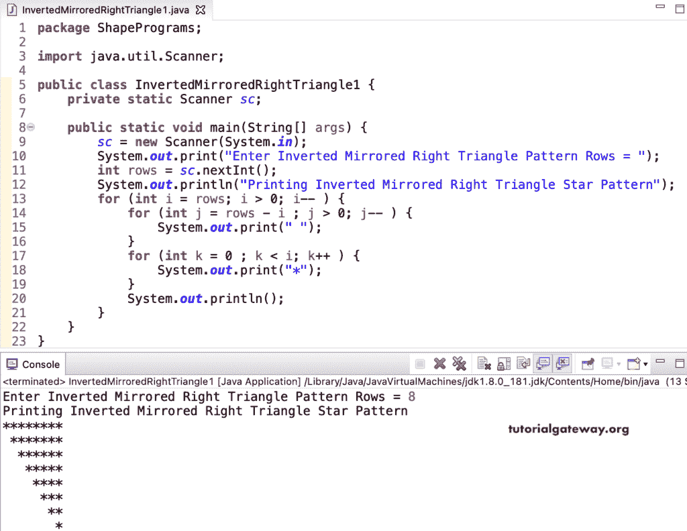

# Java 程序：打印星号的倒镜像直角三角形图案

> 原文：<https://www.tutorialgateway.org/java-program-to-print-inverted-mirrored-right-triangle-star-pattern/>

写一个 Java 程序来打印星号的倒镜像直角三角形图案，用于循环。

```java
package ShapePrograms;

import java.util.Scanner;

public class InvertedMirroredRightTriangle1 {
	private static Scanner sc;

	public static void main(String[] args) {
		sc = new Scanner(System.in);

		System.out.print("Enter Inverted Mirrored Right Triangle Pattern Rows = ");
		int rows = sc.nextInt();

		System.out.println("Printing Inverted Mirrored Right Triangle Star Pattern");

		for (int i = rows; i > 0; i-- ) 
		{
			for (int j = rows - i ; j > 0; j-- ) 
			{
				System.out.print(" ");
			}
			for (int k = 0 ; k < i; k++ ) 
			{
				System.out.print("*");
			}
			System.out.println();
		}
	}
}
```



在这个 [Java](https://www.tutorialgateway.org/learn-java-programs/) 倒镜像直角三角形星号图案程序中，我们将循环的[替换为循环](https://www.tutorialgateway.org/java-for-loop/)的[。](https://www.tutorialgateway.org/java-while-loop/)

```java
package ShapePrograms;

import java.util.Scanner;

public class InvertedMirroredRightTriangle2 {
	private static Scanner sc;

	public static void main(String[] args) {
		sc = new Scanner(System.in);

		System.out.print("Enter Inverted Mirrored Right Triangle Pattern Rows = ");
		int rows = sc.nextInt();

		System.out.println("-- Printing Inverted Mirrored Right Triangle Star Pattern --");
		int i = rows; 
		while(i > 0) 
		{
			int j = rows - i ;
			while( j > 0) 
			{
				System.out.print(" ");
				j--;
			}
			int k = 0 ;
			while ( k < i ) 
			{
				System.out.print("*");
				k++;
			}
			System.out.println();
			i--;
		}
	}
}
```

```java
Enter Inverted Mirrored Right Triangle Pattern Rows = 11
-- Printing Inverted Mirrored Right Triangle Star Pattern --
***********
 **********
  *********
   ********
    *******
     ******
      *****
       ****
        ***
         **
          *
```

## 用边循环边打印星号的倒镜像直角三角形图案的 Java 程序

```java
package ShapePrograms;

import java.util.Scanner;

public class InvertedMirroredRightTriangle3 {
	private static Scanner sc;

	public static void main(String[] args) {
		sc = new Scanner(System.in);

		System.out.print("Enter Inverted Mirrored Right Triangle Pattern Rows = ");
		int rows = sc.nextInt();

		System.out.println("-- Printing Inverted Mirrored Right Triangle Star Pattern --");
		int j, k, i = rows; 
		do
		{
			j = rows - i ;
			do 
			{
				System.out.print(" ");
			}while( j-- > 0);
			k = 0 ;
			do
			{
				System.out.print("*");
			}while (++k < i );
			System.out.println();
		}while(--i > 0);
	}
}
```

```java
Enter Inverted Mirrored Right Triangle Pattern Rows = 14
-- Printing Inverted Mirrored Right Triangle Star Pattern --
 **************
  *************
   ************
    ***********
     **********
      *********
       ********
        *******
         ******
          *****
           ****
            ***
             **
              *
```

在这个 Java 例子中，InvertedMirroredRightTrianglePat 函数打印给定符号的反向镜像直角三角形图案。

```java
package ShapePrograms;

import java.util.Scanner;

public class InvertedMirroredRightTriangle4 {
	private static Scanner sc;

	public static void main(String[] args) {
		sc = new Scanner(System.in);

		System.out.print("Enter Inverted Mirrored Right Triangle Pattern Rows = ");
		int rows = sc.nextInt();

		System.out.print("Enter Character for Inverted Mirrored Right Triangle = ");
		char ch = sc.next().charAt(0);

		System.out.println("-- Printing Inverted Mirrored Right Triangle Pattern --");
		InvertedMirroredRightTrianglePat(rows, ch);	
	}

	public static void InvertedMirroredRightTrianglePat(int rows, char ch) {
		for (int i = rows; i > 0; i-- ) 
		{
			for (int j = rows - i ; j > 0; j-- ) 
			{
				System.out.print(" ");
			}
			for (int k = 0 ; k < i; k++ ) 
			{
				System.out.print(ch);
			}
			System.out.println();
		}
	}
}
```

```java
Enter Inverted Mirrored Right Triangle Pattern Rows = 17
Enter Character for Inverted Mirrored Right Triangle = @
-- Printing Inverted Mirrored Right Triangle Pattern --
@@@@@@@@@@@@@@@@@
 @@@@@@@@@@@@@@@@
  @@@@@@@@@@@@@@@
   @@@@@@@@@@@@@@
    @@@@@@@@@@@@@
     @@@@@@@@@@@@
      @@@@@@@@@@@
       @@@@@@@@@@
        @@@@@@@@@
         @@@@@@@@
          @@@@@@@
           @@@@@@
            @@@@@
             @@@@
              @@@
               @@
                @ 
```