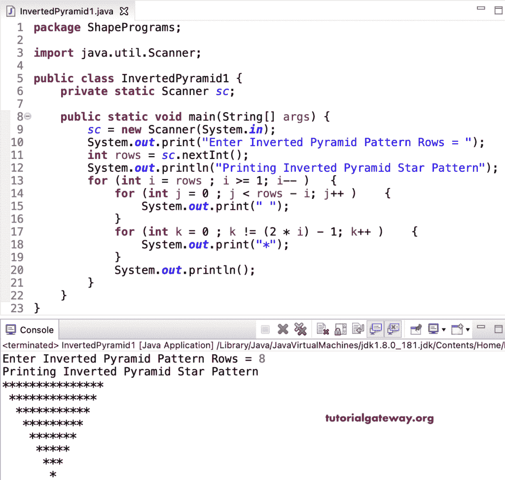

# Java 程序：打印倒星形金字塔

> 原文：<https://www.tutorialgateway.org/java-program-to-print-inverted-star-pyramid/>

写一个 Java 程序来打印倒星形金字塔模式，用于循环。这个 Java 倒金字塔模式示例使用嵌套 for 循环来迭代和显示倒金字塔。

```java
package ShapePrograms;

import java.util.Scanner;

public class InvertedPyramid1 {
	private static Scanner sc;

	public static void main(String[] args) {
		sc = new Scanner(System.in);

		System.out.print("Enter Inverted Pyramid Pattern Rows = ");
		int rows = sc.nextInt();

		System.out.println("Printing Inverted Pyramid Star Pattern");

		for (int i = rows ; i >= 1; i-- ) 
		{
			for (int j = 0 ; j < rows - i; j++ ) 
			{
				System.out.print(" ");
			}
			for (int k = 0 ; k != (2 * i) - 1; k++ ) 
			{
				System.out.print("*");
			}
			System.out.println();
		}
	}
}
```



在这个 Java 倒星金字塔[程序](https://www.tutorialgateway.org/learn-java-programs/)中，我们将循环的[替换为](https://www.tutorialgateway.org/java-for-loop/)[而循环](https://www.tutorialgateway.org/java-while-loop/)。

```java
package ShapePrograms;

import java.util.Scanner;

public class InvertedPyramid2 {
	private static Scanner sc;

	public static void main(String[] args) {
		sc = new Scanner(System.in);

		System.out.print("Enter Inverted Pyramid Pattern Rows = ");
		int rows = sc.nextInt();

		System.out.println("Printing Inverted Pyramid Star Pattern");
		int i = rows, j, k ;
		while ( i >= 1) 
		{
			j = 0 ;
			while (j < rows - i ) 
			{
				System.out.print(" ");
				j++;
			}
			k = 0 ;
			while ( k != (2 * i) - 1) 
			{
				System.out.print("*");
				k++ ;
			}
			System.out.println();
			i-- ;
		}
	}
}
```

```java
Enter Inverted Pyramid Pattern Rows = 10
Printing Inverted Pyramid Star Pattern
*******************
 *****************
  ***************
   *************
    ***********
     *********
      *******
       *****
        ***
         * 
```

## 用边做边循环打印倒星形金字塔的 Java 程序

```java
package ShapePrograms;

import java.util.Scanner;

public class InvertedPyramid3 {
	private static Scanner sc;

	public static void main(String[] args) {
		sc = new Scanner(System.in);

		System.out.print("Enter Inverted Pyramid Pattern Rows = ");
		int rows = sc.nextInt();

		System.out.println("Printing Inverted Pyramid Star Pattern");
		int i = rows, j, k ;

		do
		{
			j = 0 ;
			do
			{
				System.out.print(" ");
			} while (j++ < rows - i );
			k = 0 ;
			do
			{
				System.out.print("*");
			} while ( ++k != (2 * i) - 1);
			System.out.println();
		} while ( --i >= 1) ;
	}
}
```

```java
Enter Inverted Pyramid Pattern Rows = 13
Printing Inverted Pyramid Star Pattern
 *************************
  ***********************
   *********************
    *******************
     *****************
      ***************
       *************
        ***********
         *********
          *******
           *****
            ***
             *
```

在这个 Java 例子中，反转金字塔模式函数打印给定符号的反转金字塔模式。

```java
package ShapePrograms;

import java.util.Scanner;

public class InvertedPyramid4 {
	private static Scanner sc;

	public static void main(String[] args) {
		sc = new Scanner(System.in);

		System.out.print("Enter Inverted Pyramid Pattern Rows = ");
		int rows = sc.nextInt();

		System.out.print("Character for Inverted  Pyramid Pattern = ");
		char ch = sc.next().charAt(0);

		System.out.println("Printing Inverted Pyramid Pattern");
		InvertedPyramidPattern(rows, ch);		
	}

	public static void InvertedPyramidPattern(int rows, char ch) {
		for (int i = rows ; i >= 1; i-- ) 
		{
			for (int j = 0 ; j < rows - i; j++ ) 
			{
				System.out.print(" ");
			}
			for (int k = 0 ; k != (2 * i) - 1; k++ ) 
			{
				System.out.print(ch);
			}
			System.out.println();
		}
	}
}
```

```java
Enter Inverted Pyramid Pattern Rows = 16
Character for Inverted  Pyramid Pattern = $
Printing Inverted Pyramid Pattern
$$$$$$$$$$$$$$$$$$$$$$$$$$$$$$$
 $$$$$$$$$$$$$$$$$$$$$$$$$$$$$
  $$$$$$$$$$$$$$$$$$$$$$$$$$$
   $$$$$$$$$$$$$$$$$$$$$$$$$
    $$$$$$$$$$$$$$$$$$$$$$$
     $$$$$$$$$$$$$$$$$$$$$
      $$$$$$$$$$$$$$$$$$$
       $$$$$$$$$$$$$$$$$
        $$$$$$$$$$$$$$$
         $$$$$$$$$$$$$
          $$$$$$$$$$$
           $$$$$$$$$
            $$$$$$$
             $$$$$
              $$$
               $
```