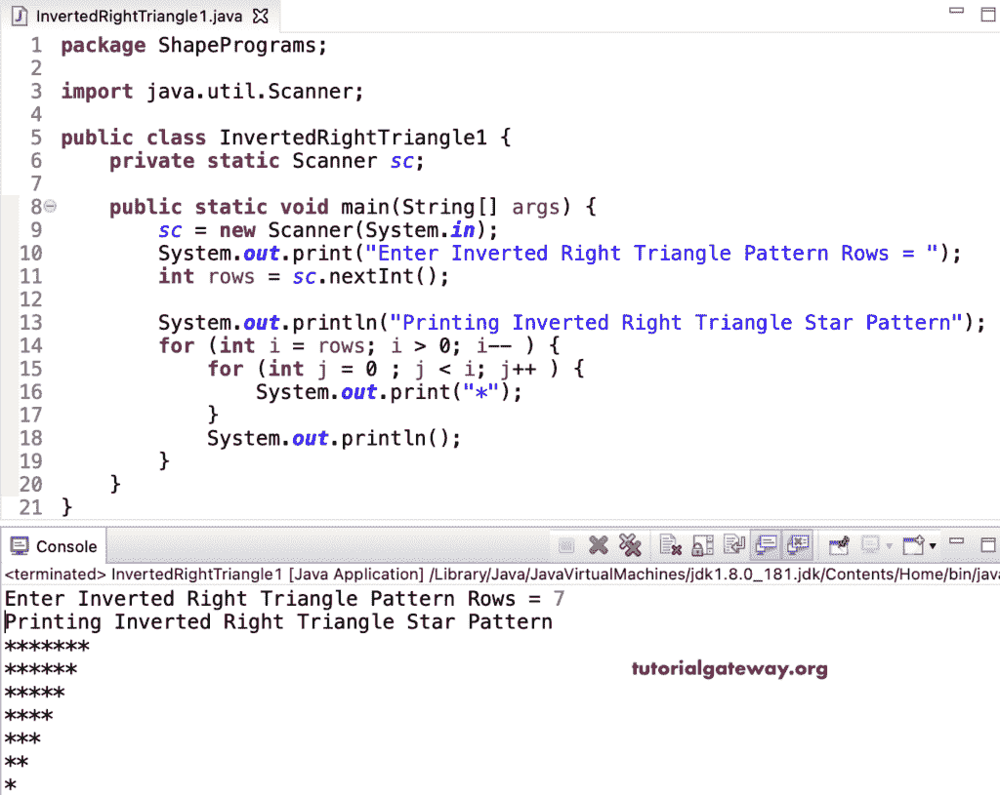

# Java 程序：打印星号的倒直角三角形图案

> 原文：<https://www.tutorialgateway.org/java-program-to-print-inverted-right-triangle-star-pattern/>

写一个 Java 程序打印星号的倒直角三角形图案用于循环。这个 Java 倒直角三角形星号图案示例使用嵌套 for 循环从上到下迭代并显示输出。

```java
package ShapePrograms;

import java.util.Scanner;

public class InvertedRightTriangle1 {
	private static Scanner sc;

	public static void main(String[] args) {
		sc = new Scanner(System.in);

		System.out.print("Enter Inverted Right Triangle Pattern Rows = ");
		int rows = sc.nextInt();

		System.out.println("Printing Inverted Right Triangle Star Pattern");

		for (int i = rows; i > 0; i-- ) 
		{
			for (int j = 0 ; j < i; j++ ) 
			{
				System.out.print("*");
			}
			System.out.println();
		}
	}
}
```



在这个 Java 倒直角三角形星号图案[程序](https://www.tutorialgateway.org/learn-java-programs/)中，我们将循环的[替换为循环](https://www.tutorialgateway.org/java-for-loop/)的[。](https://www.tutorialgateway.org/java-while-loop/)

```java
package ShapePrograms;

import java.util.Scanner;

public class InvertedRightTriangle2 {
	private static Scanner sc;

	public static void main(String[] args) {
		sc = new Scanner(System.in);

		System.out.print("Enter Inverted Right Triangle Pattern Rows = ");
		int rows = sc.nextInt();

		System.out.println("-- Printing Inverted Right Triangle Star Pattern --");
		int j, i = rows; 
		while (i > 0) 
		{
			j = 0 ; 
			while (j < i) 
			{
				System.out.print("*");
				j++;
			}
			System.out.println();
			i--;
		}
	}
}
```

```java
Enter Inverted Right Triangle Pattern Rows = 9
-- Printing Inverted Right Triangle Star Pattern --
*********
********
*******
******
*****
****
***
**
*
```

## 用边循环边做打印星号的倒直角三角形图案的 Java 程序

```java
package ShapePrograms;

import java.util.Scanner;

public class InvertedRightTriangle3 {
	private static Scanner sc;

	public static void main(String[] args) {
		sc = new Scanner(System.in);

		System.out.print("Enter Inverted Right Triangle Pattern Rows = ");
		int rows = sc.nextInt();

		System.out.println("-- Printing Inverted Right Triangle Star Pattern --");
		int j, i = rows; 
		do
		{
			j = 0; 
			do
			{
				System.out.print("*");
			} while (++j < i);
			System.out.println();
		}while (--i > 0);
	}
}
```

```java
Enter Inverted Right Triangle Pattern Rows = 13
-- Printing Inverted Right Triangle Star Pattern --
*************
************
***********
**********
*********
********
*******
******
*****
****
***
**
*
```

在这个 Java 示例中，InvertedRightTrianglePat 函数打印给定符号的倒直角三角形图案。

```java
package ShapePrograms;

import java.util.Scanner;

public class InvertedRightTriangle4 {
	private static Scanner sc;

	public static void main(String[] args) {
		sc = new Scanner(System.in);

		System.out.print("Enter Inverted Right Triangle Pattern Rows = ");
		int rows = sc.nextInt();

		System.out.print("Enter Character for Inverted Right Triangle Pattern = ");
		char ch = sc.next().charAt(0);

		System.out.println("-- Printing Inverted Right Triangle Pattern --");
		InvertedRightTrianglePat(rows, ch);

	}
	public static void InvertedRightTrianglePat(int rows, char ch) {
		for (int i = rows; i > 0; i-- ) 
		{
			for (int j = 0 ; j < i; j++ ) 
			{
				System.out.print(ch);
			}
			System.out.println();
		}
	}
}
```

```java
Enter Inverted Right Triangle Pattern Rows = 15
Enter Character for Inverted Right Triangle Pattern = &
-- Printing Inverted Right Triangle Pattern --
&&&&&&&&&&&&&&&
&&&&&&&&&&&&&&
&&&&&&&&&&&&&
&&&&&&&&&&&&
&&&&&&&&&&&
&&&&&&&&&&
&&&&&&&&&
&&&&&&&&
&&&&&&&
&&&&&&
&&&&&
&&&&
&&&
&&
&
```