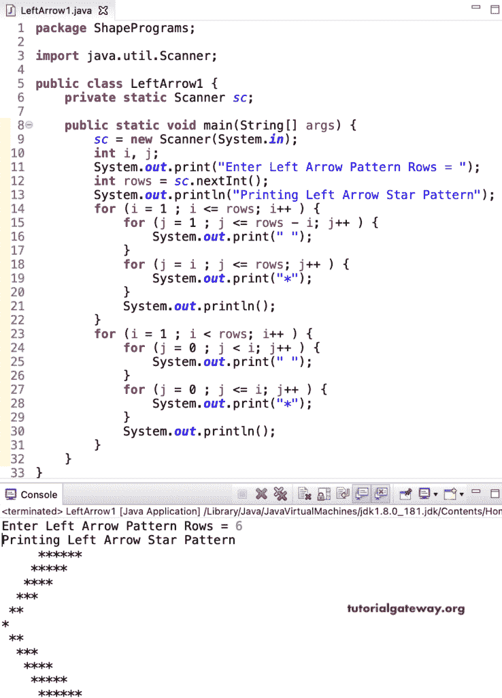

# Java 程序：打印星号的左箭头图案

> 原文：<https://www.tutorialgateway.org/java-program-to-print-left-arrow-star-pattern/>

编写一个 Java 程序，使用 for 循环打印星号的左箭头图案。在这个 Java 左箭头示例中，第一个嵌套的 for 循环集打印左箭头顶部，另一个代码打印左箭头底部。

```java
package ShapePrograms;

import java.util.Scanner;

public class LeftArrow1 {
	private static Scanner sc;

	public static void main(String[] args) {
		sc = new Scanner(System.in);

		int i, j;

		System.out.print("Enter Left Arrow Pattern Rows = ");
		int rows = sc.nextInt();

		System.out.println("Printing Left Arrow Star Pattern");

		for (i = 1 ; i <= rows; i++ ) 
		{
			for (j = 1 ; j <= rows - i; j++ ) 
			{
				System.out.print(" ");	
			}
			for (j = i ; j <= rows; j++ ) 
			{
				System.out.print("*");
			}
			System.out.println();
		}

		for (i = 1 ; i < rows; i++ ) 
		{
			for (j = 0 ; j < i; j++ ) 
			{
				System.out.print(" ");
			}
			for (j = 0 ; j <= i; j++ ) 
			{
				System.out.print("*");
			}
			System.out.println();
		}
	}
}
```



在这个 Java 左箭头星号图案[程序中，](https://www.tutorialgateway.org/learn-java-programs/)我们用一个 [while loop](https://www.tutorialgateway.org/java-while-loop/) 代替了 [for loop](https://www.tutorialgateway.org/java-for-loop/) 。

```java
package ShapePrograms;

import java.util.Scanner;

public class LeftArrow2 {
	private static Scanner sc;

	public static void main(String[] args) {
		sc = new Scanner(System.in);

		System.out.print("Enter Left Arrow Pattern Rows = ");
		int rows = sc.nextInt();

		int i = 1, j;

		System.out.println("Printing Left Arrow Star Pattern");

		while(i <= rows) 
		{
			j = 1 ;
			while ( j <= rows - i ) 
			{
				System.out.print(" ");	
				j++;
			}
			j = i;
			while(j <= rows ) 
			{
				System.out.print("*");
				j++;
			}
			System.out.println();
			i++;
		}
		i = 1;
		while (i < rows ) 
		{
			j = 0 ;
			while ( j < i) 
			{
				System.out.print(" ");
				j++;
			}
			j = 0 ;
			while (j <= i ) 
			{
				System.out.print("*");
				j++;
			}
			System.out.println();
			i++;
		}
	}
}
```

```java
Enter Left Arrow Pattern Rows = 7
Printing Left Arrow Star Pattern
      *******
     ******
    *****
   ****
  ***
 **
*
 **
  ***
   ****
    *****
     ******
      *******
```

## 使用边循环边打印星号的左箭头图案的 Java 程序

```java
package ShapePrograms;

import java.util.Scanner;

public class LeftArrow3 {
	private static Scanner sc;

	public static void main(String[] args) {
		sc = new Scanner(System.in);

		System.out.print("Enter Left Arrow Pattern Rows = ");
		int rows = sc.nextInt();

		int i = 1, j;

		System.out.println("Printing Left Arrow Star Pattern");

		do
		{
			j = 1 ;
			do
			{
				System.out.print(" ");	
			} while ( j++ <= rows - i ) ;
			j = i;
			do
			{
				System.out.print("*");
			} while(++j <= rows ) ;
			System.out.println();
		} while(++i <= rows) ;
		i = 1;
		do 
		{
			j = 0 ;
			do
			{
				System.out.print(" ");
			} while ( j++ < i) ;
			j = 0 ;
			do
			{
				System.out.print("*");

			} while (++j <= i ) ;
			System.out.println();

		} while (++i < rows );
	}
}
```

```java
Enter Left Arrow Pattern Rows = 9
Printing Left Arrow Star Pattern
         *********
        ********
       *******
      ******
     *****
    ****
   ***
  **
 *
  **
   ***
    ****
     *****
      ******
       *******
        ********
         *********
```

在这个 Java 例子中，左箭头模式函数打印给定符号的左箭头模式。

```java
package ShapePrograms;

import java.util.Scanner;

public class LeftArrow4 {
	private static Scanner sc;

	public static void main(String[] args) {
		sc = new Scanner(System.in);

		System.out.print("Enter Left Arrow Pattern Rows = ");
		int rows = sc.nextInt();

		System.out.print("Enter Character for Left Arrow Pattern = ");
		char ch = sc.next().charAt(0);

		System.out.println("Printing Left Arrow Pattern");
		leftArrowPattern(rows, ch);
	}

	public static void leftArrowPattern(int rows, char ch) {
		int i, j;
		for (i = 1 ; i <= rows; i++ ) 
		{
			for (j = 1 ; j <= rows - i; j++ ) 
			{
				System.out.print(" ");	
			}
			for (j = i ; j <= rows; j++ ) 
			{
				System.out.print( ch);
			}
			System.out.println();
		}

		for (i = 1 ; i < rows; i++ ) 
		{
			for (j = 0 ; j < i; j++ ) 
			{
				System.out.print(" ");
			}
			for (j = 0 ; j <= i; j++ ) 
			{
				System.out.print(ch);
			}
			System.out.println();
		}
	}
}
```

```java
Enter Left Arrow Pattern Rows = 11
Enter Character for Left Arrow Pattern = $
Printing Left Arrow Pattern
          $$$$$$$$$$$
         $$$$$$$$$$
        $$$$$$$$$
       $$$$$$$$
      $$$$$$$
     $$$$$$
    $$$$$
   $$$$
  $$$
 $$
$
 $$
  $$$
   $$$$
    $$$$$
     $$$$$$
      $$$$$$$
       $$$$$$$$
        $$$$$$$$$
         $$$$$$$$$$
          $$$$$$$$$$$
```