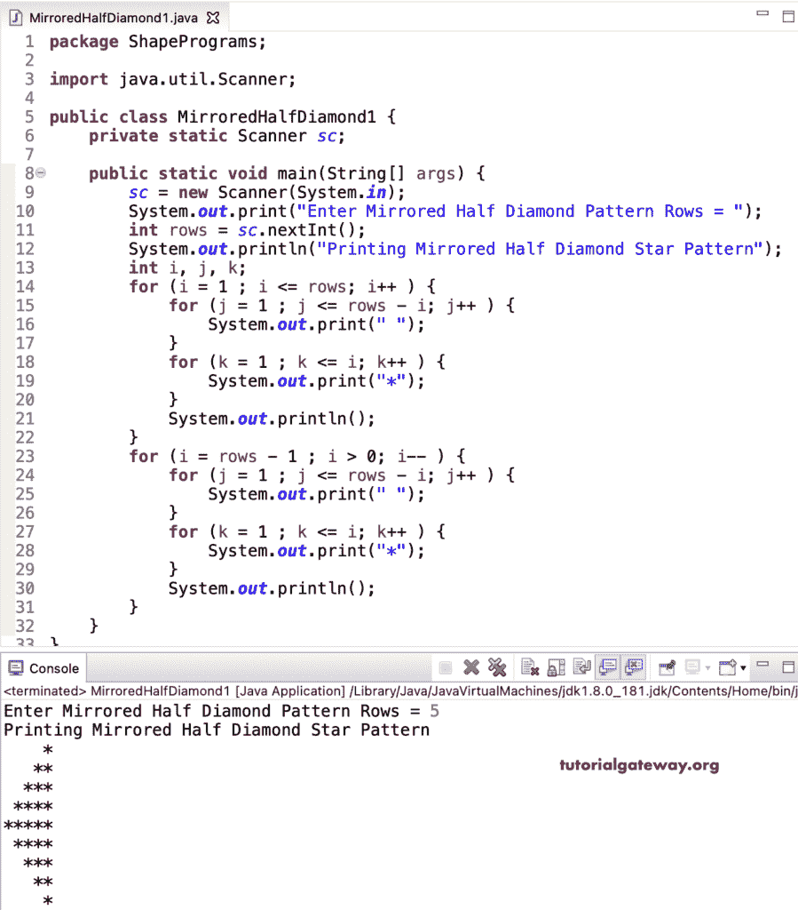

# Java 程序：打印星号的镜像半菱形图案

> 原文：<https://www.tutorialgateway.org/java-program-to-print-mirrored-half-diamond-star-pattern/>

编写一个 Java 程序来打印星号的镜像的半菱形图案，或者编写一个 Java 程序来打印星号的用于循环的左侧半菱形图案。

```java
package ShapePrograms;

import java.util.Scanner;

public class MirroredHalfDiamond1 {
	private static Scanner sc;

	public static void main(String[] args) {
		sc = new Scanner(System.in);

		System.out.print("Enter Mirrored Half Diamond Pattern Rows = ");
		int rows = sc.nextInt();

		System.out.println("Printing Mirrored Half Diamond Star Pattern");
		int i, j, k;

		for (i = 1 ; i <= rows; i++ ) 
		{
			for (j = 1 ; j <= rows - i; j++ ) 
			{
				System.out.print(" ");	
			}
			for (k = 1 ; k <= i; k++ ) 
			{
				System.out.print("*");
			}
			System.out.println();
		}

		for (i = rows - 1 ; i > 0; i-- ) 
		{
			for (j = 1 ; j <= rows - i; j++ ) 
			{
				System.out.print(" ");
			}
			for (k = 1 ; k <= i; k++ ) 
			{
				System.out.print("*");
			}
			System.out.println();
		}
	}
}
```



我们用一个[代替了循环](https://www.tutorialgateway.org/java-while-loop/)的[，而在这个 Java 镜像半菱形星号图案](https://www.tutorialgateway.org/java-for-loop/)[程序](https://www.tutorialgateway.org/learn-java-programs/)中的循环。

```java
package ShapePrograms;

import java.util.Scanner;

public class MirroredHalfDiamond2 {
	private static Scanner sc;

	public static void main(String[] args) {
		sc = new Scanner(System.in);

		System.out.print("Enter Diamond Pattern Rows = ");
		int rows = sc.nextInt();

		System.out.println("Printing Diamond Star Pattern");
		int i, j, k;
		i = 1 ;
		while( i <= rows) 
		{
			j = 1 ;
			while(j <= rows - i ) 
			{
				System.out.print(" ");	
				j++;
			}
			k = 1 ;
			while(k <= i) 
			{
				System.out.print("*");
				k++ ;
			}
			System.out.println();
			i++ ;
		}

		i = rows - 1 ;
		while( i > 0) 
		{
			j = 1 ;
			while( j <= rows - i ) 
			{
				System.out.print(" ");
				j++;
			}
			k = 1 ;
			while ( k <= i ) 
			{
				System.out.print("*");
				k++ ;
			}
			System.out.println();
			i-- ;
		}
	}
}
```

```java
Enter Diamond Pattern Rows = 7
Printing Diamond Star Pattern
      *
     **
    ***
   ****
  *****
 ******
*******
 ******
  *****
   ****
    ***
     **
      *
```

## 使用边循环边打印星号的镜像半菱形图案的 Java 程序

```java
package ShapePrograms;

import java.util.Scanner;

public class MirroredHalfDiamond3 {
	private static Scanner sc;

	public static void main(String[] args) {
		sc = new Scanner(System.in);

		System.out.print("Enter Diamond Pattern Rows = ");
		int rows = sc.nextInt();

		System.out.println("Printing Diamond Star Pattern");
		int i, j, k;
		i = 1 ;
		do
		{
			j = 1 ;
			do
			{
				System.out.print(" ");	
			} while(j++ <= rows - i ) ;
			k = 1 ;
			do
			{
				System.out.print("*");
			} while(++k <= i) ;
			System.out.println();
		} while( ++i <= rows) ;

		i = rows - 1 ;
		do
		{
			j = 1 ;
			do
			{
				System.out.print(" ");
			} while( j++ <= rows - i ) ;
			k = 1 ;
			do 
			{
				System.out.print("*");
			} while ( ++k <= i );
			System.out.println();
		} while( --i > 0) ;
	}
}
```

```java
Enter Diamond Pattern Rows = 10
Printing Diamond Star Pattern
          *
         **
        ***
       ****
      *****
     ******
    *******
   ********
  *********
 **********
  *********
   ********
    *******
     ******
      *****
       ****
        ***
         **
          *
```

在这个 Java 例子中，MirroredHalfDiamondPattern 函数打印给定符号的镜像半菱形图案。

```java
package ShapePrograms;

import java.util.Scanner;

public class MirroredHalfDiamond4 {
	private static Scanner sc;

	public static void main(String[] args) {
		sc = new Scanner(System.in);

		System.out.print("Enter Mirrored Half Diamond Pattern Rows = ");
		int rows = sc.nextInt();

		System.out.print("Enter Character for Mirrored Half Diamond = ");
		char ch = sc.next().charAt(0);

		System.out.println("Printing Mirrored Half Diamond Pattern");
		MirroredHalfDiamondPattern(rows, ch);
	}

	public static void MirroredHalfDiamondPattern(int rows, char ch) {
		int i, j, k;

		for (i = 1 ; i <= rows; i++ ) 
		{
			for (j = 1 ; j <= rows - i; j++ ) 
			{
				System.out.print(" ");	
			}
			for (k = 1 ; k <= i; k++ ) 
			{
				System.out.print(ch);
			}
			System.out.println();
		}

		for (i = rows - 1 ; i > 0; i-- ) 
		{
			for (j = 1 ; j <= rows - i; j++ ) 
			{
				System.out.print(" ");
			}
			for (k = 1 ; k <= i; k++ ) 
			{
				System.out.print(ch);
			}
			System.out.println();
		}
	}
}
```

```java
Enter Mirrored Half Diamond Pattern Rows = 12
Enter Character for Mirrored Half Diamond = $
Printing Mirrored Half Diamond Pattern
           $
          $$
         $$$
        $$$$
       $$$$$
      $$$$$$
     $$$$$$$
    $$$$$$$$
   $$$$$$$$$
  $$$$$$$$$$
 $$$$$$$$$$$
$$$$$$$$$$$$
 $$$$$$$$$$$
  $$$$$$$$$$
   $$$$$$$$$
    $$$$$$$$
     $$$$$$$
      $$$$$$
       $$$$$
        $$$$
         $$$
          $$
           $
```