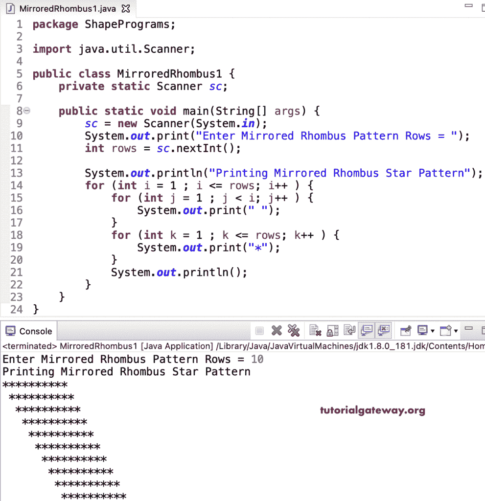

# Java 程序：打印星号的镜像菱形图案

> 原文：<https://www.tutorialgateway.org/java-program-to-print-mirrored-rhombus-star-pattern/>

写一个 Java 程序来打印星号的镜像菱形图案，用于循环。这个 Java 镜像菱形图案示例使用嵌套 for 循环来迭代菱形行。

```java
package ShapePrograms;

import java.util.Scanner;

public class MirroredRhombus1 {
	private static Scanner sc;

	public static void main(String[] args) {
		sc = new Scanner(System.in);

		System.out.print("Enter Mirrored Rhombus Pattern Rows = ");
		int rows = sc.nextInt();

		System.out.println("Printing Mirrored Rhombus Star Pattern");	

		for (int i = 1 ; i <= rows; i++ ) 
		{
			for (int j = 1 ; j < i; j++ ) 
			{
				System.out.print(" ");
			}
			for (int k = 1 ; k <= rows; k++ ) 
			{
				System.out.print("*");
			}
			System.out.println();
		}
	}
}
```



在这个 Java 镜像菱形星号图案[程序](https://www.tutorialgateway.org/learn-java-programs/)中，我们将循环的[替换为循环](https://www.tutorialgateway.org/java-for-loop/)的[。](https://www.tutorialgateway.org/java-while-loop/)

```java
package ShapePrograms;

import java.util.Scanner;

public class MirroredRhombus2 {
	private static Scanner sc;

	public static void main(String[] args) {
		sc = new Scanner(System.in);

		System.out.print("Enter Mirrored Rhombus Pattern Rows = ");
		int rows = sc.nextInt();

		System.out.println("Printing Mirrored Rhombus Star Pattern");
		int j, k, i = 1 ;
		while( i <= rows ) 
		{
			j = 1 ;
			while (j < i ) 
			{
				System.out.print(" ");
				j++;
			}
			k = 1 ;
			while( k <= rows ) 
			{
				System.out.print("*");
				k++ ;
			}
			System.out.println();
			i++;
		}
	}
}
```

```java
Enter Mirrored Rhombus Pattern Rows = 10
Printing Mirrored Rhombus Star Pattern
**********
 **********
  **********
   **********
    **********
     **********
      **********
       **********
        **********
         **********
```

## 使用边循环边打印星号的镜像菱形图案的 Java 程序

```java
package ShapePrograms;

import java.util.Scanner;

public class MirroredRhombus3 {
	private static Scanner sc;

	public static void main(String[] args) {
		sc = new Scanner(System.in);

		System.out.print("Enter Mirrored Rhombus Pattern Rows = ");
		int rows = sc.nextInt();

		System.out.println("Printing Mirrored Rhombus Star Pattern");
		int j, k, i = 1 ;
		do
		{
			j = 1 ;
			do
			{
				System.out.print(" ");
			} while (j++ < i );
			k = 1 ;
			do
			{
				System.out.print("*");
			} while( ++k <= rows );
			System.out.println();
		} while( ++i <= rows ) ;
	}
}
```

```java
Enter Mirrored Rhombus Pattern Rows = 15
Printing Mirrored Rhombus Star Pattern
 ***************
  ***************
   ***************
    ***************
     ***************
      ***************
       ***************
        ***************
         ***************
          ***************
           ***************
            ***************
             ***************
              ***************
               ***************
```

在这个 Java 例子中，MirroredRhombusPat 函数打印给定符号的镜像菱形图案。

```java
package ShapePrograms;

import java.util.Scanner;

public class MirroredRhombus4 {
	private static Scanner sc;

	public static void main(String[] args) {
		sc = new Scanner(System.in);

		System.out.print("Enter Mirrored Rhombus Pattern Rows = ");
		int rows = sc.nextInt();

		System.out.print("Enter Character for Mirrored Rhombus Pattern = ");
		char ch = sc.next().charAt(0);

		System.out.println("Printing Mirrored Rhombus Star Pattern");
		MirroredRhombusPat(rows, ch);	
	}

	public static void MirroredRhombusPat(int rows, char ch) {
		for (int i = 1 ; i <= rows; i++ ) 
		{
			for (int j = 1 ; j < i; j++ ) 
			{
				System.out.print(" ");
			}
			for (int k = 1 ; k <= rows; k++ ) 
			{
				System.out.print(ch);
			}
			System.out.println();
		}
	}
}
```

```java
Enter Mirrored Rhombus Pattern Rows = 12
Enter Character for Mirrored Rhombus Pattern = $
Printing Mirrored Rhombus Star Pattern
$$$$$$$$$$$$
 $$$$$$$$$$$$
  $$$$$$$$$$$$
   $$$$$$$$$$$$
    $$$$$$$$$$$$
     $$$$$$$$$$$$
      $$$$$$$$$$$$
       $$$$$$$$$$$$
        $$$$$$$$$$$$
         $$$$$$$$$$$$
          $$$$$$$$$$$$
           $$$$$$$$$$$$
```