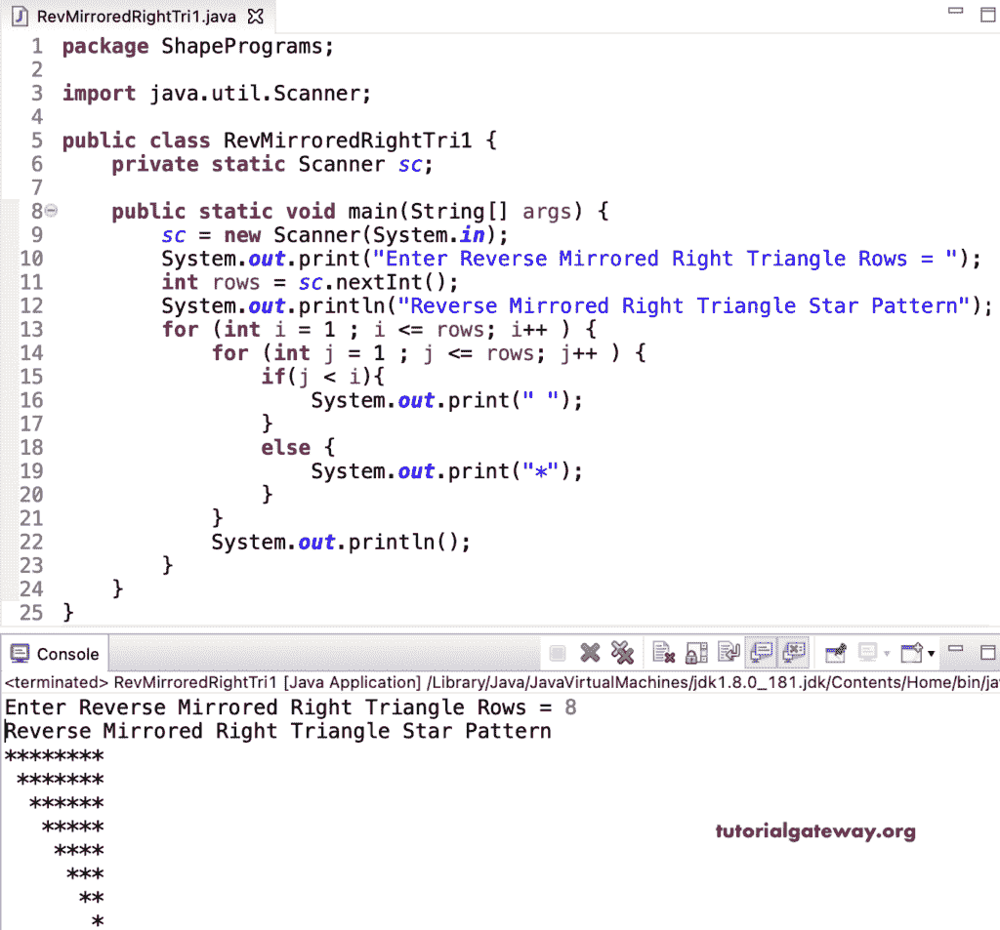

# Java 程序：打印反向镜像直角三角形星形图案

> 原文：<https://www.tutorialgateway.org/java-program-to-print-reverse-mirrored-right-triangle-star-pattern/>

写一个 Java 程序来打印反向镜像的直角三角形星形模式，用于循环。这个 Java 反向镜像直角三角形示例根据 If 条件打印星形或空白。

```java
package ShapePrograms;

import java.util.Scanner;

public class RevMirroredRightTri1 {
	private static Scanner sc;

	public static void main(String[] args) {
		sc = new Scanner(System.in);

		System.out.print("Enter Reverse Mirrored Right Triangle Rows = ");
		int rows = sc.nextInt();

		System.out.println("Reverse Mirrored Right Triangle Star Pattern");

		for (int i = 1 ; i <= rows; i++ ) 
		{
			for (int j = 1 ; j <= rows; j++ ) 
			{
				if(j < i)
				{
					System.out.print(" ");
				}
				else
				{
					System.out.print("*");
				}
			}
			System.out.println();
		}
	}
}
```



在这个 Java 反向镜像直角三角形星形模式[程序](https://www.tutorialgateway.org/learn-java-programs/)中，我们将循环的[替换为循环](https://www.tutorialgateway.org/java-for-loop/)的[。](https://www.tutorialgateway.org/java-while-loop/)

```java
package ShapePrograms;

import java.util.Scanner;

public class RevMirroredRightTri2 {
	private static Scanner sc;

	public static void main(String[] args) {
		sc = new Scanner(System.in);

		System.out.print("Enter Reverse Mirrored Right Triangle Rows = ");
		int rows = sc.nextInt();

		System.out.println("Reverse Mirrored Right Triangle Star Pattern");
		int i = 1, j;
		while( i <= rows ) 
		{
			j = 1 ;
			while(j <= rows) 
			{
				if(j < i)
				{
					System.out.print(" ");
				}
				else
				{
					System.out.print("*");
				}
				j++;
			}
			System.out.println();
			i++;
		}
	}
}
```

```java
Enter Reverse Mirrored Right Triangle Rows = 10
Reverse Mirrored Right Triangle Star Pattern
**********
 *********
  ********
   *******
    ******
     *****
      ****
       ***
        **
         *
```

## 使用边循环边打印反向镜像直角三角形星形图案的 Java 程序

```java
package ShapePrograms;

import java.util.Scanner;

public class RevMirroredRightTri3 {
	private static Scanner sc;

	public static void main(String[] args) {
		sc = new Scanner(System.in);

		System.out.print("Enter Reverse Mirrored Right Triangle Rows = ");
		int rows = sc.nextInt();

		System.out.println("Reverse Mirrored Right Triangle Star Pattern");
		int i = 1, j;
		do
		{
			j = 1 ;
			do 
			{
				if(j < i)
				{
					System.out.print(" ");
				}
				else
				{
					System.out.print("*");
				}
			} while(++j <= rows);
			System.out.println();
		} while( ++i <= rows );
	}
}
```

```java
Enter Reverse Mirrored Right Triangle Rows = 14
Reverse Mirrored Right Triangle Star Pattern
**************
 *************
  ************
   ***********
    **********
     *********
      ********
       *******
        ******
         *****
          ****
           ***
            **
             *
```

在这个 Java 例子中，RevMirroredRightTriangle 函数打印给定符号的反向镜像直角三角形模式。

```java
package ShapePrograms;

import java.util.Scanner;

public class RevMirroredRightTri4 {
	private static Scanner sc;

	public static void main(String[] args) {
		sc = new Scanner(System.in);

		System.out.print("Enter Reverse Mirrored Right Triangle Rows = ");
		int rows = sc.nextInt();

		System.out.print("Character for Reverse Mirrored Right Triangle Pattern = ");
		char ch = sc.next().charAt(0);

		System.out.println("Reverse Mirrored Right Triangle Star Pattern");
		RevMirroredRightTriangle(rows, ch);		
	}

	public static void RevMirroredRightTriangle(int rows, char ch) {
		for (int i = 1 ; i <= rows; i++ ) 
		{
			for (int j = 1 ; j <= rows; j++ ) 
			{
				if(j < i)
				{
					System.out.print(" ");
				}
				else
				{
					System.out.print(ch);
				}
			}
			System.out.println();
		}
	}
}
```

```java
Enter Reverse Mirrored Right Triangle Rows = 17
Character for Reverse Mirrored Right Triangle Pattern = #
Reverse Mirrored Right Triangle Star Pattern
#################
 ################
  ###############
   ##############
    #############
     ############
      ###########
       ##########
        #########
         ########
          #######
           ######
            #####
             ####
              ###
               ##
                #
```