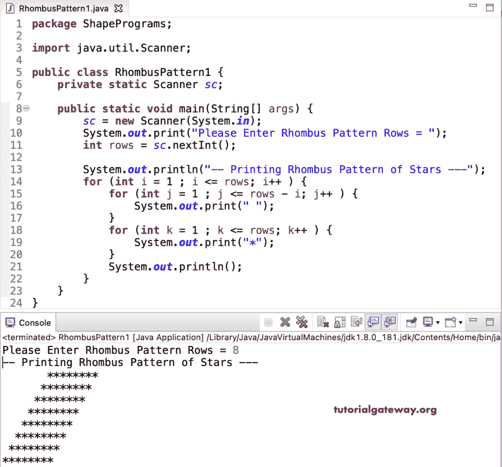

# Java 程序：打印菱形星形图案

> 原文：<https://www.tutorialgateway.org/java-program-to-print-rhombus-star-pattern/>

写一个 Java 程序打印菱形星形图案用于循环。这个 Java 菱形星形示例使用嵌套在 for 循环中的多个 for 循环来迭代菱形行。

```java
package ShapePrograms;

import java.util.Scanner;

public class RhombusPattern1 {
	private static Scanner sc;

	public static void main(String[] args) {
		sc = new Scanner(System.in);

		System.out.print("Please Enter Rhombus Pattern Rows = ");
		int rows = sc.nextInt();

		System.out.println("-- Printing Rhombus Pattern of Stars ---");

		for (int i = 1 ; i <= rows; i++ ) 
		{
			for (int j = 1 ; j <= rows - i; j++ ) 
			{
				System.out.print(" ");
			}
			for (int k = 1 ; k <= rows; k++ ) 
			{
				System.out.print("*");
			}
			System.out.println();
		}
	}
}
```



在这个 Java 菱形星形模式[程序](https://www.tutorialgateway.org/learn-java-programs/)中，我们将循环的嵌套[替换为循环](https://www.tutorialgateway.org/java-for-loop/)的[。](https://www.tutorialgateway.org/java-while-loop/)

```java
package ShapePrograms;

import java.util.Scanner;

public class RhombusPattern2 {
	private static Scanner sc;

	public static void main(String[] args) {
		sc = new Scanner(System.in);

		System.out.print("Please Enter Rhombus Pattern Rows = ");
		int rows = sc.nextInt();

		System.out.println("--- Printing Rhombus Pattern of Stars ---");
		int i = 1 ;
		while( i <= rows ) 
		{
			int j = 1;
			while(j <= rows - i) 
			{
				System.out.print(" ");
				j++;
			}
			int k = 1;
			while(k <= rows) 
			{
				System.out.print("*");
				k++;
			}
			System.out.println();
			i++;
		}
	}
}
```

```java
Please Enter Rhombus Pattern Rows = 12
--- Printing Rhombus Pattern of Stars ---
           ************
          ************
         ************
        ************
       ************
      ************
     ************
    ************
   ************
  ************
 ************
************
```

## 用边循环边打印菱形星形图案的 Java 程序

```java
package ShapePrograms;

import java.util.Scanner;

public class RhombusPattern3 {
	private static Scanner sc;

	public static void main(String[] args) {
		sc = new Scanner(System.in);

		System.out.print("Please Enter Rhombus Pattern Rows = ");
		int rows = sc.nextInt();

		System.out.println("-- Printing Rhombus Pattern of Stars ---");
		int i = 1 ;
		do
		{
			int j = 1;
			do 
			{
				System.out.print(" ");
			}while(j++ <= rows - i);
			int k = 1;
			do
			{
				System.out.print("*");
			}while(++k <= rows);
			System.out.println();
			i++;
		}while(i <= rows);
	}
}
```

```java
Please Enter Rhombus Pattern Rows = 10
-- Printing Rhombus Pattern of Stars ---
          **********
         **********
        **********
       **********
      **********
     **********
    **********
   **********
  **********
 **********
```

在这个 Java 例子中，菱形模式函数打印用户给定符号的菱形模式。

```java
package ShapePrograms;

import java.util.Scanner;

public class RhombusPattern4 {
	private static Scanner sc;

	public static void main(String[] args) {
		sc = new Scanner(System.in);

		System.out.print("Please Enter Rhombus Pattern Rows = ");
		int rows = sc.nextInt();

		System.out.print("Please Enter Character for Rhombus Pattern = ");
		char ch = sc.next().charAt(0);

		System.out.println("---- Printing Rhombus Pattern ------");
		RhombusPattern(rows, ch);

	}
	public static void RhombusPattern(int rows, char ch) {
		for (int i = 1 ; i <= rows; i++ ) 
		{
			for (int j = 1 ; j <= rows - i; j++ ) 
			{
				System.out.print(" ");
			}
			for (int k = 1 ; k <= rows; k++ ) 
			{
				System.out.print(ch);
			}
			System.out.println();
		}
	}
}
```

```java
Please Enter Rhombus Pattern Rows = 15
Please Enter Character for Rhombus Pattern = #
---- Printing Rhombus Pattern ------
              ###############
             ###############
            ###############
           ###############
          ###############
         ###############
        ###############
       ###############
      ###############
     ###############
    ###############
   ###############
  ###############
 ###############
###############
```