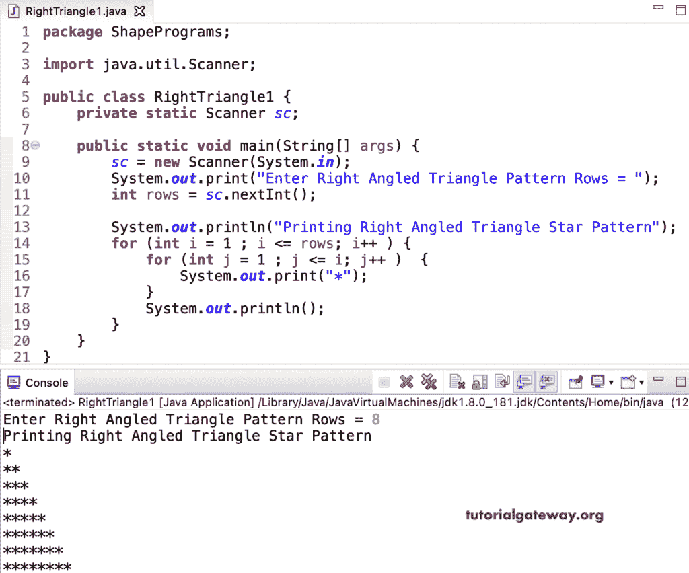

# Java 程序：打印星号的直角三角形图案

> 原文：<https://www.tutorialgateway.org/java-program-to-print-right-angled-triangle-star-pattern/>

写一个 Java 程序来打印星号的直角三角形图案，用于循环。这个 Java 直角三角形星号示例使用嵌套 for 循环来迭代行并显示输出。

```java
package ShapePrograms;

import java.util.Scanner;

public class RightTriangle1 {
	private static Scanner sc;

	public static void main(String[] args) {
		sc = new Scanner(System.in);	

		System.out.print("Enter Right Angled Triangle Pattern Rows = ");
		int rows = sc.nextInt();

		System.out.println("Printing Right Angled Triangle Star Pattern");

		for (int i = 1 ; i <= rows; i++ ) 
		{
			for (int j = 1 ; j <= i; j++ ) 	
			{
				System.out.print("*");
			}
			System.out.println();
		}
	}
}
```



在这个 Java 直角三角形星号图案[程序](https://www.tutorialgateway.org/learn-java-programs/)中，我们将循环的[替换为循环](https://www.tutorialgateway.org/java-for-loop/)的[。](https://www.tutorialgateway.org/java-while-loop/)

```java
package ShapePrograms;

import java.util.Scanner;

public class RightTriangle2 {
	private static Scanner sc;

	public static void main(String[] args) {
		sc = new Scanner(System.in);

		System.out.print("Enter Right Angled Triangle Pattern Rows = ");
		int rows = sc.nextInt();

		System.out.println("Printing Right Angled Triangle Pattern of Stars");
		int i = 1, j ;

		while( i <= rows ) 
		{
			j = 1 ;
			while(j <= i ) 
			{
				System.out.print("*");
				j++;
			}
			System.out.println();
			i++;
		}
	}
}
```

```java
Enter Right Angled Triangle Pattern Rows = 10
Printing Right Angled Triangle Pattern of Stars
*
**
***
****
*****
******
*******
********
*********
**********
```

## 用边循环边打印星号的直角三角形图案的 Java 程序

```java
package ShapePrograms;

import java.util.Scanner;

public class RightTriangle3 {
	private static Scanner sc;

	public static void main(String[] args) {
		sc = new Scanner(System.in);

		System.out.print("Enter Right Angled Triangle Pattern Rows = ");
		int rows = sc.nextInt();

		System.out.println("Printing Right Angled Triangle Pattern of Stars");
		int i = 1, j ;

		do
		{
			j = 1 ;
			do
			{
				System.out.print("*");
			} while(++j <= i ) ;
			System.out.println();
		} while( ++i <= rows );
	}
}
```

```java
Enter Right Angled Triangle Pattern Rows = 14
Printing Right Angled Triangle Pattern of Stars
*
**
***
****
*****
******
*******
********
*********
**********
***********
************
*************
**************
```

在这个 Java 例子中，RightTrianglePattern 函数打印给定符号的直角三角形模式。

```java
package ShapePrograms;

import java.util.Scanner;

public class RightTriangle4 {
	private static Scanner sc;

	public static void main(String[] args) {
		sc = new Scanner(System.in);

		System.out.print("Enter Right Angled Triangle Pattern Rows = ");
		int rows = sc.nextInt();

		System.out.print("Character for Right Angled Triangle Pattern = ");
		char ch = sc.next().charAt(0);

		System.out.println("Printing Right Angled Triangle Pattern of Stars");
		RightTrianglePattern(rows, ch);	
	}

	public static void RightTrianglePattern(int rows, char ch) {
		for (int i = 1 ; i <= rows; i++ ) 
		{
			for (int j = 1 ; j <= i; j++ ) 
			{
				System.out.print(ch);
			}
			System.out.println();
		}
	}
}
```

```java
Enter Right Angled Triangle Pattern Rows = 17
Character for Right Angled Triangle Pattern = $
Printing Right Angled Triangle Pattern of Stars
$
$$
$$$
$$$$
$$$$$
$$$$$$
$$$$$$$
$$$$$$$$
$$$$$$$$$
$$$$$$$$$$
$$$$$$$$$$$
$$$$$$$$$$$$
$$$$$$$$$$$$$
$$$$$$$$$$$$$$
$$$$$$$$$$$$$$$
$$$$$$$$$$$$$$$$
$$$$$$$$$$$$$$$$$
```