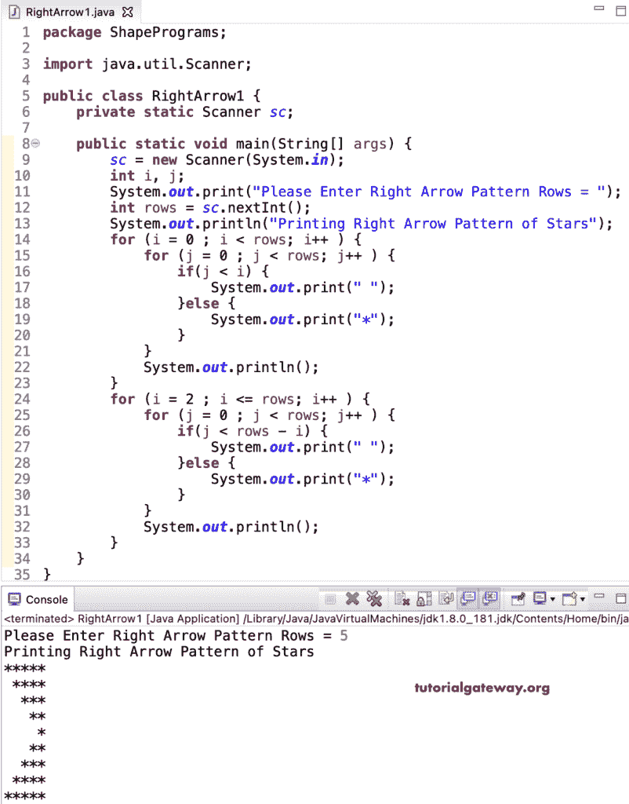

# Java 程序：打印星号的右箭头图案

> 原文：<https://www.tutorialgateway.org/java-program-to-print-right-arrow-star-pattern/>

编写一个 Java 程序来打印星号的用于循环的右箭头图案。这个 Java 右箭头星号示例将代码分为两部分，第一部分(嵌套 for 循环)打印右箭头的顶部，另一部分代码打印底部。

```java
package ShapePrograms;

import java.util.Scanner;

public class RightArrow1 {
	private static Scanner sc;

	public static void main(String[] args) {
		sc = new Scanner(System.in);

		int i, j;

		System.out.print("Please Enter Right Arrow Pattern Rows = ");
		int rows = sc.nextInt();

		System.out.println("Printing Right Arrow Pattern of Stars");

		for (i = 0 ; i < rows; i++ ) 
		{
			for (j = 0 ; j < rows; j++ ) 
			{
				if(j < i) {
					System.out.print(" ");
				}
				else {
					System.out.print("*");
				}
			}
			System.out.println();
		}

		for (i = 2 ; i <= rows; i++ ) 
		{
			for (j = 0 ; j < rows; j++ ) 
			{
				if(j < rows - i) {
					System.out.print(" ");
				}
				else {
					System.out.print("*");
				}
			}
			System.out.println();
		}
	}
}
```



在这个 Java 右箭头星号图案[程序](https://www.tutorialgateway.org/learn-java-programs/)中，我们用一个 [while 循环](https://www.tutorialgateway.org/java-while-loop/)代替了循环的[。](https://www.tutorialgateway.org/java-for-loop/)

```java
package ShapePrograms;

import java.util.Scanner;

public class RightArrow2 {
	private static Scanner sc;

	public static void main(String[] args) {
		sc = new Scanner(System.in);

		int i, j;

		System.out.print("Please Enter Right Arrow Pattern Rows = ");
		int rows = sc.nextInt();

		System.out.println("---- Printing Right Arrow Pattern of Stars ------");
		i = 0 ;
		while ( i < rows ) {
			j = 0 ;
			while( j < rows) {
				if(j < i) {
					System.out.print(" ");
				}
				else {
					System.out.print("*");
				}
				j++;
			}
			System.out.println();
			i++;
		}
		i = 2 ;
		while( i <= rows ) 
		{
			j = 0 ;
			while( j < rows) 
			{
				if(j < rows - i) {
					System.out.print(" ");
				}
				else {
					System.out.print("*");
				}
				j++;
			}
			System.out.println();
			i++;
		}
	}
}
```

```java
Please Enter Right Arrow Pattern Rows = 6
---- Printing Right Arrow Pattern of Stars ------
******
 *****
  ****
   ***
    **
     *
    **
   ***
  ****
 *****
******
```

## 使用边循环边打印星号的右箭头图案的 Java 程序

```java
package ShapePrograms;

import java.util.Scanner;

public class RightArrow3 {
	private static Scanner sc;

	public static void main(String[] args) {
		sc = new Scanner(System.in);

		int i, j;

		System.out.print("Please Enter Right Arrow Pattern Rows = ");
		int rows = sc.nextInt();

		System.out.println("---- Printing Right Arrow Pattern of Stars ------");
		i = 0 ;
		do {
			j = 0 ;
			do {
				if(j < i) {
					System.out.print(" ");
				}
				else {
					System.out.print("*");
				}
				j++;
			} while( j < rows);
			System.out.println();
			i++;
		} while ( i < rows );

		i = 2 ;
		do	{
			j = 0 ;
			do	{
				if(j < rows - i) {
					System.out.print(" ");
				}
				else {
					System.out.print("*");
				}
				j++;
			} while( j < rows) ;
			System.out.println();
			i++;
		} while( i <= rows );
	}
}
```

```java
Please Enter Right Arrow Pattern Rows = 8
---- Printing Right Arrow Pattern of Stars ------
********
 *******
  ******
   *****
    ****
     ***
      **
       *
      **
     ***
    ****
   *****
  ******
 *******
********
```

在这个 Java 例子中，右箭头模式函数打印给定符号的右箭头模式。

```java
package ShapePrograms;

import java.util.Scanner;

public class RightArrow4 {
	private static Scanner sc;

	public static void main(String[] args) {
		sc = new Scanner(System.in);

		System.out.print("Please Enter Right Arrow Pattern Rows = ");
		int rows = sc.nextInt();

		System.out.print("Please Enter Character for Right Arrow Pattern = ");
		char ch = sc.next().charAt(0);

		System.out.println("--- Printing Right Arrow Pattern of Stars ----");
		RightArrowPattern(rows, ch);
	}

	public static void RightArrowPattern(int rows, char ch) {
		int i, j;
		for (i = 0 ; i < rows; i++ ) 
		{
			for (j = 0 ; j < rows; j++ ) 
			{
				if(j < i) {
					System.out.print(" ");
				}
				else {
					System.out.print(ch);
				}
			}
			System.out.println();
		}

		for (i = 2 ; i <= rows; i++ ) 
		{
			for (j = 0 ; j < rows; j++ ) 
			{
				if(j < rows - i) {
					System.out.print(" ");
				}
				else {
					System.out.print(ch);
				}
			}
			System.out.println();
		}
	}
}
```

```java
Please Enter Right Arrow Pattern Rows = 10
Please Enter Character for Right Arrow Pattern = #
--- Printing Right Arrow Pattern of Stars ----
##########
 #########
  ########
   #######
    ######
     #####
      ####
       ###
        ##
         #
        ##
       ###
      ####
     #####
    ######
   #######
  ########
 #########
##########
```