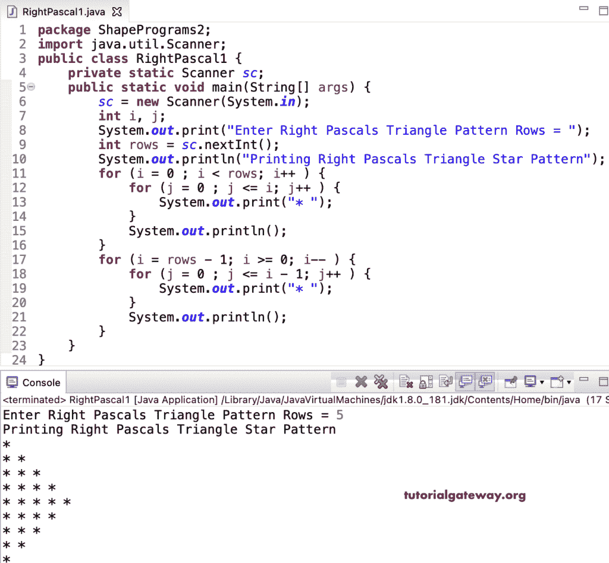

# Java 程序：打印星号的右帕斯卡直角三角形

> 原文：<https://www.tutorialgateway.org/java-program-to-print-right-pascals-star-triangle/>

编写一个 Java 程序，使用 for 循环打印右帕斯卡星号三角形。

```java
package ShapePrograms2;

import java.util.Scanner;

public class RightPascal1 {
	private static Scanner sc;

	public static void main(String[] args) {
		sc = new Scanner(System.in);

		int i, j;

		System.out.print("Enter Right Pascals Triangle Pattern Rows = ");
		int rows = sc.nextInt();

		System.out.println("Printing Right Pascals Triangle Star Pattern");

		for (i = 0 ; i < rows; i++ ) 
		{
			for (j = 0 ; j <= i; j++ ) 
			{
				System.out.print("* ");
			}
			System.out.println();
		}

		for (i = rows - 1; i >= 0; i-- ) 
		{
			for (j = 0 ; j <= i - 1; j++ ) 
			{
				System.out.print("* ");
			}
			System.out.println();
		}
	}
}
```



这个 [Java 示例](https://www.tutorialgateway.org/learn-java-programs/)使用 while 循环以右帕斯卡三角形模式显示星星。

```java
package ShapePrograms2;

import java.util.Scanner;

public class RightPascal2 {
	private static Scanner sc;

	public static void main(String[] args) {
		sc = new Scanner(System.in);

		System.out.print("Enter Right Pascals Triangle Pattern Rows = ");
		int rows = sc.nextInt();

		System.out.println("Printing Right Pascals Triangle Star Pattern");
		int j, i = 0;

		while(i < rows ) 
		{
			j = 0 ;

			while( j <= i ) 
			{
				System.out.print("* ");
				j++;
			}
			System.out.println();
			i++;
		}

		i = rows - 1; 
		while (i >= 0) 
		{
			j = 0 ;
			while ( j <= i - 1 ) 
			{
				System.out.print("* ");
				j++;
			}
			System.out.println();
			i--;
		}
	}
}
```

```java
Enter Right Pascals Triangle Pattern Rows = 8
Printing Right Pascals Triangle Star Pattern
* 
* * 
* * * 
* * * * 
* * * * * 
* * * * * * 
* * * * * * * 
* * * * * * * * 
* * * * * * * 
* * * * * * 
* * * * * 
* * * * 
* * * 
* * 
* 
```

## Java 程序使用 do while 循环打印右帕斯卡星号三角形。

```java
package ShapePrograms2;

import java.util.Scanner;

public class RightPascal3 {
	private static Scanner sc;

	public static void main(String[] args) {
		sc = new Scanner(System.in);

		System.out.print("Enter Right Pascals Triangle Pattern Rows = ");
		int rows = sc.nextInt();

		System.out.println("Printing Right Pascals Triangle Star Pattern");
		int j, i = 0;

		do 
		{
			j = 0 ;

			do
			{
				System.out.print("* ");

			} while( ++j <= i );

			System.out.println();

		} while(++i < rows );

		i = rows - 1; 
		do
		{
			j = 0 ;
			do
			{
				System.out.print("* ");

			} while ( ++j <= i - 1 );

			System.out.println();

		} while (--i > 0);
	}
}
```

```java
Enter Right Pascals Triangle Pattern Rows = 9
Printing Right Pascals Triangle Star Pattern
* 
* * 
* * * 
* * * * 
* * * * * 
* * * * * * 
* * * * * * * 
* * * * * * * * 
* * * * * * * * * 
* * * * * * * * 
* * * * * * * 
* * * * * * 
* * * * * 
* * * * 
* * * 
* * 
* 
```

在这个 Java 例子中，RightPascalTrianglePattern 函数打印给定符号的右帕斯卡三角形模式。

```java
package ShapePrograms2;

import java.util.Scanner;

public class RightPascal4 {
	private static Scanner sc;

	public static void main(String[] args) {
		sc = new Scanner(System.in);

		System.out.print("Enter Right Pascals Triangle Pattern Rows = ");
		int rows = sc.nextInt();

		System.out.print("Enter Character for Right Pascals Triangle Pattern = ");
		char ch = sc.next().charAt(0);

		System.out.println("Printing Right Pascals Triangle Pattern");
		RightPascalTrianglePattern(rows, ch);	
	}

	public static void RightPascalTrianglePattern(int rows, char ch) {
		int i, j;

		for (i = 0 ; i < rows; i++ ) 
		{
			for (j = 0 ; j <= i; j++ ) 
			{
				System.out.print(ch + " ");
			}
			System.out.println();
		}

		for (i = rows - 1; i >= 0; i-- ) 
		{
			for (j = 0 ; j <= i - 1; j++ ) 
			{
				System.out.print(ch + " ");
			}
			System.out.println();
		}
	}
}
```

```java
Enter Right Pascals Triangle Pattern Rows = 11
Enter Character for Right Pascals Triangle Pattern = #
Printing Right Pascals Triangle Pattern
# 
# # 
# # # 
# # # # 
# # # # # 
# # # # # # 
# # # # # # # 
# # # # # # # # 
# # # # # # # # # 
# # # # # # # # # # 
# # # # # # # # # # # 
# # # # # # # # # # 
# # # # # # # # # 
# # # # # # # # 
# # # # # # # 
# # # # # # 
# # # # # 
# # # # 
# # # 
# # 
# 
```