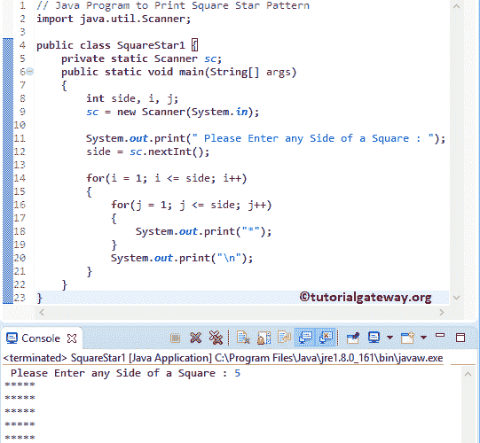

# Java 程序：打印星号的方形图案

> 原文：<https://www.tutorialgateway.org/java-program-to-print-square-star-pattern/>

编写一个 Java 程序，使用 For 循环和 While 循环打印星号的方形图案，并举例说明。

## 用 For 循环打印星号的方形图案的 Java 程序

该程序允许用户输入正方形的任意一边(整数值)。接下来，这个 Java 程序显示方形星号图案，直到它到达用户指定的行和列。

```java
// Java Program to Print Square Star Pattern
import java.util.Scanner;

public class SquareStar1 {
	private static Scanner sc;
	public static void main(String[] args) 
	{
		int side, i, j;
		sc = new Scanner(System.in);

		System.out.print(" Please Enter any Side of a Square : ");
		side = sc.nextInt();	

		for(i = 1; i <= side; i++)
		{
			for(j = 1; j <= side; j++)
			{
				System.out.print("*"); 
			}
			System.out.print("\n"); 
		}	
	}
}
```



首先 [For 循环](https://www.tutorialgateway.org/java-for-loop/)是从 1 迭代到用户输入端。接下来，我们使用[嵌套循环](https://www.tutorialgateway.org/nested-for-loop-in-java/)将 j 从 1 迭代到用户输入的值(边)。在这个 [Java](https://www.tutorialgateway.org/java-tutorial/) 示例中，用户输入的值:side = 5

第一次 For 循环–第一次迭代:For(I = 1；i <= 5; i++)
条件为真。因此，它进入第二个 For 循环

第二次 For 循环–第一次迭代:For(j = 1；1 <= 5; 1++)
条件为真。所以，*在系统内部。打印出来。

第二次 For 循环–第二次迭代:For(j = 2；2 <= 5; 2++)
条件为真。所以，*在系统内部。打印出来。

第二个 For 循环重复该过程，直到 j 达到 6。因为如果 j 是 6，条件就失败了，所以它从第二个循环退出。

第一次 For 循环–第二次迭代:For(I = 2；i <= 5; 2++)
条件为真。因此，它进入第二个 For 循环。重复上述过程，直到我达到 6。

## 用 While 循环打印星号的方形图案的 Java 程序

这个返回方形星号图案的 Java 程序与上面的例子相同，但是我们使用的是 While 循环。

```java
// Java Program to Print Square Star Pattern
import java.util.Scanner;

public class SquareStar2 {
	private static Scanner sc;
	public static void main(String[] args) 
	{
		int side, i = 1, j;
		sc = new Scanner(System.in);

		System.out.print(" Please Enter any Side of a Square : ");
		side = sc.nextInt();	

		while(i <= side)
		{
			j = 1;
			while(j <= side)
			{
				System.out.print("* "); 
				j++;
			}
			i++;
			System.out.print("\n"); 
		}	
	}
}
```

Java 方形星号图案使用 [While 循环](https://www.tutorialgateway.org/java-while-loop/)输出

```java
 Please Enter any Side of a Square : 8
* * * * * * * * 
* * * * * * * * 
* * * * * * * * 
* * * * * * * * 
* * * * * * * * 
* * * * * * * * 
* * * * * * * * 
* * * * * * * * 
```

## 打印自定义字符方形图案的 Java 程序

这个 [Java 程序](https://www.tutorialgateway.org/learn-java-programs/)允许用户输入任何字符，然后以正方形模式打印该字符。

```java
// Java Program to Print Square Star Pattern
import java.util.Scanner;

public class SquareStar3 {
	private static Scanner sc;
	public static void main(String[] args) 
	{
		int side, i, j;
		char ch;
		sc = new Scanner(System.in);

		System.out.print(" Please Enter any Side of a Square : ");
		side = sc.nextInt();	

		System.out.print(" Please Enter any Character : ");
		ch = sc.next().charAt(0);	

		for(i = 1; i <= side; i++)
		{
			for(j = 1; j <= side; j++)
			{
				System.out.print(ch + " "); 
			}
			System.out.print("\n"); 
		}	
	}
}
```

```java
 Please Enter any Side of a Square : 10
 Please Enter any Character : $
$ $ $ $ $ $ $ $ $ $ 
$ $ $ $ $ $ $ $ $ $ 
$ $ $ $ $ $ $ $ $ $ 
$ $ $ $ $ $ $ $ $ $ 
$ $ $ $ $ $ $ $ $ $ 
$ $ $ $ $ $ $ $ $ $ 
$ $ $ $ $ $ $ $ $ $ 
$ $ $ $ $ $ $ $ $ $ 
$ $ $ $ $ $ $ $ $ $ 
$ $ $ $ $ $ $ $ $ $ 
```