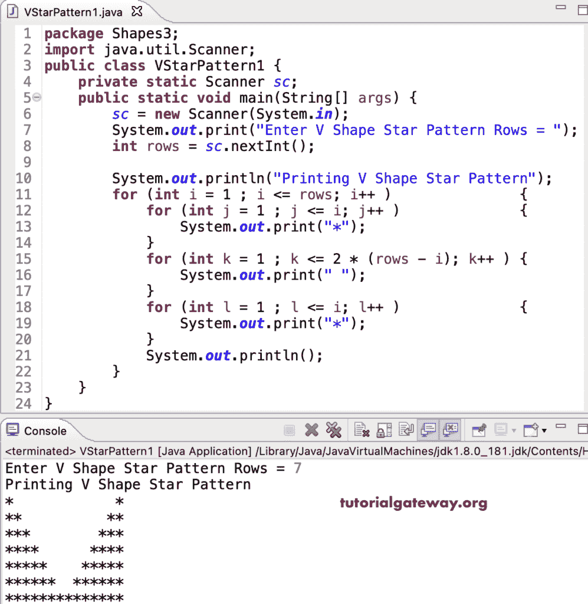

# Java 程序：打印`V`星形图案

> 原文：<https://www.tutorialgateway.org/java-program-to-print-v-star-pattern/>

编写一个 Java 程序，使用 for 循环打印`V`星形图案。

```java
package Shapes3;

import java.util.Scanner;

public class VStarPattern1 {
	private static Scanner sc;

	public static void main(String[] args) {
		sc = new Scanner(System.in);

		System.out.print("Enter V Shape Star Pattern Rows = ");
		int rows = sc.nextInt();

		System.out.println("Printing V Shape Star Pattern");

		for (int i = 1 ; i <= rows; i++ ) 
		{
			for (int j = 1 ; j <= i; j++ ) 
			{
				System.out.print("*");
			}
			for (int k = 1 ; k <= 2 * (rows - i); k++ ) 
			{
				System.out.print(" ");
			}
			for (int l = 1 ; l <= i; l++ ) 
			{
				System.out.print("*");
			}
			System.out.println();
		}
	}
}
```



## 用 while 循环打印`V`星形图案的 Java 程序

```java
package Shapes3;

import java.util.Scanner;

public class VStarPattern2 {
	private static Scanner sc;

	public static void main(String[] args) {
		sc = new Scanner(System.in);

		int i, j, k, l;

		System.out.print("Enter V Shape Star Pattern Rows = ");
		int rows = sc.nextInt();

		System.out.println("Printing V Shape Star Pattern");
		i = 1 ;
		while( i <= rows) 
		{
			j = 1 ;
			while( j <= i ) 
			{
				System.out.print("*");
				j++;

			}
			k = 1 ;
			while( k <= 2 * (rows - i) ) 
			{
				System.out.print(" ");
				k++;
			}
			l = 1 ;
			while( l <= i ) 
			{
				System.out.print("*");
				l++;
			}
			System.out.println();
			i++;
		}
	}
}
```

```java
Enter V Shape Star Pattern Rows = 12
Printing V Shape Star Pattern
*                      *
**                    **
***                  ***
****                ****
*****              *****
******            ******
*******          *******
********        ********
*********      *********
**********    **********
***********  ***********
************************
```

这个 Java 示例使用 do while 循环来显示字母 V 星形模式。

```java
package Shapes3;

import java.util.Scanner;

public class VStarPattern3 {
	private static Scanner sc;

	public static void main(String[] args) {
		sc = new Scanner(System.in);

		int i, j, k, l;

		System.out.print("Enter V Shape Star Pattern Rows = ");
		int rows = sc.nextInt();

		System.out.println("Printing V Shape Star Pattern");
		i = 1 ;
		do 
		{
			j = 1 ;
			do
			{
				System.out.print("*");

			} while( ++j <= i );
			k = 1 ;
			while(k <= 2 * (rows - i))
			{
				System.out.print(" ");
				k++;
			}
			l = 1 ;
			do
			{
				System.out.print("*");
			} while( ++l <= i ) ;
			System.out.println();
		} while(++i <= rows);
	}
}
```

```java
Enter V Shape Star Pattern Rows = 16
Printing V Shape Star Pattern
*                              *
**                            **
***                          ***
****                        ****
*****                      *****
******                    ******
*******                  *******
********                ********
*********              *********
**********            **********
***********          ***********
************        ************
*************      *************
**************    **************
***************  ***************
********************************
```

在这个 [Java 例子](https://www.tutorialgateway.org/learn-java-programs/)中，允许输入任意字符并打印给定字符的 V 模式的 VShapePattern 函数。

```java
package Shapes3;

import java.util.Scanner;

public class VStarPattern4 {
	private static Scanner sc;

	public static void main(String[] args) {
		sc = new Scanner(System.in);

		System.out.print("Enter V Shape Star Pattern Rows = ");
		int rows = sc.nextInt();

		System.out.print("Enter Character for V Pattern = ");
		char ch = sc.next().charAt(0);

		System.out.println("Printing V Shape Pattern");
		VShapePattern(rows, ch);
	}
	public static void VShapePattern(int rows, char ch) 
	{
		for (int i = 1 ; i <= rows; i++ ) 
		{
			for (int j = 1 ; j <= i; j++ ) 
			{
				System.out.print(ch);

			}
			for (int k = 1 ; k <= 2 * (rows - i); k++ ) 
			{
				System.out.print(" ");
			}
			for (int l = 1 ; l <= i; l++ ) 
			{
				System.out.print(ch);
			}
			System.out.println();
		}
	}
}
```

```java
Enter V Shape Star Pattern Rows = 19
Enter Character for V Pattern = $
Printing V Shape Pattern
$                                    $
$$                                  $$
$$$                                $$$
$$$$                              $$$$
$$$$$                            $$$$$
$$$$$$                          $$$$$$
$$$$$$$                        $$$$$$$
$$$$$$$$                      $$$$$$$$
$$$$$$$$$                    $$$$$$$$$
$$$$$$$$$$                  $$$$$$$$$$
$$$$$$$$$$$                $$$$$$$$$$$
$$$$$$$$$$$$              $$$$$$$$$$$$
$$$$$$$$$$$$$            $$$$$$$$$$$$$
$$$$$$$$$$$$$$          $$$$$$$$$$$$$$
$$$$$$$$$$$$$$$        $$$$$$$$$$$$$$$
$$$$$$$$$$$$$$$$      $$$$$$$$$$$$$$$$
$$$$$$$$$$$$$$$$$    $$$$$$$$$$$$$$$$$
$$$$$$$$$$$$$$$$$$  $$$$$$$$$$$$$$$$$$
$$$$$$$$$$$$$$$$$$$$$$$$$$$$$$$$$$$$$$
```