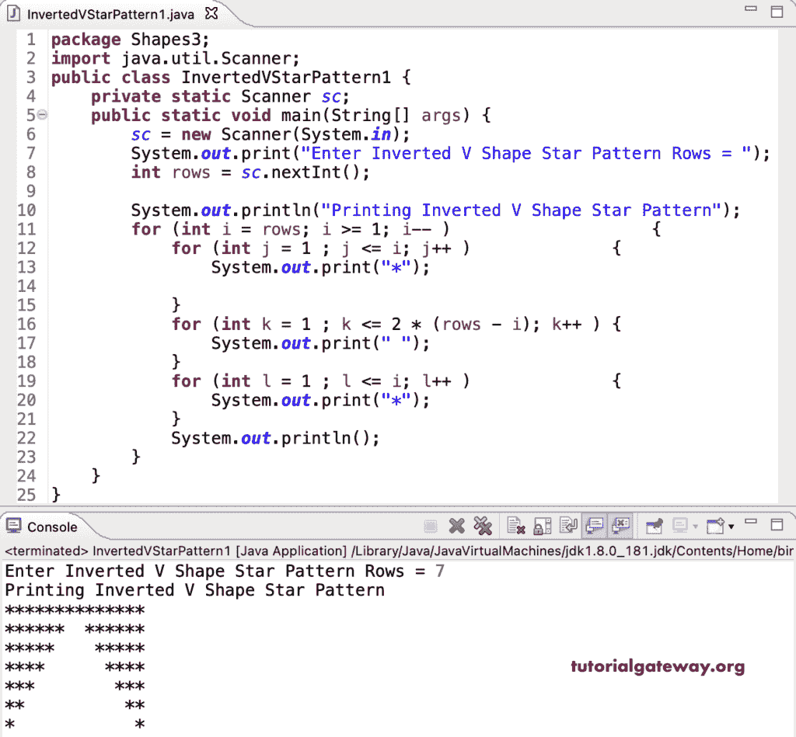

# Java 程序：打印倒 V 星图案

> 原文：<https://www.tutorialgateway.org/java-program-to-print-inverted-v-star-pattern/>

编写一个 Java 程序，用 for 循环在正方形星形图案内打印倒 V 星形图案或半菱形。

```java
package Shapes3;

import java.util.Scanner;

public class InvertedVStarPattern1 {
	private static Scanner sc;

	public static void main(String[] args) {
		sc = new Scanner(System.in);

		System.out.print("Enter Inverted V Shape Star Pattern Rows = ");
		int rows = sc.nextInt();

		System.out.println("Printing Inverted V Shape Star Pattern");

		for (int i = rows; i >= 1; i-- ) 
		{
			for (int j = 1 ; j <= i; j++ ) 
			{
				System.out.print("*");

			}
			for (int k = 1 ; k <= 2 * (rows - i); k++ ) 
			{
				System.out.print(" ");
			}
			for (int l = 1 ; l <= i; l++ ) 
			{
				System.out.print("*");
			}
			System.out.println();
		}
	}
}
```



这个 Java 程序使用 while 循环显示星星的倒 V 星图案。

```java
package Shapes3;

import java.util.Scanner;

public class InvertedVStarPattern2 {
	private static Scanner sc;

	public static void main(String[] args) {
		sc = new Scanner(System.in);

		System.out.print("Enter Inverted V Shape Star Pattern Rows = ");
		int rows = sc.nextInt();

		System.out.println("Printing Inverted V Shape Star Pattern");

		int i = rows;
		while( i >= 1) 
		{
			int j = 1 ;
			while( j <= i ) 
			{
				System.out.print("*");
				j++;

			}
			int k = 1 ;
			while( k <= 2 * (rows - i) ) 
			{
				System.out.print(" ");
				k++;
			}
			int l = 1 ;
			while( l <= i ) 
			{
				System.out.print("*");
				l++;
			}
			System.out.println();
			i--;
		}
	}
}
```

```java
Enter Inverted V Shape Star Pattern Rows = 13
Printing Inverted V Shape Star Pattern
**************************
************  ************
***********    ***********
**********      **********
*********        *********
********          ********
*******            *******
******              ******
*****                *****
****                  ****
***                    ***
**                      **
*                        *
```

## 用边做边循环打印倒 V 星图案的 Java 程序

```java
package Shapes3;

import java.util.Scanner;

public class InvertedVStarPattern3 {
	private static Scanner sc;

	public static void main(String[] args) {
		sc = new Scanner(System.in);

		System.out.print("Enter Inverted V Shape Star Pattern Rows = ");
		int rows = sc.nextInt();

		System.out.println("Printing Inverted V Shape Star Pattern");

		int i = rows;
		do 
		{
			int j = 1 ;
			do
			{
				System.out.print("*");

			} while( ++j <= i );
			int k = 1 ;
			while(k <= 2 * (rows - i))
			{
				System.out.print(" ");
				k++;
			}
			int l = 1 ;
			do
			{
				System.out.print("*");
			} while( ++l <= i ) ;
			System.out.println();
		} while(--i >= 1);
	}
}
```

```java
Enter Inverted V Shape Star Pattern Rows = 15
Printing Inverted V Shape Star Pattern
******************************
**************  **************
*************    *************
************      ************
***********        ***********
**********          **********
*********            *********
********              ********
*******                *******
******                  ******
*****                    *****
****                      ****
***                        ***
**                          **
*                            *
```

在这个 Java 模式[示例](https://www.tutorialgateway.org/learn-java-programs/)中，InvertedVShapePattern 函数允许输入任意字符并打印给定字符的倒 V。

```java
package Shapes3;

import java.util.Scanner;

public class InvertedVStarPattern4 {
	private static Scanner sc;

	public static void main(String[] args) {
		sc = new Scanner(System.in);

		System.out.print("Enter Inverted V Shape Star Pattern Rows = ");
		int rows = sc.nextInt();

		System.out.print("Enter Character for Inverted V Pattern = ");
		char ch = sc.next().charAt(0);

		System.out.println("Printing Inverted V Shape Star Pattern");	
		InvertedVShapePattern(rows, ch);
	}
	public static void InvertedVShapePattern(int rows, char ch) 
	{
		for (int i = rows; i >= 1; i-- ) 
		{
			for (int j = 1 ; j <= i; j++ ) 
			{
				System.out.print(ch);

			}
			for (int k = 1 ; k <= 2 * (rows - i); k++ ) 
			{
				System.out.print(" ");
			}
			for (int l = 1 ; l <= i; l++ ) 
			{
				System.out.print(ch);
			}
			System.out.println();
		}	
	}
}
```

```java
Enter Inverted V Shape Star Pattern Rows = 17
Enter Character for Inverted V Pattern = #
Printing Inverted V Shape Star Pattern
##################################
################  ################
###############    ###############
##############      ##############
#############        #############
############          ############
###########            ###########
##########              ##########
#########                #########
########                  ########
#######                    #######
######                      ######
#####                        #####
####                          ####
###                            ###
##                              ##
#                                #
```