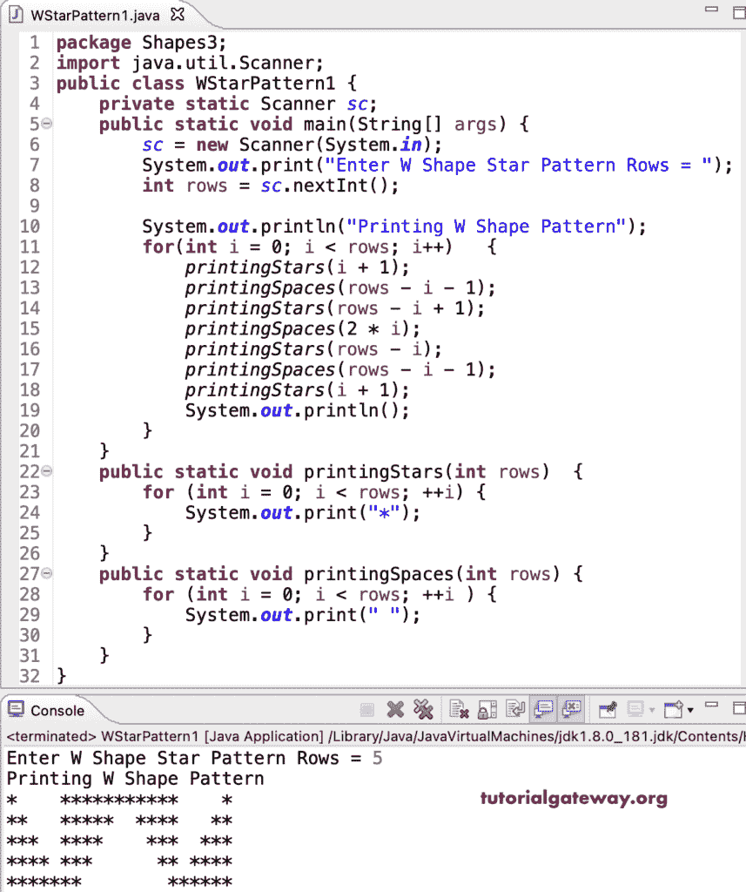

# Java 程序：打印星形图案

> 原文：<https://www.tutorialgateway.org/java-program-to-print-w-star-pattern/>

编写一个 Java 程序，使用 for 循环打印 W 星形模式。

```java
package Shapes3;

import java.util.Scanner;

public class WStarPattern1 {
	private static Scanner sc;

	public static void main(String[] args) {
		sc = new Scanner(System.in);

		System.out.print("Enter W Shape Star Pattern Rows = ");
		int rows = sc.nextInt();

		System.out.println("Printing W Shape Pattern");
		for(int i = 0; i < rows; i++)
		{
			printingStars(i + 1);
			printingSpaces(rows - i - 1);
			printingStars(rows - i + 1);
			printingSpaces(2 * i);
			printingStars(rows - i);
			printingSpaces(rows - i - 1);
			printingStars(i + 1);
			System.out.println();
		}
	}
	public static void printingStars(int rows) 
	{
		for (int i = 0; i < rows; ++i) 
		{
			System.out.print("*");
		}
	}
	public static void printingSpaces(int rows) 
	{
		for (int i = 0; i < rows; ++i ) 
		{
			System.out.print(" ");
		}
	}
}
```



这个 [Java 例子](https://www.tutorialgateway.org/learn-java-programs/)使用 while 循环打印字母 W 星形图案。

```java
package Shapes3;

import java.util.Scanner;

public class WStarPattern2 {
	private static Scanner sc;

	public static void main(String[] args) {
		sc = new Scanner(System.in);

		System.out.print("Enter W Shape Star Pattern Rows = ");
		int rows = sc.nextInt();

		System.out.println("Printing W Shape Pattern");
		int i = 0; 
		while(i < rows)
		{
			printingStars(i + 1);
			printingSpaces(rows - i - 1);
			printingStars(rows - i + 1);
			printingSpaces(2 * i);
			printingStars(rows - i);
			printingSpaces(rows - i - 1);
			printingStars(i + 1);
			System.out.println();
			i++;
		}
	}
	public static void printingStars(int rows) 
	{
		int i = 0; 
		while(i < rows) 
		{
			System.out.print("*");
			++i;
		}
	}
	public static void printingSpaces(int rows) 
	{
		int i = 0;
		while( i < rows ) 
		{
			System.out.print(" ");
			++i;
		}
	}
}
```

```java
Enter W Shape Star Pattern Rows = 12
Printing W Shape Pattern
*           *************************           *
**          ************  ***********          **
***         ***********    **********         ***
****        **********      *********        ****
*****       *********        ********       *****
******      ********          *******      ******
*******     *******            ******     *******
********    ******              *****    ********
*********   *****                ****   *********
**********  ****                  ***  **********
*********** ***                    ** ***********
**************                      *************
```

在这个 Java 程序中，printingStars 函数允许输入任何字符，并显示给定字符的 W 模式。

```java
package Shapes3;

import java.util.Scanner;

public class WStarPattern3 {
	private static Scanner sc;

	public static void main(String[] args) {
		sc = new Scanner(System.in);

		System.out.print("Enter W Shape Star Pattern Rows = ");
		int rows = sc.nextInt();

		System.out.print("Enter Character for W Pattern = ");
		char ch = sc.next().charAt(0);

		System.out.println("Printing W Shape Pattern");
		for(int i = 0; i < rows; i++)
		{
			printingStars(i + 1, ch);
			printingSpaces(rows - i - 1);
			printingStars(rows - i + 1, ch);
			printingSpaces(2 * i);
			printingStars(rows - i, ch);
			printingSpaces(rows - i - 1);
			printingStars(i + 1, ch);
			System.out.println();
		}
	}
	public static void printingStars(int rows, char ch) 
	{
		for (int i = 0; i < rows; ++i) 
		{
			System.out.print(ch);
		}
	}
	public static void printingSpaces(int rows) 
	{
		for (int i = 0; i < rows; ++i ) 
		{
			System.out.print(" ");
		}
	}
}
```

```java
Enter W Shape Star Pattern Rows = 16
Enter Character for W Pattern = $
Printing W Shape Pattern
$               $$$$$$$$$$$$$$$$$$$$$$$$$$$$$$$$$               $
$$              $$$$$$$$$$$$$$$$  $$$$$$$$$$$$$$$              $$
$$$             $$$$$$$$$$$$$$$    $$$$$$$$$$$$$$             $$$
$$$$            $$$$$$$$$$$$$$      $$$$$$$$$$$$$            $$$$
$$$$$           $$$$$$$$$$$$$        $$$$$$$$$$$$           $$$$$
$$$$$$          $$$$$$$$$$$$          $$$$$$$$$$$          $$$$$$
$$$$$$$         $$$$$$$$$$$            $$$$$$$$$$         $$$$$$$
$$$$$$$$        $$$$$$$$$$              $$$$$$$$$        $$$$$$$$
$$$$$$$$$       $$$$$$$$$                $$$$$$$$       $$$$$$$$$
$$$$$$$$$$      $$$$$$$$                  $$$$$$$      $$$$$$$$$$
$$$$$$$$$$$     $$$$$$$                    $$$$$$     $$$$$$$$$$$
$$$$$$$$$$$$    $$$$$$                      $$$$$    $$$$$$$$$$$$
$$$$$$$$$$$$$   $$$$$                        $$$$   $$$$$$$$$$$$$
$$$$$$$$$$$$$$  $$$$                          $$$  $$$$$$$$$$$$$$
$$$$$$$$$$$$$$$ $$$                            $$ $$$$$$$$$$$$$$$
$$$$$$$$$$$$$$$$$$                              $$$$$$$$$$$$$$$$$ 
```