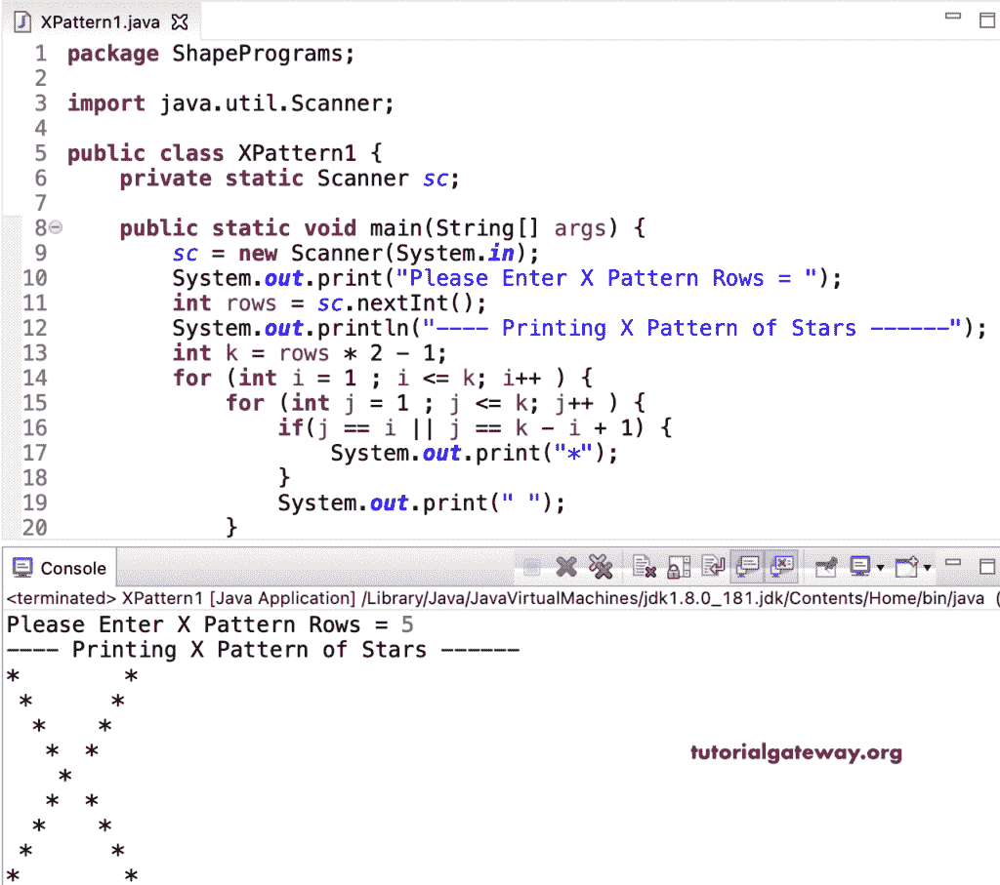

# Java 程序：打印 X 星图案

> 原文：<https://www.tutorialgateway.org/java-program-to-print-x-star-pattern/>

编写一个 Java 程序，使用 for 循环打印 X 星形模式。这个 Java X star 示例使用嵌套循环中的 if 条件来迭代行。

```java
package ShapePrograms;

import java.util.Scanner;

public class XPattern1 {
	private static Scanner sc;

	public static void main(String[] args) {
		sc = new Scanner(System.in);	

		System.out.print("Please Enter X Pattern Rows = ");
		int rows = sc.nextInt();	

		System.out.println("---- Printing X Pattern of Stars ------");

		int k = rows * 2 - 1;	

		for (int i = 1 ; i <= k; i++ ) 
		{
			for (int j = 1 ; j <= k; j++ ) 
			{
				if(j == i || j == k - i + 1) 
				{
					System.out.print("*");
				}
				System.out.print(" ");
			}
			System.out.println();
		}
	}
}
```



在这个 Java X 星型模式[程序](https://www.tutorialgateway.org/learn-java-programs/)中，我们用 [while loop](https://www.tutorialgateway.org/java-while-loop/) 代替了 [for loop](https://www.tutorialgateway.org/java-for-loop/) 。

```java
package ShapePrograms;

import java.util.Scanner;

public class XPattern2 {
	private static Scanner sc;

	public static void main(String[] args) {
		int  rows,  j;
		sc = new Scanner(System.in);	

		System.out.print("Please Enter X Pattern Rows = ");
		rows = sc.nextInt();

		System.out.println("---- Printing X Pattern of Stars ------");
		int k = rows * 2 - 1;
		int i = 1 ;

		while( i <= k) 
		{
			j = 1;
			while (j <= k) 
			{
				if(j == i || j == k - i + 1) {
					System.out.print("*");
				}
				System.out.print(" ");
				j++;
			}
			System.out.println();
			i++;
		}
	}
}
```

```java
Please Enter X Pattern Rows = 7
---- Printing X Pattern of Stars ------
*            * 
 *          *  
  *        *   
   *      *    
    *    *     
     *  *      
      *       
     *  *      
    *    *     
   *      *    
  *        *   
 *          *  
*            * 
```

## 使用边循环边打印 X 星形图案的 Java 程序

```java
package ShapePrograms;

import java.util.Scanner;

public class XPattern3 {
	private static Scanner sc;

	public static void main(String[] args) {
		int  rows,  j;
		sc = new Scanner(System.in);	

		System.out.print("Please Enter X Pattern Rows = ");
		rows = sc.nextInt();

		System.out.println("---- Printing X Pattern of Stars ------");
		int k = rows * 2 - 1;
		int i = 1 ;

		do
		{
			j = 1;
			do
			{
				if(j == i || j == k - i + 1) {
					System.out.print("*");
				}
				System.out.print(" ");
				j++;
			} while (j <= k);
			System.out.println();
			i++;
		}while( i <= k);
	}
}
```

```java
Please Enter X Pattern Rows = 9
---- Printing X Pattern of Stars ------
*                * 
 *              *  
  *            *   
   *          *    
    *        *     
     *      *      
      *    *       
       *  *        
        *         
       *  *        
      *    *       
     *      *      
    *        *     
   *          *    
  *            *   
 *              *  
*                * 
```

在这个 Java 例子中，XPattern 函数打印给定符号的 X 模式。

```java
package ShapePrograms;

import java.util.Scanner;

public class XPattern4 {
	private static Scanner sc;

	public static void main(String[] args) {
		sc = new Scanner(System.in);

		System.out.print("Please Enter X Pattern Rows = ");
		int rows = sc.nextInt();

		System.out.print("Enter Character for X Pattern = ");
		char ch = sc.next().charAt(0);

		System.out.println("---- Printing X Pattern ------");
		XPattern(rows, ch);
	}

	public static void XPattern(int rows, char ch) {
		int k = rows * 2 - 1;

		for (int i = 1 ; i <= k; i++ ) 
		{
			for (int j = 1 ; j <= k; j++ ) 
			{
				if(j == i || j == k - i + 1) {
					System.out.print(ch);
				}
				System.out.print(" ");
			}
			System.out.println();
		}
	}
}
```

```java
Please Enter X Pattern Rows = 10
Enter Character for X Pattern = #
---- Printing X Pattern ------
#                  # 
 #                #  
  #              #   
   #            #    
    #          #     
     #        #      
      #      #       
       #    #        
        #  #         
         #          
        #  #         
       #    #        
      #      #       
     #        #      
    #          #     
   #            #    
  #              #   
 #                #  
#                  # 
```