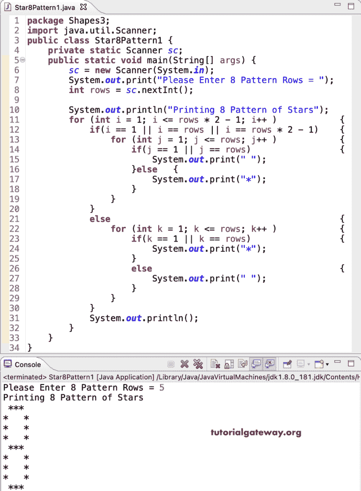

# Java 程序：打印星号的`8`图案

> 原文：<https://www.tutorialgateway.org/java-program-to-print-8-star-pattern/>

编写一个 Java 程序，使用 for 循环打印星号的`8`图案。

```java
package Shapes3;

import java.util.Scanner;

public class Star8Pattern1 {

	private static Scanner sc;

	public static void main(String[] args) {
		sc = new Scanner(System.in);

		System.out.print("Please Enter 8 Pattern Rows = ");
		int rows = sc.nextInt();

		System.out.println("Printing 8 Pattern of Stars");

		for (int i = 1; i <= rows * 2 - 1; i++ ) 
		{
			if(i == 1 || i == rows || i == rows * 2 - 1)
			{
				for (int j = 1; j <= rows; j++ )
				{
					if(j == 1 || j == rows)
					{
						System.out.print(" ");
					}
					else
					{
						System.out.print("*");
					}
				}
			}
			else
			{
				for (int k = 1; k <= rows; k++ )
				{
					if(k == 1 || k == rows)
					{
						System.out.print("*");
					}
					else
					{
						System.out.print(" ");
					}
				}
			}
			System.out.println();
		}
	}
}
```



## 使用 while 循环打印星号的`8`图案的 Java 程序

```java
package Shapes3;

import java.util.Scanner;

public class Star8Pattern2 {

	private static Scanner sc;

	public static void main(String[] args) {
		sc = new Scanner(System.in);

		System.out.print("Please Enter 8 Pattern Rows = ");
		int rows = sc.nextInt();

		System.out.println("Printing 8 Pattern of Stars");
		int i = 1;
		while( i <= rows * 2 - 1 ) 
		{
			if(i == 1 || i == rows || i == rows * 2 - 1)
			{
				int j = 1;
				while( j <= rows )
				{
					if(j == 1 || j == rows)
					{
						System.out.print(" ");
					}
					else
					{
						System.out.print("*");
					}
					j++;
				}
			}
			else
			{
				int k = 1;
				while( k <= rows )
				{
					if(k == 1 || k == rows)
					{
						System.out.print("*");
					}
					else
					{
						System.out.print(" ");
					}
					k++;
				}
			}
			System.out.println();
			i++;
		}
	}
}
```

```java
Please Enter 8 Pattern Rows = 7
Printing 8 Pattern of Stars
 ***** 
*     *
*     *
*     *
*     *
*     *
 ***** 
*     *
*     *
*     *
*     *
*     *
 ***** 
```

这个 Java 程序使用 do while 循环来打印星号的 8 位图案。

```java
package Shapes3;

import java.util.Scanner;

public class Star8Pattern3 {

	private static Scanner sc;

	public static void main(String[] args) {
		sc = new Scanner(System.in);

		System.out.print("Please Enter 8 Pattern Rows = ");
		int rows = sc.nextInt();

		System.out.println("Printing 8 Pattern of Stars");
		int i = 1;
		do
		{
			if(i == 1 || i == rows || i == rows * 2 - 1)
			{
				int j = 1;
				do
				{
					if(j == 1 || j == rows)
					{
						System.out.print(" ");
					}
					else
					{
						System.out.print("*");
					}
				} while( ++j <= rows );
			}
			else
			{
				int k = 1;
				do
				{
					if(k == 1 || k == rows)
					{
						System.out.print("*");
					}
					else
					{
						System.out.print(" ");
					}
				} while( ++k <= rows );
			}
			System.out.println();
		} while( ++i <= rows * 2 - 1 );
	}
}
```

```java
Please Enter 8 Pattern Rows = 10
Printing 8 Pattern of Stars
 ******** 
*        *
*        *
*        *
*        *
*        *
*        *
*        *
*        *
 ******** 
*        *
*        *
*        *
*        *
*        *
*        *
*        *
*        *
 ******** 
```

在这个 [Java 示例](https://www.tutorialgateway.org/learn-java-programs/)中，Pattern8 函数允许行和字符，并打印给定字符的 8 位数模式。

```java
package Shapes3;

import java.util.Scanner;

public class Star8Pattern4 {

	private static Scanner sc;

	public static void main(String[] args) {
		sc = new Scanner(System.in);

		System.out.print("Please Enter 8 Pattern Rows = ");
		int rows = sc.nextInt();

		System.out.print("Enter Character for 8 Pattern = ");
		char ch = sc.next().charAt(0);

		System.out.println("Printing 8 Pattern of Stars");
		Pattern8(rows, ch);
	}
	public static void Pattern8(int rows, char ch) 
	{
		for (int i = 1; i <= rows * 2 - 1; i++ ) 
		{
			if(i == 1 || i == rows || i == rows * 2 - 1)
			{
				for (int j = 1; j <= rows; j++ )
				{
					if(j == 1 || j == rows)
					{
						System.out.print(" ");
					}
					else
					{
						System.out.print(ch);
					}
				}
			}
			else
			{
				for (int k = 1; k <= rows; k++ )
				{
					if(k == 1 || k == rows)
					{
						System.out.print(ch);
					}
					else
					{
						System.out.print(" ");
					}
				}
			}
			System.out.println();
		}

	}
}
```

```java
Please Enter 8 Pattern Rows = 13
Enter Character for 8 Pattern = #
Printing 8 Pattern of Stars
 ########### 
#           #
#           #
#           #
#           #
#           #
#           #
#           #
#           #
#           #
#           #
#           #
 ########### 
#           #
#           #
#           #
#           #
#           #
#           #
#           #
#           #
#           #
#           #
#           #
 ########### 
```