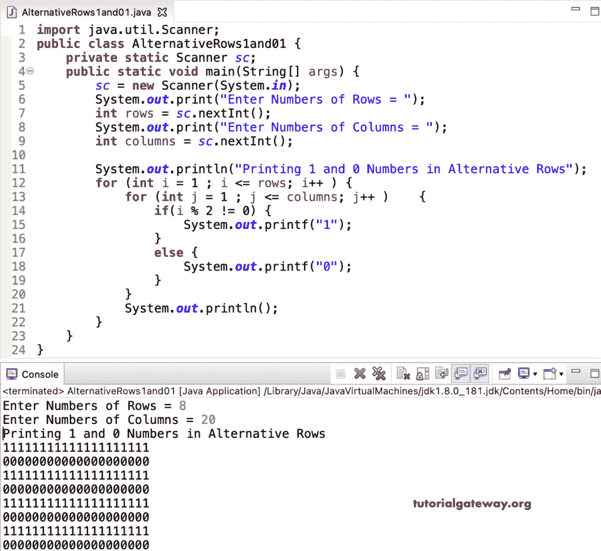

# Java 程序：在交替矩形行中打印`1`和`0`

> 原文：<https://www.tutorialgateway.org/java-program-to-print-1-and-0-in-alternative-rectangle-rows/>

编写一个 Java 程序，使用 for 循环在交替的矩形行中打印 1 和 0。

```java
import java.util.Scanner;

public class AlternativeRows1and01 {

	private static Scanner sc;

	public static void main(String[] args) {

		sc = new Scanner(System.in);	

		System.out.print("Enter Numbers of Rows = ");
		int rows = sc.nextInt();

		System.out.print("Enter Numbers of Columns = ");
		int columns = sc.nextInt();

		System.out.println("Printing 1 and 0 Numbers in Alternative Rows");

		for (int i = 1 ; i <= rows; i++ ) 
		{
			for (int j = 1 ; j <= columns; j++ ) 	
			{
				if(i % 2 != 0) {
					System.out.printf("1");
				}
				else {
					System.out.printf("0");
				}
			}
			System.out.println();
		}
	}
}
```



这个 [Java 程序](https://www.tutorialgateway.org/learn-java-programs/)使用 while 循环在交替的行中打印一个 1 和 0 的矩形。

```java
import java.util.Scanner;

public class AlternativeRows1and02 {

	private static Scanner sc;

	public static void main(String[] args) {

		sc = new Scanner(System.in);	

		System.out.print("Enter Numbers of Rows and Columns = ");
		int rows = sc.nextInt();
		int columns = sc.nextInt();

		System.out.println("Printing 1 and 0 Numbers in Alternative Rows");

		for (int i = 1 ; i <= rows; i++ ) 
		{
			for (int j = 1 ; j <= columns; j++ ) 	
			{
				System.out.printf("%d", i % 2);
			}
			System.out.println();
		}
	}
}
```

```java
Enter Numbers of Rows and Columns = 9 14
Printing 1 and 0 Numbers in Alternative Rows
11111111111111
00000000000000
11111111111111
00000000000000
11111111111111
00000000000000
11111111111111
00000000000000
11111111111111
```

Java 程序使用 do while 循环在矩形的可选行中打印 1 和 0。

```java
import java.util.Scanner;

public class AlternativeRows1and03 {

	private static Scanner sc;

	public static void main(String[] args) {

		sc = new Scanner(System.in);	

		System.out.print("Enter Numbers of Rows and Columns = ");
		int rows = sc.nextInt();
		int columns = sc.nextInt();

		System.out.println("Printing 1 and 0 Numbers in Alternative Rows");

		int j, i = 1;

		while (i <= rows ) 
		{
			j = 1 ;
			while(j <= columns) 	
			{
				System.out.printf("%d", i % 2);
				j++ ;
			}
			System.out.println();
			i++;
		}
	}
}
```

```java
Enter Numbers of Rows and Columns = 10 20
Printing 1 and 0 Numbers in Alternative Rows
11111111111111111111
00000000000000000000
11111111111111111111
00000000000000000000
11111111111111111111
00000000000000000000
11111111111111111111
00000000000000000000
11111111111111111111
00000000000000000000
```

这个 Java 示例在交替行中打印矩形 0 和 1。

```java
import java.util.Scanner;

public class AlternativeRows1and04 {

	private static Scanner sc;

	public static void main(String[] args) {

		sc = new Scanner(System.in);	

		System.out.print("Enter Numbers of Rows and Columns = ");
		int rows = sc.nextInt();
		int columns = sc.nextInt();

		System.out.println("Printing 0 and 1 Numbers in Alternative Rows");

		for (int i = 1 ; i <= rows; i++ ) 
		{
			for (int j = 1 ; j <= columns; j++ ) 	
			{
				if(i % 2 != 0) {
					System.out.printf("0");
				}
				else {
					System.out.printf("1");
				}
			}
			System.out.println();
		}
	}
}
```

```java
Enter Numbers of Rows and Columns = 12 25
Printing 0 and 1 Numbers in Alternative Rows
0000000000000000000000000
1111111111111111111111111
0000000000000000000000000
1111111111111111111111111
0000000000000000000000000
1111111111111111111111111
0000000000000000000000000
1111111111111111111111111
0000000000000000000000000
1111111111111111111111111
0000000000000000000000000
1111111111111111111111111
```