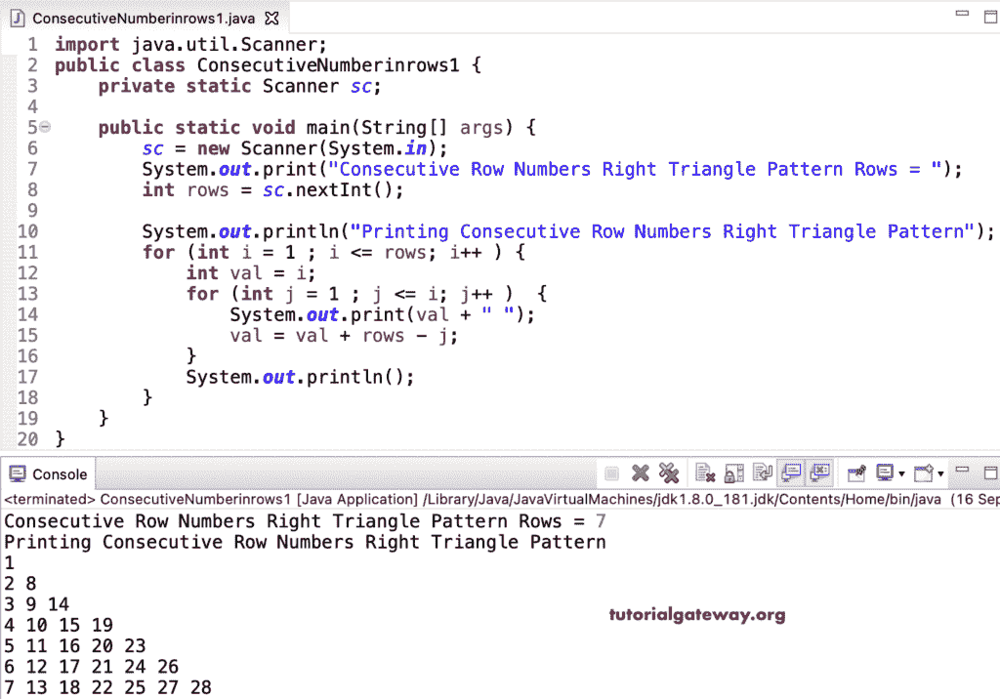

# Java 程序：打印连续数字直角三角形行

> 原文：<https://www.tutorialgateway.org/java-program-to-print-consecutive-numbers-right-triangle-rows/>

编写一个 Java 程序，使用 for 循环打印直角三角形行中的连续数字。

```java
import java.util.Scanner;

public class ConsecutiveNumberinrows1 {

	private static Scanner sc;

	public static void main(String[] args) {

		sc = new Scanner(System.in);	

		System.out.print("Consecutive Row Numbers Right Triangle Pattern Rows = ");
		int rows = sc.nextInt();

		System.out.println("Printing Consecutive Row Numbers Right Triangle Pattern");

		for (int i = 1 ; i <= rows; i++ ) 
		{
			int val = i;

			for (int j = 1 ; j <= i; j++ ) 	
			{
				System.out.print(val + " ");
				val = val + rows - j;
			}
			System.out.println();
		}
	}
}
```



Java 行数字连续的直角三角形[程序](https://www.tutorialgateway.org/learn-java-programs/)使用 while 循环。

```java
import java.util.Scanner;

public class ConsecutiveNumberinrows2 {

	private static Scanner sc;

	public static void main(String[] args) {

		sc = new Scanner(System.in);	

		System.out.print("Consecutive Row Numbers Right Triangle Pattern Rows = ");
		int rows = sc.nextInt();

		System.out.println("Printing Consecutive Row Numbers Right Triangle Pattern");
		int val, j, i = 1 ; 

		while(i <= rows) 
		{
			val = i;
			j = 1 ;

			while( j <= i ) 	
			{
				System.out.print(val + " ");
				val = val + rows - j;
				j++;
			}
			System.out.println();
			i++;
		}
	}
}
```

```java
Consecutive Row Numbers Right Triangle Pattern Rows = 10
Printing Consecutive Row Numbers Right Triangle Pattern
1 
2 11 
3 12 20 
4 13 21 28 
5 14 22 29 35 
6 15 23 30 36 41 
7 16 24 31 37 42 46 
8 17 25 32 38 43 47 50 
9 18 26 33 39 44 48 51 53 
10 19 27 34 40 45 49 52 54 55 
```

使用 do while 循环打印连续数字直角三角形行的 Java 程序。

```java
import java.util.Scanner;

public class ConsecutiveNumberinrows3 {

	private static Scanner sc;

	public static void main(String[] args) {

		sc = new Scanner(System.in);	

		System.out.print("Consecutive Row Numbers Right Triangle Pattern Rows = ");
		int rows = sc.nextInt();

		System.out.println("Printing Consecutive Row Numbers Right Triangle Pattern");
		int val, j, i = 1 ; 

		do
		{
			val = i;
			j = 1 ;

			do	
			{
				System.out.print(val + " ");
				val = val + rows - j;

			} while( ++j <= i );

			System.out.println();

		} while(++i <= rows);
	}
}
```

```java
Consecutive Row Numbers Right Triangle Pattern Rows = 13
Printing Consecutive Row Numbers Right Triangle Pattern
1 
2 14 
3 15 26 
4 16 27 37 
5 17 28 38 47 
6 18 29 39 48 56 
7 19 30 40 49 57 64 
8 20 31 41 50 58 65 71 
9 21 32 42 51 59 66 72 77 
10 22 33 43 52 60 67 73 78 82 
11 23 34 44 53 61 68 74 79 83 86 
12 24 35 45 54 62 69 75 80 84 87 89 
13 25 36 46 55 63 70 76 81 85 88 90 91 
```