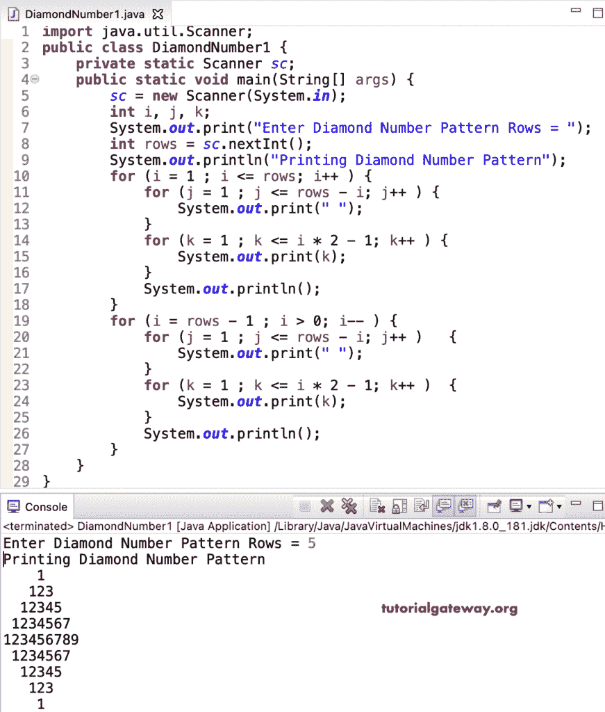

# Java 程序：打印菱形数字图案

> 原文：<https://www.tutorialgateway.org/java-program-to-print-diamond-number-pattern/>

编写一个 Java 程序，使用 for 循环打印菱形数字图案。

```java
import java.util.Scanner;

public class DiamondNumber1 {

	private static Scanner sc;

	public static void main(String[] args) {
		sc = new Scanner(System.in);

		int i, j, k;

		System.out.print("Enter Diamond Number Pattern Rows = ");
		int rows = sc.nextInt();

		System.out.println("Printing Diamond Number Pattern");

		for (i = 1 ; i <= rows; i++ ) 
		{
			for (j = 1 ; j <= rows - i; j++ ) 
			{
				System.out.print(" ");	
			}
			for (k = 1 ; k <= i * 2 - 1; k++ ) 
			{
				System.out.print(k);
			}
			System.out.println();
		}

		for (i = rows - 1 ; i > 0; i-- ) 
		{
			for (j = 1 ; j <= rows - i; j++ ) 
			{
				System.out.print(" ");
			}
			for (k = 1 ; k <= i * 2 - 1; k++ ) 
			{
				System.out.print(k);
			}
			System.out.println();
		}
	}
}
```



打印数字的菱形图案是编写 [Java 程序](https://www.tutorialgateway.org/learn-java-programs/)的另一种方式。

```java
import java.util.Scanner;

public class DiamondNumber2 {

	private static Scanner sc;

	public static void main(String[] args) {
		sc = new Scanner(System.in);

		int i, j, k, l;

		System.out.print("Enter Diamond Number Pattern Rows = ");
		int rows = sc.nextInt();

		System.out.println("Printing Diamond Number Pattern");

		for (i = 1 ; i <= rows; i++ ) 
		{
			for (j = 1 ; j <= rows - i; j++ ) 
			{
				System.out.print(" ");	
			}
			for (k = i ; k >= 1; k-- ) 
			{
				System.out.print(k);
			}
			for (l = 2 ; l <= i; l++) 
			{
				System.out.print(l);
			}
			System.out.println();
		}

		for (i = rows - 1 ; i > 0; i-- ) 
		{
			for (j = 1 ; j <= rows - i; j++ ) 
			{
				System.out.print(" ");
			}
			for (k = i ; k >= 1; k-- ) 
			{
				System.out.print(k);
			}
			for (l = 2 ; l <= i; l++) 
			{
				System.out.print(l);
			}
			System.out.println();
		}
	}
}
```

```java
Enter Diamond Number Pattern Rows = 8
Printing Diamond Number Pattern
       1
      212
     32123
    4321234
   543212345
  65432123456
 7654321234567
876543212345678
 7654321234567
  65432123456
   543212345
    4321234
     32123
      212
       1
```

Java 菱形数字程序使用 while 循环。

```java
import java.util.Scanner;

public class DiamondNumber3 {

	private static Scanner sc;

	public static void main(String[] args) {
		sc = new Scanner(System.in);

		System.out.print("Enter Diamond Number Pattern Rows = ");
		int rows = sc.nextInt();

		System.out.println("Printing Diamond Number Pattern");
		int i = 1, j, k, l;

		while (i <= rows ) 
		{
			j = 1 ;
			while ( j <= rows - i ) 
			{
				System.out.print(" ");
				j++;
			}

			k = i ;
			while (k >= 1 ) 
			{
				System.out.print(k);
				k--;
			}

			l = 2 ; 
			while (l <= i) 
			{
				System.out.print(l);
				l++;
			}
			System.out.println();
			i++;
		}

		i = rows - 1 ;
		while ( i > 0 ) 
		{
			j = 1 ;
			while (j <= rows - i ) 
			{
				System.out.print(" ");
				j++;
			}

			k = i ;
			while ( k >= 1 ) 
			{
				System.out.print(k);
				k--;
			}

			l = 2 ; 
			while (l <= i) 
			{
				System.out.print(l);
				l++;
			}
			System.out.println();
			i--;
		}
	}
}
```

```java
Enter Diamond Number Pattern Rows = 9
Printing Diamond Number Pattern
        1
       212
      32123
     4321234
    543212345
   65432123456
  7654321234567
 876543212345678
98765432123456789
 876543212345678
  7654321234567
   65432123456
    543212345
     4321234
      32123
       212
        1
```