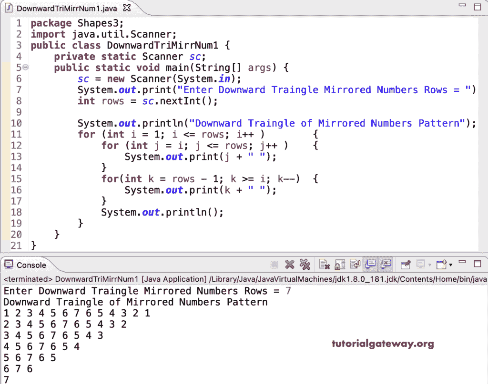

# Java 程序：打印数字的镜像向下三角形图案

> 原文：<https://www.tutorialgateway.org/java-program-to-print-downward-triangle-mirrored-numbers-pattern/>

编写一个 Java 程序，使用 for 循环打印向下的三角形镜像数字图案。

```java
package Shapes3;

import java.util.Scanner;

public class DownwardTriMirrNum1 {

	private static Scanner sc;

	public static void main(String[] args) {
		sc = new Scanner(System.in);

		System.out.print("Enter Downward Traingle Mirrored Numbers Rows = ");
		int rows = sc.nextInt();

		System.out.println("Downward Traingle of Mirrored Numbers Pattern");

		for (int i = 1; i <= rows; i++ ) 
		{
			for (int j = i; j <= rows; j++ ) 
			{
				System.out.print(j + " ");
			}
			for(int k = rows - 1; k >= i; k--) 
			{
				System.out.print(k + " ");
			}
			System.out.println();
		}
	}
}
```



这个 [Java 示例](https://www.tutorialgateway.org/learn-java-programs/)使用 while 循环打印镜像数字的向下三角形图案。

```java
package Shapes3;

import java.util.Scanner;

public class DownwardTriMirrNum2 {

	private static Scanner sc;

	public static void main(String[] args) {
		sc = new Scanner(System.in);

		System.out.print("Enter Downward Traingle Mirrored Numbers Rows = ");
		int rows = sc.nextInt();

		System.out.println("Downward Traingle of Mirrored Numbers Pattern");
		int j, k, i = 1; 

		while(i <= rows) 
		{
			j = i;
			while(j <= rows) 
			{
				System.out.print(j + " ");
				j++;
			}

			k = rows - 1;
			while(k >= i) 
			{
				System.out.print(k + " ");
				k--;
			}

			System.out.println();
			i++;
		}
	}
}
```

```java
Enter Downward Traingle Mirrored Numbers Rows = 9
Downward Traingle of Mirrored Numbers Pattern
1 2 3 4 5 6 7 8 9 8 7 6 5 4 3 2 1 
2 3 4 5 6 7 8 9 8 7 6 5 4 3 2 
3 4 5 6 7 8 9 8 7 6 5 4 3 
4 5 6 7 8 9 8 7 6 5 4 
5 6 7 8 9 8 7 6 5 
6 7 8 9 8 7 6 
7 8 9 8 7 
8 9 8 
9 
```