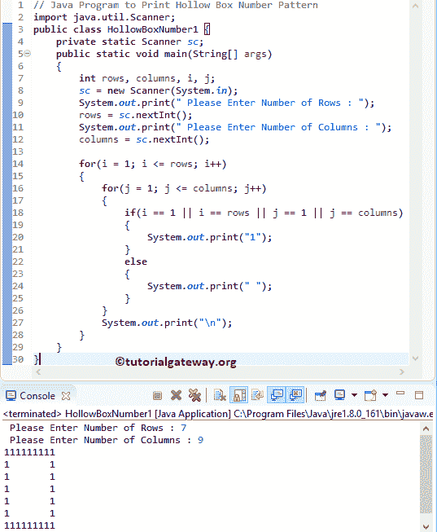

# Java 程序：打印数字的空心盒图案

> 原文：<https://www.tutorialgateway.org/java-program-to-print-hollow-box-number-pattern/>

编写一个 Java 程序，使用 For 循环和 While 循环打印数字的空心盒图案，并举例说明。

## 用 For 循环打印数字的空心盒图案的 Java 程序

这个 Java 程序允许用户输入行数和列值。接下来，它打印 1 的空心盒数字图案。我的意思是，它打印第一行、最后一行、第一列和最后一列为 1，其余元素为空。

```java
// Java Program to Print Hollow Box Number Pattern
import java.util.Scanner;

public class HollowBoxNumber1 {
	private static Scanner sc;
	public static void main(String[] args) 
	{
		int rows, columns, i, j;
		sc = new Scanner(System.in);

		System.out.print(" Please Enter Number of Rows : ");
		rows = sc.nextInt();	

		System.out.print(" Please Enter Number of Columns : ");
		columns = sc.nextInt();	

		for(i = 1; i <= rows; i++)
		{
			for(j = 1; j <= columns; j++)
			{
				if(i == 1 || i == rows || j == 1 || j == columns)
				{
					System.out.print("1"); 
				}
				else
				{
					System.out.print(" "); 
				}
			}
			System.out.print("\n"); 
		}	
	}
}
```



第一个 [For 循环](https://www.tutorialgateway.org/java-for-loop/)是从 1 迭代到总行数。接下来，我们使用[嵌套 For 循环](https://www.tutorialgateway.org/nested-for-loop-in-java/)将 j 从 1 迭代到列的总数。

用户输入的值:行= 7，列= 9

第一次 For 循环–第一次迭代:For(I = 1；i <= 7; i++)
条件为真。因此，它进入第二个 For 循环

第二次 For 循环–第一次迭代:For(j = 1；1 <= 9; 1++)
条件为真。因此，它检查 If 语句
中的条件 if(i == 1 || i ==行|| j == 1 || j ==列)
=>If(1 = = 1 | | 1 = = 7 | | 1 = = 1 | | 1 = = 9)–条件为真。所以，它会打印 1

对剩余的 [Java](https://www.tutorialgateway.org/java-tutorial/) 迭代重复同样的操作。

## 使用 While 循环打印数字的空心盒图案的程序

这个显示数字空心框的 Java 程序与上面的例子相同，但是我们使用的是 [While Loop](https://www.tutorialgateway.org/java-while-loop/) 。

```java
// Java Program to Print Hollow Box Number Pattern
import java.util.Scanner;

public class HollowBoxNumber2 {
	private static Scanner sc;
	public static void main(String[] args) 
	{
		int rows, columns, i = 1, j;
		sc = new Scanner(System.in);

		System.out.print(" Please Enter Number of Rows : ");
		rows = sc.nextInt();	

		System.out.print(" Please Enter Number of Columns : ");
		columns = sc.nextInt();	

		while(i <= rows)
		{
			j = 1;
			while(j <= columns)
			{
				if(i == 1 || i == rows || j == 1 || j == columns)
				{
					System.out.print("1 "); 
				}
				else
				{
					System.out.print("  "); 
				}
				j++;
			}
			i++;
			System.out.print("\n"); 
		}	
	}
}
```

使用 While 循环输出的 Java 空心盒数字图案

```java
 Please Enter Number of Rows : 9
 Please Enter Number of Columns : 14
1 1 1 1 1 1 1 1 1 1 1 1 1 1 
1                         1 
1                         1 
1                         1 
1                         1 
1                         1 
1                         1 
1                         1 
1 1 1 1 1 1 1 1 1 1 1 1 1 1 
```

## 打印数字的空心盒图案的 Java 程序示例 3

这个 [Java 程序](https://www.tutorialgateway.org/learn-java-programs/)和第一个例子一样。但是它将第一行、最后一行、第一列和最后一列打印为 0，其余元素打印为空白。

```java
// Java Program to Print Hollow Box Number Pattern
import java.util.Scanner;

public class HollowBoxNumber3 {
	private static Scanner sc;
	public static void main(String[] args) 
	{
		int rows, columns, i, j;
		sc = new Scanner(System.in);

		System.out.print(" Please Enter Number of Rows : ");
		rows = sc.nextInt();	

		System.out.print(" Please Enter Number of Columns : ");
		columns = sc.nextInt();	

		for(i = 1; i <= rows; i++)
		{
			for(j = 1; j <= columns; j++)
			{
				if(i == 1 || i == rows || j == 1 || j == columns)
				{
					System.out.print("0 "); 
				}
				else
				{
					System.out.print("  "); 
				}
			}
			System.out.print("\n"); 
		}	
	}
}
```

```java
 Please Enter Number of Rows : 10
 Please Enter Number of Columns : 20
0 0 0 0 0 0 0 0 0 0 0 0 0 0 0 0 0 0 0 0 
0                                     0 
0                                     0 
0                                     0 
0                                     0 
0                                     0 
0                                     0 
0                                     0 
0                                     0 
0 0 0 0 0 0 0 0 0 0 0 0 0 0 0 0 0 0 0 0 
```