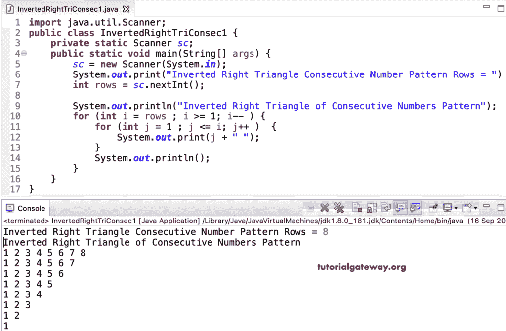

# Java 程序：打印连续数字的倒直角三角形

> 原文：<https://www.tutorialgateway.org/java-program-to-print-inverted-right-triangle-of-consecutive-numbers/>

编写一个 Java 程序，使用 for 循环打印连续数字的倒直角三角形，并给出一个例子。

```java
import java.util.Scanner;

public class InvertedRightTriConsec1 {

	private static Scanner sc;

	public static void main(String[] args) {

		sc = new Scanner(System.in);	

		System.out.print("Inverted Right Triangle Consecutive Number Pattern Rows = ");
		int rows = sc.nextInt();

		System.out.println("Inverted Right Triangle of Consecutive Numbers Pattern");

		for (int i = rows ; i >= 1; i-- ) 
		{
			for (int j = 1 ; j <= i; j++ ) 	
			{
				System.out.print(j + " ");
			}
			System.out.println();
		}
	}
}
```



这个 [Java 示例](https://www.tutorialgateway.org/learn-java-programs/)使用 while 循环显示直角三角形的连续数字。

```java
import java.util.Scanner;

public class InvertedRightTriConsec2 {

	private static Scanner sc;

	public static void main(String[] args) {

		sc = new Scanner(System.in);	

		System.out.print("Inverted Right Triangle Consecutive Number Pattern Rows = ");
		int rows = sc.nextInt();

		System.out.println("Inverted Right Triangle of Consecutive Numbers Pattern");
		int i = rows, j;

		while( i >= 1 ) 
		{
			j = 1 ;
			while ( j <= i ) 	
			{
				System.out.print(j + " ");
				j++;
			}
			System.out.println();
			i--;
		}
	}
}
```

```java
Inverted Right Triangle Consecutive Number Pattern Rows = 9
Inverted Right Triangle of Consecutive Numbers Pattern
1 2 3 4 5 6 7 8 9 
1 2 3 4 5 6 7 8 
1 2 3 4 5 6 7 
1 2 3 4 5 6 
1 2 3 4 5 
1 2 3 4 
1 2 3 
1 2 
1 
```

Java 程序使用 do while 循环打印连续数字的倒直角三角形。

```java
import java.util.Scanner;

public class InvertedRightTriConsec3 {

	private static Scanner sc;

	public static void main(String[] args) {

		sc = new Scanner(System.in);	

		System.out.print("Inverted Right Triangle Consecutive Number Pattern Rows = ");
		int rows = sc.nextInt();

		System.out.println("Inverted Right Triangle of Consecutive Numbers Pattern");
		int i = rows, j;

		do
		{
			j = 1 ;
			do 	
			{
				System.out.print(j + " ");

			}while ( ++j <= i );

			System.out.println();

		} while( --i >= 1 );
	}
}
```

```java
Inverted Right Triangle Consecutive Number Pattern Rows = 15
Inverted Right Triangle of Consecutive Numbers Pattern
1 2 3 4 5 6 7 8 9 10 11 12 13 14 15 
1 2 3 4 5 6 7 8 9 10 11 12 13 14 
1 2 3 4 5 6 7 8 9 10 11 12 13 
1 2 3 4 5 6 7 8 9 10 11 12 
1 2 3 4 5 6 7 8 9 10 11 
1 2 3 4 5 6 7 8 9 10 
1 2 3 4 5 6 7 8 9 
1 2 3 4 5 6 7 8 
1 2 3 4 5 6 7 
1 2 3 4 5 6 
1 2 3 4 5 
1 2 3 4 
1 2 3 
1 2 
1 
```