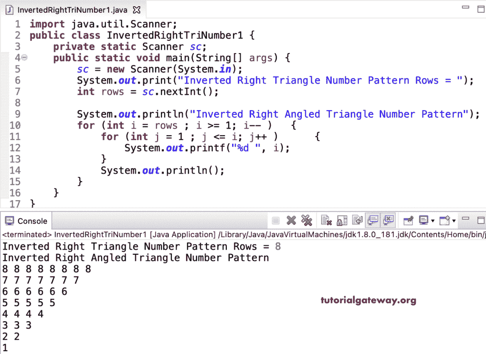

# Java 程序：打印数字的倒直角三角形图案

> 原文：<https://www.tutorialgateway.org/java-program-to-print-inverted-right-triangle-number-pattern/>

编写一个 Java 程序，使用 for 循环打印数字的倒直角三角形图案。它在每行打印一个数字。

```java
import java.util.Scanner;

public class InvertedRightTriNumber1 {

	private static Scanner sc;

	public static void main(String[] args) {

		sc = new Scanner(System.in);	

		System.out.print("Inverted Right Triangle Number Pattern Rows = ");
		int rows = sc.nextInt();

		System.out.println("Inverted Right Angled Triangle Number Pattern");

		for (int i = rows ; i >= 1; i-- ) 
		{
			for (int j = 1 ; j <= i; j++ ) 	
			{
				System.out.printf("%d ", i);
			}
			System.out.println();
		}
	}
}
```



这个 [Java 程序](https://www.tutorialgateway.org/learn-java-programs/)使用 while 循环显示每行相同数字的倒直角三角形图案。

```java
import java.util.Scanner;

public class InvertedRightTriNumber2 {

	private static Scanner sc;

	public static void main(String[] args) {

		sc = new Scanner(System.in);	

		System.out.print("Inverted Right Triangle Number Pattern Rows = ");
		int rows = sc.nextInt();

		System.out.println("Inverted Right Angled Triangle Number Pattern");

		int j, i = rows;

		while (i >= 1 ) 
		{
			j = 1 ; 
			while (j <= i ) 	
			{
				System.out.printf("%d ", i);
				j++;
			}
			System.out.println();
			i--;
		}
	}
}
```

```java
Inverted Right Triangle Number Pattern Rows = 9
Inverted Right Angled Triangle Number Pattern
9 9 9 9 9 9 9 9 9 
8 8 8 8 8 8 8 8 
7 7 7 7 7 7 7 
6 6 6 6 6 6 
5 5 5 5 5 
4 4 4 4 
3 3 3 
2 2 
1 
```

使用 do while 循环打印数字的倒直角三角形图案的 Java 程序。

```java
import java.util.Scanner;

public class InvertedRightTriNumber3 {

	private static Scanner sc;

	public static void main(String[] args) {

		sc = new Scanner(System.in);	

		System.out.print("Inverted Right Triangle Number Pattern Rows = ");
		int rows = sc.nextInt();

		int j, i = rows;

		System.out.println("Inverted Right Angled Triangle Number Pattern");

		do
		{
			j = 1 ; 
			do 	
			{
				System.out.printf("%d ", i);

			} while (++j <= i );
			System.out.println();

		} while (--i >= 1 ) ;
	}
}
```

```java
Inverted Right Triangle Number Pattern Rows = 5
Inverted Right Angled Triangle Number Pattern
5 5 5 5 5 
4 4 4 4 
3 3 3 
2 2 
1 
```