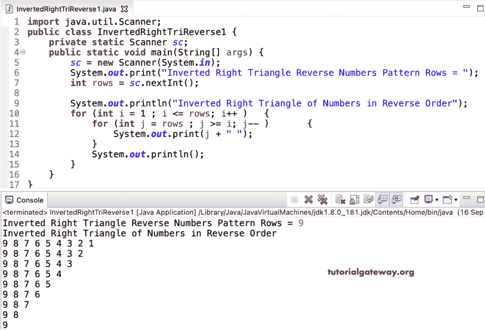

# Java 程序：反向打印数字的倒直角三角形

> 原文：<https://www.tutorialgateway.org/java-program-to-print-inverted-right-triangle-numbers-in-reverse/>

编写一个 Java 程序，使用 for 循环以相反的顺序打印数字的倒直角三角形图案。

```java
import java.util.Scanner;

public class InvertedRightTriReverse1 {

	private static Scanner sc;

	public static void main(String[] args) {

		sc = new Scanner(System.in);	

		System.out.print("Inverted Right Triangle Reverse Numbers Pattern Rows = ");
		int rows = sc.nextInt();

		System.out.println("Inverted Right Triangle of Numbers in Reverse Order");

		for (int i = 1 ; i <= rows; i++ ) 
		{
			for (int j = rows ; j >= i; j-- ) 	
			{
				System.out.print(j + " ");
			}
			System.out.println();
		}
	}
}
```



这个 [Java 程序](https://www.tutorialgateway.org/learn-java-programs/)使用 while 循环，以相反的顺序显示每列中相同数字的倒直角三角形模式。

```java
import java.util.Scanner;

public class InvertedRightTriReverse2 {

	private static Scanner sc;

	public static void main(String[] args) {

		sc = new Scanner(System.in);	

		System.out.print("Inverted Right Triangle Reverse Numbers Pattern Rows = ");
		int rows = sc.nextInt();

		System.out.println("Inverted Right Triangle of Numbers in Reverse Order");

		int i = 1, j;

		while (i <= rows ) 
		{
			j = rows ; 
			while (j >= i ) 	
			{
				System.out.print(j + " ");
				j--;
			}

			System.out.println();
			i++;
		}
	}
}
```

```java
Inverted Right Triangle Reverse Numbers Pattern Rows = 7
Inverted Right Triangle of Numbers in Reverse Order
7 6 5 4 3 2 1 
7 6 5 4 3 2 
7 6 5 4 3 
7 6 5 4 
7 6 5 
7 6 
7 
```

使用 do while 循环以逆序打印倒直角三角形数字的 Java 程序。

```java
import java.util.Scanner;

public class InvertedRightTriReverse3 {

	private static Scanner sc;

	public static void main(String[] args) {

		sc = new Scanner(System.in);	

		System.out.print("Inverted Right Triangle Reverse Numbers Pattern Rows = ");
		int rows = sc.nextInt();

		System.out.println("Inverted Right Triangle of Numbers in Reverse Order");

		int i = 1, j;

		do
		{
			j = rows ; 
			do 	
			{
				System.out.print(j + " ");

			} while (--j >= i );

			System.out.println();

		} while (++i <= rows );
	}
}
```

```java
Inverted Right Triangle Reverse Numbers Pattern Rows = 14
Inverted Right Triangle of Numbers in Reverse Order
14 13 12 11 10 9 8 7 6 5 4 3 2 1 
14 13 12 11 10 9 8 7 6 5 4 3 2 
14 13 12 11 10 9 8 7 6 5 4 3 
14 13 12 11 10 9 8 7 6 5 4 
14 13 12 11 10 9 8 7 6 5 
14 13 12 11 10 9 8 7 6 
14 13 12 11 10 9 8 7 
14 13 12 11 10 9 8 
14 13 12 11 10 9 
14 13 12 11 10 
14 13 12 11 
14 13 12 
14 13 
14 
```