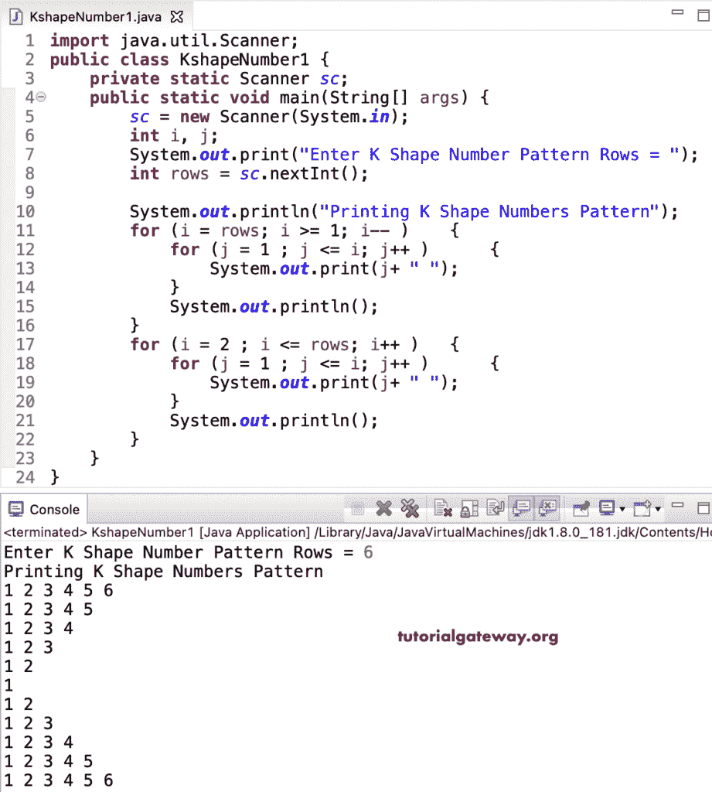

# Java 程序：打印数字的`K`形图案

> 原文：<https://www.tutorialgateway.org/java-program-to-print-k-shape-number-pattern/>

用一个 for 循环写一个 Java 程序打印数字的 K 形图案，并举例说明。

```java
import java.util.Scanner;

public class KshapeNumber1 {

	private static Scanner sc;

	public static void main(String[] args) {

		sc = new Scanner(System.in);	

		int i, j;

		System.out.print("Enter K Shape Number Pattern Rows = ");
		int rows = sc.nextInt();

		System.out.println("Printing K Shape Numbers Pattern");		

		for (i = rows; i >= 1; i-- ) 
		{
			for (j = 1 ; j <= i; j++ ) 	
			{
				System.out.print(j+ " ");
			}
			System.out.println();
		}

		for (i = 2 ; i <= rows; i++ ) 
		{
			for (j = 1 ; j <= i; j++ ) 	
			{
				System.out.print(j+ " ");
			}
			System.out.println();
		}
	}
}
```



这个 [Java 程序](https://www.tutorialgateway.org/learn-java-programs/)使用 while 循环显示数字的 K 形模式。

```java
import java.util.Scanner;

public class KshapeNumber2 {

	private static Scanner sc;

	public static void main(String[] args) {

		sc = new Scanner(System.in);	

		System.out.print("Enter K Shape Number Pattern Rows = ");
		int rows = sc.nextInt();

		System.out.println("Printing K Shape Numbers Pattern");		
		int i = rows, j;

		while (i >= 1 ) 
		{
			j = 1 ; 
			while (j <= i ) 	
			{
				System.out.print(j+ " ");
				j++;
			}
			System.out.println();
			i--;
		}

		i = 2 ;
		while( i <= rows ) 
		{
			j = 1 ; 
			while (j <= i ) 	
			{
				System.out.print(j+ " ");
				j++;
			}
			System.out.println();
			i++;
		}
	}
}
```

```java
Enter K Shape Number Pattern Rows = 9
Printing K Shape Numbers Pattern
1 2 3 4 5 6 7 8 9 
1 2 3 4 5 6 7 8 
1 2 3 4 5 6 7 
1 2 3 4 5 6 
1 2 3 4 5 
1 2 3 4 
1 2 3 
1 2 
1 
1 2 
1 2 3 
1 2 3 4 
1 2 3 4 5 
1 2 3 4 5 6 
1 2 3 4 5 6 7 
1 2 3 4 5 6 7 8 
1 2 3 4 5 6 7 8 9 
```

用边循环边打印数字的`K`形图案的 Java 程序。

```java
import java.util.Scanner;

public class KshapeNumber3 {

	private static Scanner sc;

	public static void main(String[] args) {

		sc = new Scanner(System.in);	

		System.out.print("Enter K Shape Number Pattern Rows = ");
		int rows = sc.nextInt();

		System.out.println("Printing K Shape Numbers Pattern");		
		int i = rows, j;

		do 
		{
			j = 1 ; 
			do	
			{
				System.out.print(j+ " ");

			} while (++j <= i );

			System.out.println();

		} while (--i >= 1 );

		i = 2 ;
		do
		{
			j = 1 ; 
			do	
			{
				System.out.print(j+ " ");

			} while (++j <= i );

			System.out.println();

		} while( ++i <= rows );
	}
}
```

```java
Enter K Shape Number Pattern Rows = 12
Printing K Shape Numbers Pattern
1 2 3 4 5 6 7 8 9 10 11 12 
1 2 3 4 5 6 7 8 9 10 11 
1 2 3 4 5 6 7 8 9 10 
1 2 3 4 5 6 7 8 9 
1 2 3 4 5 6 7 8 
1 2 3 4 5 6 7 
1 2 3 4 5 6 
1 2 3 4 5 
1 2 3 4 
1 2 3 
1 2 
1 
1 2 
1 2 3 
1 2 3 4 
1 2 3 4 5 
1 2 3 4 5 6 
1 2 3 4 5 6 7 
1 2 3 4 5 6 7 8 
1 2 3 4 5 6 7 8 9 
1 2 3 4 5 6 7 8 9 10 
1 2 3 4 5 6 7 8 9 10 11 
1 2 3 4 5 6 7 8 9 10 11 12 
```