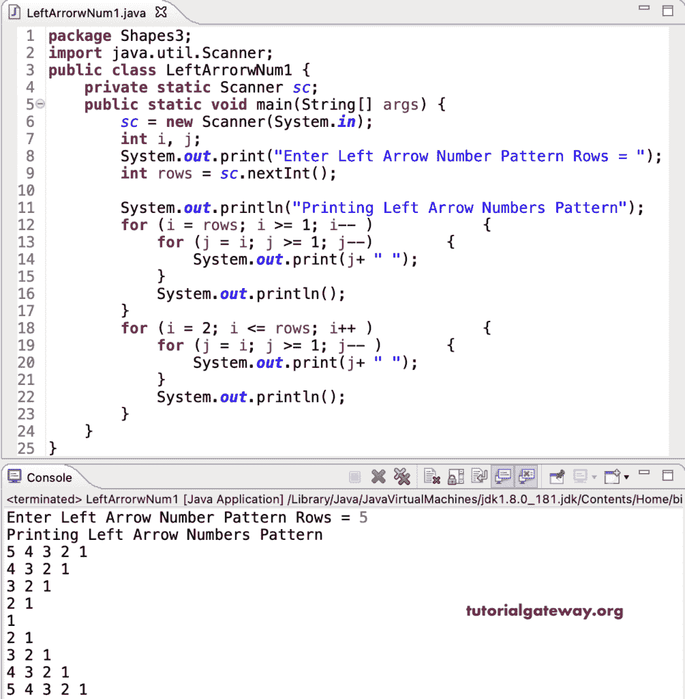

# Java 程序：打印左箭头数字图案

> 原文：<https://www.tutorialgateway.org/java-program-to-print-left-arrow-numbers-pattern/>

编写一个 Java 程序，使用 for 循环打印左箭头数字模式。

```java
package Shapes3;
import java.util.Scanner;

public class LeftArrorwNum1 {

	private static Scanner sc;

	public static void main(String[] args) {

		sc = new Scanner(System.in);	

		int i, j;

		System.out.print("Enter Left Arrow Number Pattern Rows = ");
		int rows = sc.nextInt();

		System.out.println("Printing Left Arrow Numbers Pattern");		

		for (i = rows; i >= 1; i-- ) 
		{
			for (j = i; j >= 1; j--) 	
			{
				System.out.print(j+ " ");
			}
			System.out.println();
		}

		for (i = 2; i <= rows; i++ ) 
		{
			for (j = i; j >= 1; j-- ) 	
			{
				System.out.print(j+ " ");
			}
			System.out.println();
		}
	}
}
```



这个 Java 程序使用 while 循环打印数字模式的左箭头。

```java
package Shapes3;

import java.util.Scanner;

public class LeftArrorwNum2 {

	private static Scanner sc;

	public static void main(String[] args) {

		sc = new Scanner(System.in);	

		int i, j;

		System.out.print("Enter Left Arrow Number Pattern Rows = ");
		int rows = sc.nextInt();

		System.out.println("Printing Left Arrow Numbers Pattern");		
		i = rows;

		while(i >= 1 ) 
		{
			j = i;
			while(j >= 1) 	
			{
				System.out.print(j+ " ");
				j--;
			}
			System.out.println();
			i--;
		}

		i = 2;
		while(i <= rows ) 
		{
			j = i;
			while(j >= 1 ) 	
			{
				System.out.print(j+ " ");
				j--;
			}
			System.out.println();
			i++;
		}
	}
}
```

```java
Enter Left Arrow Number Pattern Rows = 9
Printing Left Arrow Numbers Pattern
9 8 7 6 5 4 3 2 1 
8 7 6 5 4 3 2 1 
7 6 5 4 3 2 1 
6 5 4 3 2 1 
5 4 3 2 1 
4 3 2 1 
3 2 1 
2 1 
1 
2 1 
3 2 1 
4 3 2 1 
5 4 3 2 1 
6 5 4 3 2 1 
7 6 5 4 3 2 1 
8 7 6 5 4 3 2 1 
9 8 7 6 5 4 3 2 1 
```

这个 [Java 示例](https://www.tutorialgateway.org/learn-java-programs/)使用 do while 循环来显示数字的左箭头模式。

```java
package Shapes3;

import java.util.Scanner;

public class LeftArrorwNum3 {

	private static Scanner sc;

	public static void main(String[] args) {

		sc = new Scanner(System.in);	

		int i, j;

		System.out.print("Enter Left Arrow Number Pattern Rows = ");
		int rows = sc.nextInt();

		System.out.println("Printing Left Arrow Numbers Pattern");		
		i = rows;

		do
		{
			j = i;
			do	
			{
				System.out.print(j+ " ");

			} while(--j >= 1);
			System.out.println();

		} while(--i >= 1 );

		i = 2;
		do
		{
			j = i;
			do 	
			{
				System.out.print(j+ " ");

			} while(--j >= 1 );
			System.out.println();

		} while(++i <= rows );
	}
}
```

```java
Enter Left Arrow Number Pattern Rows = 13
Printing Left Arrow Numbers Pattern
13 12 11 10 9 8 7 6 5 4 3 2 1 
12 11 10 9 8 7 6 5 4 3 2 1 
11 10 9 8 7 6 5 4 3 2 1 
10 9 8 7 6 5 4 3 2 1 
9 8 7 6 5 4 3 2 1 
8 7 6 5 4 3 2 1 
7 6 5 4 3 2 1 
6 5 4 3 2 1 
5 4 3 2 1 
4 3 2 1 
3 2 1 
2 1 
1 
2 1 
3 2 1 
4 3 2 1 
5 4 3 2 1 
6 5 4 3 2 1 
7 6 5 4 3 2 1 
8 7 6 5 4 3 2 1 
9 8 7 6 5 4 3 2 1 
10 9 8 7 6 5 4 3 2 1 
11 10 9 8 7 6 5 4 3 2 1 
12 11 10 9 8 7 6 5 4 3 2 1 
13 12 11 10 9 8 7 6 5 4 3 2 1 
```