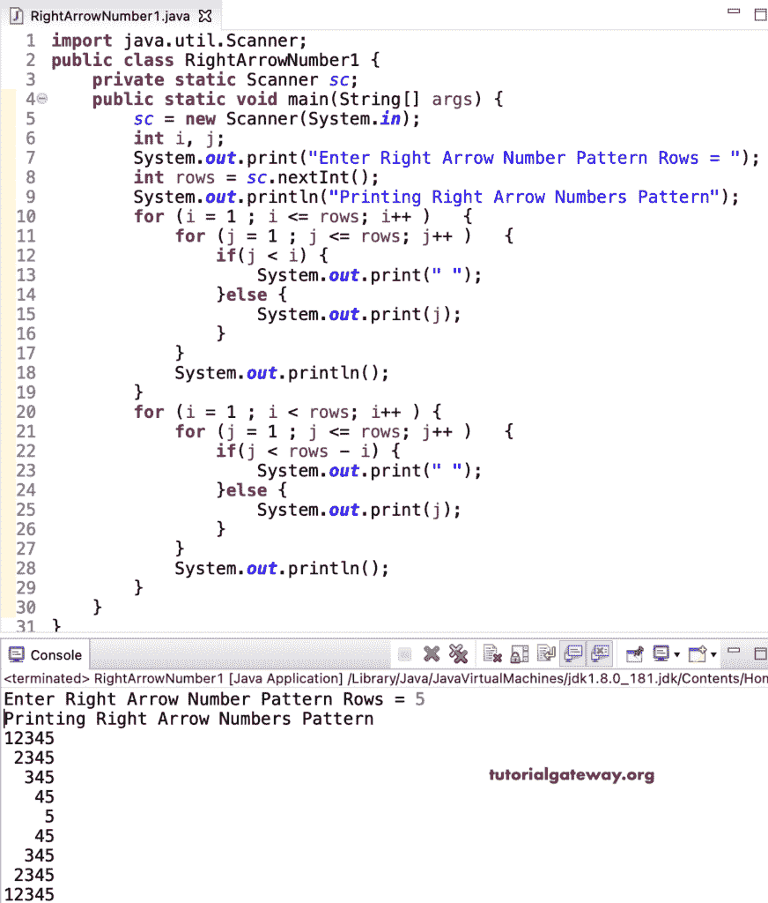

# Java 程序：打印数字的右箭头图案

> 原文：<https://www.tutorialgateway.org/java-program-to-print-right-arrow-number-pattern/>

编写一个 Java 程序，使用 for 循环打印右箭头数字图案。

```java
import java.util.Scanner;

public class RightArrowNumber1 {

	private static Scanner sc;

	public static void main(String[] args) {

		sc = new Scanner(System.in);	

		int i, j;

		System.out.print("Enter Right Arrow Number Pattern Rows = ");
		int rows = sc.nextInt();

		System.out.println("Printing Right Arrow Numbers Pattern");

		for (i = 1 ; i <= rows; i++ ) 
		{
			for (j = 1 ; j <= rows; j++ ) 
			{
				if(j < i) {
					System.out.print(" ");
				}
				else {
					System.out.print(j);
				}
			}
			System.out.println();
		}

		for (i = 1 ; i < rows; i++ ) 
		{
			for (j = 1 ; j <= rows; j++ ) 
			{
				if(j < rows - i) {
					System.out.print(" ");
				}
				else {
					System.out.print(j);
				}
			}
			System.out.println();
		}
	}
}
```



这是编写 [Java 程序](https://www.tutorialgateway.org/learn-java-programs/)的另一种方法，使用 while 循环显示数字的右箭头模式。

```java
import java.util.Scanner;

public class RightArrowNumber2 {

	private static Scanner sc;

	public static void main(String[] args) {

		sc = new Scanner(System.in);	

		int i, j, k;

		System.out.print("Enter Right Arrow Number Pattern Rows = ");
		int rows = sc.nextInt();

		System.out.println("Printing Right Arrow Numbers Pattern");

		for (i = 1 ; i <= rows; i++ ) 
		{
			for (j = 1 ; j < i; j++ ) 
			{
				System.out.print(" ");
			}
			for (k = i ; k <= rows; k++ ) 
			{
				System.out.print(k);
			}
			System.out.println();
		}

		for (i = rows - 1 ; i >= 1; i-- ) 
		{
			for (j = 1 ; j < i; j++ ) 
			{
				System.out.print(" ");
			}
			for (k = i ; k <= rows; k++ ) 
			{
				System.out.print(k);
			}
			System.out.println();
		}
	}
}
```

```java
Enter Right Arrow Number Pattern Rows = 9
Printing Right Arrow Numbers Pattern
123456789
 23456789
  3456789
   456789
    56789
     6789
      789
       89
        9
       89
      789
     6789
    56789
   456789
  3456789
 23456789
123456789
```