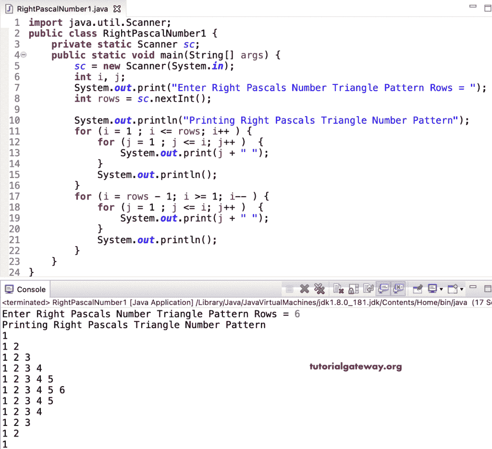

# Java 程序：打印直角帕斯卡数字三角形

> 原文：<https://www.tutorialgateway.org/java-program-to-print-right-pascals-number-triangle/>

编写一个 Java 程序，使用 for 循环打印直角帕斯卡数字三角形。

```java
import java.util.Scanner;

public class RightPascalNumber1 {

	private static Scanner sc;

	public static void main(String[] args) {
		sc = new Scanner(System.in);

		int i, j;

		System.out.print("Enter Right Pascals Number Triangle Pattern Rows = ");
		int rows = sc.nextInt();

		System.out.println("Printing Right Pascals Triangle Number Pattern");

		for (i = 1 ; i <= rows; i++ ) 
		{
			for (j = 1 ; j <= i; j++ ) 
			{
				System.out.print(j + " ");
			}
			System.out.println();
		}

		for (i = rows - 1; i >= 1; i-- ) 
		{
			for (j = 1 ; j <= i; j++ ) 
			{
				System.out.print(j + " ");
			}
			System.out.println();
		}
	}
}
```



这个 [Java 示例](https://www.tutorialgateway.org/learn-java-programs/)使用 while 循环显示数字的右帕斯卡三角形。

```java
import java.util.Scanner;

public class RightPascalNumber2 {

	private static Scanner sc;

	public static void main(String[] args) {
		sc = new Scanner(System.in);

		System.out.print("Enter Right Pascals Number Triangle Pattern Rows = ");
		int rows = sc.nextInt();

		System.out.println("Printing Right Pascals Triangle Number Pattern");
		int i = 1, j;

		while (i <= rows ) 
		{
			j = 1 ;
			while (j <= i ) 
			{
				System.out.print(j + " ");
				j++;
			}

			System.out.println();
			i++;
		}

		i = rows - 1; 
		while (i >= 1 ) 
		{
			j = 1 ;
			while( j <= i ) 
			{
				System.out.print(j + " ");
				j++;
			}
			System.out.println();
			 i--;
		}
	}
}
```

```java
Enter Right Pascals Number Triangle Pattern Rows = 7
Printing Right Pascals Triangle Number Pattern
1 
1 2 
1 2 3 
1 2 3 4 
1 2 3 4 5 
1 2 3 4 5 6 
1 2 3 4 5 6 7 
1 2 3 4 5 6 
1 2 3 4 5 
1 2 3 4 
1 2 3 
1 2 
1 
```

Java 程序打印右帕斯卡数字三角形使用 do while 循环。

```java
import java.util.Scanner;

public class RightPascalNumber3 {

	private static Scanner sc;

	public static void main(String[] args) {
		sc = new Scanner(System.in);

		System.out.print("Enter Right Pascals Number Triangle Pattern Rows = ");
		int rows = sc.nextInt();

		System.out.println("Printing Right Pascals Triangle Number Pattern");
		int i = 1, j;

		do
		{
			j = 1 ;
			do
			{
				System.out.print(j + " ");

			} while (++j <= i );

			System.out.println();

		} while (++i <= rows );

		i = rows - 1; 
		do
		{
			j = 1 ;
			do
			{
				System.out.print(j + " ");

			} while( ++j <= i );

			System.out.println();

		} while (--i >= 1 );
	}
}
```

```java
Enter Right Pascals Number Triangle Pattern Rows = 9
Printing Right Pascals Triangle Number Pattern
1 
1 2 
1 2 3 
1 2 3 4 
1 2 3 4 5 
1 2 3 4 5 6 
1 2 3 4 5 6 7 
1 2 3 4 5 6 7 8 
1 2 3 4 5 6 7 8 9 
1 2 3 4 5 6 7 8 
1 2 3 4 5 6 7 
1 2 3 4 5 6 
1 2 3 4 5 
1 2 3 4 
1 2 3 
1 2 
1 
```