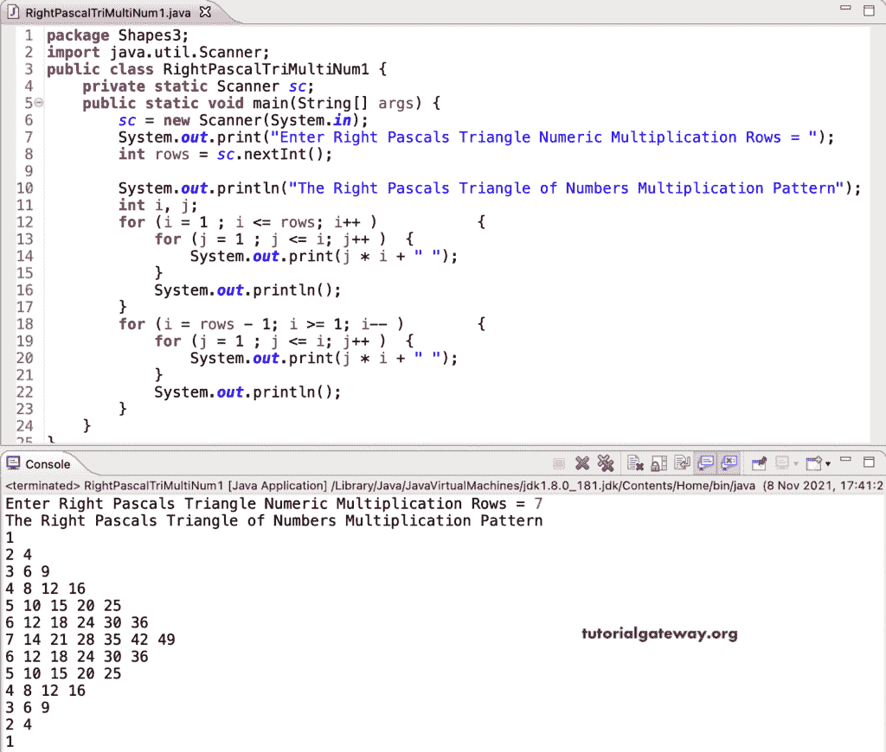

# Java 程序：打印数字乘法的直角三角形图案

> 原文：<https://www.tutorialgateway.org/java-program-to-print-right-pascals-triangle-of-multiplication-numbers-pattern/>

编写一个 Java 程序，使用 for 循环打印数字乘法的直角三角形。

```java
package Shapes3;

import java.util.Scanner;

public class RightPascalTriMultiNum1 {

	private static Scanner sc;

	public static void main(String[] args) {
		sc = new Scanner(System.in);

		System.out.print("Enter Right Pascals Triangle Numeric Multiplication Rows = ");
		int rows = sc.nextInt();

		System.out.println("The Right Pascals Triangle of Numbers Multiplication Pattern");
		int i, j;

		for (i = 1 ; i <= rows; i++ ) 
		{
			for (j = 1 ; j <= i; j++ ) 
			{
				System.out.print(j * i + " ");
			}
			System.out.println();
		}

		for (i = rows - 1; i >= 1; i-- ) 
		{
			for (j = 1 ; j <= i; j++ ) 
			{
				System.out.print(j * i + " ");
			}
			System.out.println();
		}
	}
}
```



这是编写 Java 程序的另一种方法，使用 for 循环打印数字乘法的右帕斯卡三角形或表格。

```java
package Shapes3;

import java.util.Scanner;

public class RightPascalTriMultiNum2 {

	private static Scanner sc;

	public static void main(String[] args) {
		sc = new Scanner(System.in);

		System.out.print("Enter Right Pascals Triangle Numeric Multiplication Rows = ");
		int rows = sc.nextInt();

		System.out.println("The Right Pascals Triangle of Numbers Multiplication Pattern");
		int i, j, temp = 1;

		for (i = 1 ; i <= rows / 2 + 1; i++, temp++ ) 
		{
			for (j = 1 ; j <= i; j++ ) 
			{
				System.out.print(j * temp + " ");
			}
			System.out.println();
		}

		for (i = 1; i <= rows / 2; i++, temp++) 
		{
			for (j = 1 ; j <= rows/ 2 - i + 1; j++ ) 
			{
				System.out.print(j * temp + " ");
			}
			System.out.println();
		}
	}
}
```

```java
Enter Right Pascals Triangle Numeric Multiplication Rows = 17
The Right Pascals Triangle of Numbers Multiplication Pattern
1 
2 4 
3 6 9 
4 8 12 16 
5 10 15 20 25 
6 12 18 24 30 36 
7 14 21 28 35 42 49 
8 16 24 32 40 48 56 64 
9 18 27 36 45 54 63 72 81 
10 20 30 40 50 60 70 80 
11 22 33 44 55 66 77 
12 24 36 48 60 72 
13 26 39 52 65 
14 28 42 56 
15 30 45 
16 32 
17 
```

这个 [Java 示例](https://www.tutorialgateway.org/learn-java-programs/)使用 while 循环打印数字乘法的右帕斯卡三角形模式。

```java
package Shapes3;

import java.util.Scanner;

public class RightPascalTriMultiNum3 {

	private static Scanner sc;

	public static void main(String[] args) {
		sc = new Scanner(System.in);

		System.out.print("Enter Right Pascals Numbers Multiplication Triangle Rows = ");
		int rows = sc.nextInt();

		System.out.println("The Right Pascals Triangle of Numbers Multiplication Pattern");
		int i, j, temp;
		i = temp = 1; 

		while(i <= rows / 2 + 1) 
		{
			j = 1 ; 
			while(j <= i) 
			{
				System.out.print(j * temp + " ");
				j++;
			}

			System.out.println();
			temp++; 
			i++;
		}

		i = 1; 
		while(i <= rows / 2) 
		{
			j = 1 ; 
			while(j <= rows/ 2 - i + 1) 
			{
				System.out.print(j * temp + " ");
				j++;
			}

			System.out.println();
			temp++; 
			i++;
		}
	}
}
```

```java
Enter Right Pascals Numbers Multiplication Triangle Rows = 19
The Right Pascals Triangle of Numbers Multiplication Pattern
1 
2 4 
3 6 9 
4 8 12 16 
5 10 15 20 25 
6 12 18 24 30 36 
7 14 21 28 35 42 49 
8 16 24 32 40 48 56 64 
9 18 27 36 45 54 63 72 81 
10 20 30 40 50 60 70 80 90 100 
11 22 33 44 55 66 77 88 99 
12 24 36 48 60 72 84 96 
13 26 39 52 65 78 91 
14 28 42 56 70 84 
15 30 45 60 75 
16 32 48 64 
17 34 51 
18 36 
19 
```