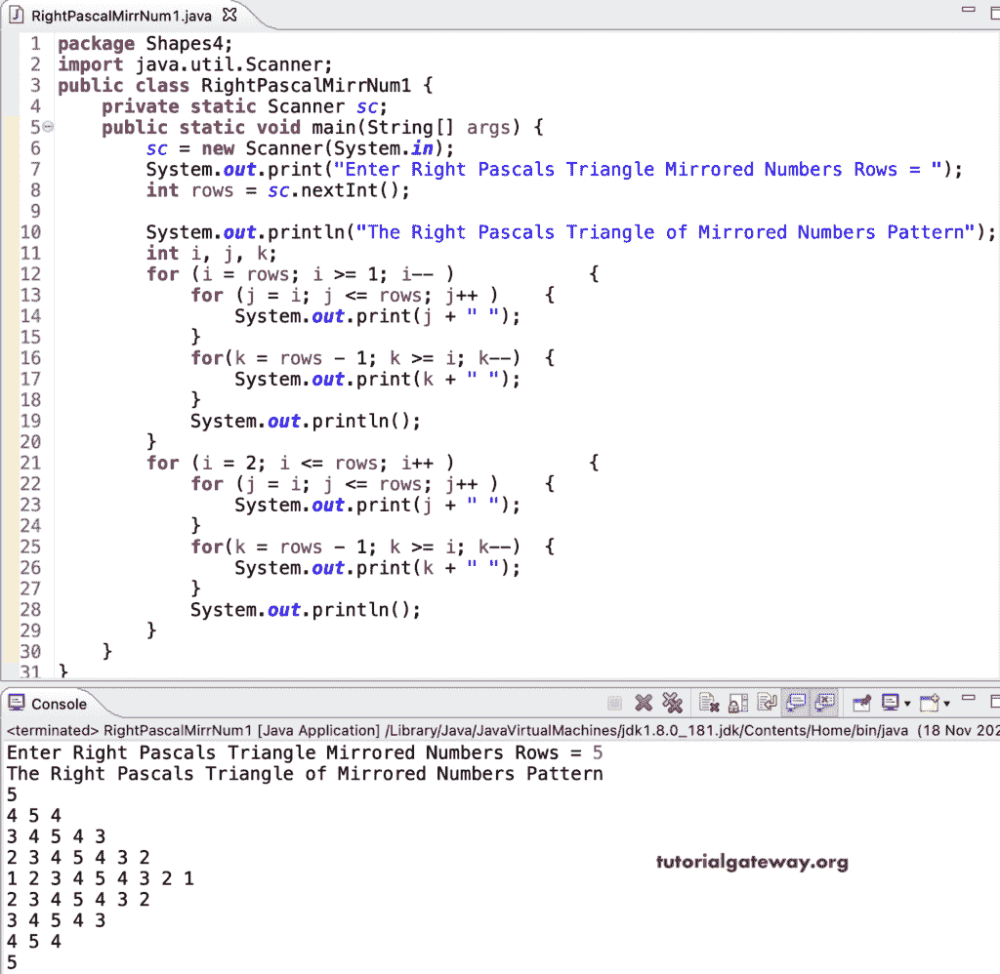

# Java 程序：打印数字的镜像直角三角形图案

> 原文：<https://www.tutorialgateway.org/java-program-to-print-right-pascals-triangle-of-mirrored-numbers-pattern/>

编写一个 Java 程序，使用 for 循环打印镜像数字图案的右帕斯卡三角形。

```java
package Shapes4;

import java.util.Scanner;

public class RightPascalMirrNum1 {

	private static Scanner sc;

	public static void main(String[] args) {
		sc = new Scanner(System.in);

		System.out.print("Enter Right Pascals Triangle Mirrored Numbers Rows = ");
		int rows = sc.nextInt();

		System.out.println("The Right Pascals Triangle of Mirrored Numbers Pattern");
		int i, j, k;

		for (i = rows; i >= 1; i-- ) 
		{
			for (j = i; j <= rows; j++ ) 
			{
				System.out.print(j + " ");
			}
			for(k = rows - 1; k >= i; k--)
			{
				System.out.print(k + " ");
			}
			System.out.println();
		}

		for (i = 2; i <= rows; i++ ) 
		{
			for (j = i; j <= rows; j++ ) 
			{
				System.out.print(j + " ");
			}
			for(k = rows - 1; k >= i; k--)
			{
				System.out.print(k + " ");
			}
			System.out.println();
		}
	}
}
```



这个 Java 程序使用 while 循环打印镜像数字的右帕斯卡三角形模式。

```java
package Shapes4;

import java.util.Scanner;

public class RightPascalMirrNum2 {

	private static Scanner sc;

	public static void main(String[] args) {
		sc = new Scanner(System.in);

		System.out.print("Enter Right Pascals Triangle Mirrored Numbers Rows = ");
		int rows = sc.nextInt();

		System.out.println("The Right Pascals Triangle of Mirrored Numbers Pattern");
		int i, j, k;
		i =rows;

		while(i >= 1 ) 
		{
			j = i; 
			while(j <= rows ) 
			{
				System.out.print(j + " ");
				j++;
			}
			k = rows - 1;
			while( k >= i)
			{
				System.out.print(k + " ");
				k--;
			}
			System.out.println();
			i--;
		}

		i = 2;
		while(i <= rows ) 
		{
			j = i; 
			while(j <= rows ) 
			{
				System.out.print(j + " ");
				j++;
			}
			k = rows - 1;
			while( k >= i)
			{
				System.out.print(k + " ");
				k--;
			}
			System.out.println();
			i++;
		}
	}
}
```

```java
Enter Right Pascals Triangle Mirrored Numbers Rows = 11
The Right Pascals Triangle of Mirrored Numbers Pattern
11 
10 11 10 
9 10 11 10 9 
8 9 10 11 10 9 8 
7 8 9 10 11 10 9 8 7 
6 7 8 9 10 11 10 9 8 7 6 
5 6 7 8 9 10 11 10 9 8 7 6 5 
4 5 6 7 8 9 10 11 10 9 8 7 6 5 4 
3 4 5 6 7 8 9 10 11 10 9 8 7 6 5 4 3 
2 3 4 5 6 7 8 9 10 11 10 9 8 7 6 5 4 3 2 
1 2 3 4 5 6 7 8 9 10 11 10 9 8 7 6 5 4 3 2 1 
2 3 4 5 6 7 8 9 10 11 10 9 8 7 6 5 4 3 2 
3 4 5 6 7 8 9 10 11 10 9 8 7 6 5 4 3 
4 5 6 7 8 9 10 11 10 9 8 7 6 5 4 
5 6 7 8 9 10 11 10 9 8 7 6 5 
6 7 8 9 10 11 10 9 8 7 6 
7 8 9 10 11 10 9 8 7 
8 9 10 11 10 9 8 
9 10 11 10 9 
10 11 10 
11 
```

在这个 Java [模式示例](https://www.tutorialgateway.org/learn-java-programs/)中，我们使用了 rightpascalMirrored 函数来分离 for 循环登录并显示 right pascals 镜像数字三角形。

```java
package Shapes4;

import java.util.Scanner;

public class RightPascalMirrNum3 {

	private static Scanner sc;

	public static void main(String[] args) {
		sc = new Scanner(System.in);

		System.out.print("Enter Right Pascals Triangle Mirrored Numbers Rows = ");
		int rows = sc.nextInt();

		System.out.println("The Right Pascals Triangle of Mirrored Numbers Pattern");
		int i;

		for (i = rows; i >= 1; i-- ) 
		{
			rightpascalMirrored(rows, i);
			System.out.println();
		}

		for (i = 2; i <= rows; i++ ) 
		{
			rightpascalMirrored(rows, i);
			System.out.println();
		}
	}

	public static void rightpascalMirrored(int rows, int i) {
		for (int j = i; j <= rows; j++ ) 
		{
			System.out.print(j + " ");
		}
		for(int k = rows - 1; k >= i; k--)
		{
			System.out.print(k + " ");
		}
	}
}
```

```java
Enter Right Pascals Triangle Mirrored Numbers Rows = 13
The Right Pascals Triangle of Mirrored Numbers Pattern
13 
12 13 12 
11 12 13 12 11 
10 11 12 13 12 11 10 
9 10 11 12 13 12 11 10 9 
8 9 10 11 12 13 12 11 10 9 8 
7 8 9 10 11 12 13 12 11 10 9 8 7 
6 7 8 9 10 11 12 13 12 11 10 9 8 7 6 
5 6 7 8 9 10 11 12 13 12 11 10 9 8 7 6 5 
4 5 6 7 8 9 10 11 12 13 12 11 10 9 8 7 6 5 4 
3 4 5 6 7 8 9 10 11 12 13 12 11 10 9 8 7 6 5 4 3 
2 3 4 5 6 7 8 9 10 11 12 13 12 11 10 9 8 7 6 5 4 3 2 
1 2 3 4 5 6 7 8 9 10 11 12 13 12 11 10 9 8 7 6 5 4 3 2 1 
2 3 4 5 6 7 8 9 10 11 12 13 12 11 10 9 8 7 6 5 4 3 2 
3 4 5 6 7 8 9 10 11 12 13 12 11 10 9 8 7 6 5 4 3 
4 5 6 7 8 9 10 11 12 13 12 11 10 9 8 7 6 5 4 
5 6 7 8 9 10 11 12 13 12 11 10 9 8 7 6 5 
6 7 8 9 10 11 12 13 12 11 10 9 8 7 6 
7 8 9 10 11 12 13 12 11 10 9 8 7 
8 9 10 11 12 13 12 11 10 9 8 
9 10 11 12 13 12 11 10 9 
10 11 12 13 12 11 10 
11 12 13 12 11 
12 13 12 
13 
```