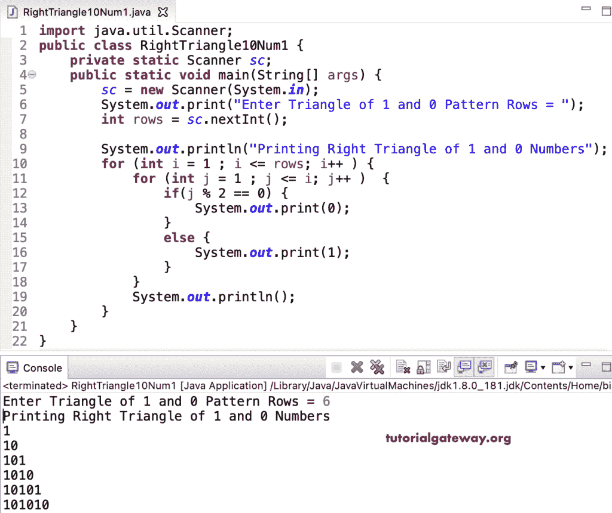

# Java 程序：打印`1`和`0`的直角三角形

> 原文：<https://www.tutorialgateway.org/java-program-to-print-right-triangle-of-1-and-0/>

写一个 Java 程序，用 for 循环打印 1 和 0 的直角三角形。

```java
import java.util.Scanner;

public class RightTriangle10Num1 {

	private static Scanner sc;

	public static void main(String[] args) {

		sc = new Scanner(System.in);	

		System.out.print("Enter Triangle of 1 and 0 Pattern Rows = ");
		int rows = sc.nextInt();

		System.out.println("Printing Right Triangle of 1 and 0 Numbers");

		for (int i = 1 ; i <= rows; i++ ) 
		{
			for (int j = 1 ; j <= i; j++ ) 	
			{
				if(j % 2 == 0) {
					System.out.print(0);
				}
				else {
					System.out.print(1);
				}
			}
			System.out.println();
		}
	}
}
```



这个 [Java 示例](https://www.tutorialgateway.org/learn-java-programs/)使用 while 循环显示了带有可选 1 和 0 的直角三角形。

```java
import java.util.Scanner;

public class RightTriangle10Num2 {

	private static Scanner sc;

	public static void main(String[] args) {

		sc = new Scanner(System.in);	

		System.out.print("Enter Triangle of 1 and 0 Pattern Rows = ");
		int rows = sc.nextInt();

		System.out.println("Printing Right Triangle of 1 and 0 Numbers");
		int i = 1, j; 

		while(i <= rows ) 
		{
			j = 1 ;
			while ( j <= i ) 	
			{
				if(j % 2 == 0) {
					System.out.print(0);
				}
				else {
					System.out.print(1);
				}
				j++;
			}
			System.out.println();
			 i++;
		}
	}
}
```

```java
Enter Triangle of 1 and 0 Pattern Rows = 9
Printing Right Triangle of 1 and 0 Numbers
1
10
101
1010
10101
101010
1010101
10101010
101010101
```

使用 do while 循环打印 1 和 0 的直角三角形的 Java 程序。

```java
import java.util.Scanner;

public class RightTriangle10Num3 {

	private static Scanner sc;

	public static void main(String[] args) {

		sc = new Scanner(System.in);	

		System.out.print("Enter Triangle of 1 and 0 Pattern Rows = ");
		int rows = sc.nextInt();

		System.out.println("Printing Right Triangle of 1 and 0 Numbers");
		int i = 1, j; 

		do
		{
			j = 1 ;
			do	
			{
				if(j % 2 == 0) {
					System.out.print(0);
				}
				else {
					System.out.print(1);
				}

			} while ( ++j <= i ) ;
			System.out.println();

		} while(++i <= rows );
	}
}
```

```java
Enter Triangle of 1 and 0 Pattern Rows = 14
Printing Right Triangle of 1 and 0 Numbers
1
10
101
1010
10101
101010
1010101
10101010
101010101
1010101010
10101010101
101010101010
1010101010101
10101010101010
```